# YUYUTSAVA Architecture

> **Scope of this document.** This is the authoritative, code-grounded reference for
> the YUYUTSAVA backend. It is written from the current source tree (not the older
> May-era draft) and covers both operating modes, every major subsystem, and the
> data/control flows that connect them. Diagrams are provided in two forms —
> **Mermaid** (rendered graphs/sequences, best for relationships and flows) and
> **ASCII line diagrams** (best for layered/box structure that must stay legible
> in a plain terminal).

---

## Table of Contents

1. [What YUYUTSAVA Is](#1-what-yuyutsava-is)
2. [The Two Operating Modes](#2-the-two-operating-modes)
3. [High-Level System Map](#3-high-level-system-map)
4. [Package / Module Layout](#4-package--module-layout)
5. [CLI Mode Architecture](#5-cli-mode-architecture)
6. [Daemon Mode Architecture](#6-daemon-mode-architecture)
7. [Agent Hierarchy](#7-agent-hierarchy)
8. [The Event → Action Pipeline](#8-the-event--action-pipeline)
9. [Consent: Two Tiers + the Allowlist](#9-consent-two-tiers--the-allowlist)
10. [TaskRunner: the Filesystem Permission Gateway](#10-taskrunner-the-filesystem-permission-gateway)
11. [Async (Background) Subagents](#11-async-background-subagents)
12. [Streaming & Interrupt Runtime](#12-streaming--interrupt-runtime)
13. [Channels & Communication Surfaces](#13-channels--communication-surfaces)
14. [Web API Layer (FastAPI + SSE + WebSocket)](#14-web-api-layer-fastapi--sse--websocket)
15. [The Context Controller](#15-the-context-controller)
16. [Memory, Skills & Retrieval (pgvector)](#16-memory-skills--retrieval-pgvector)
17. [The Model Layer (Providers, Roles, Routing, Cost)](#17-the-model-layer-providers-roles-routing-cost)
18. [Tool System & Progressive Discovery](#18-tool-system--progressive-discovery)
19. [Storage Architecture](#19-storage-architecture)
20. [Visuals Subsystem](#20-visuals-subsystem)
21. [Voice Subsystem](#21-voice-subsystem)
22. [Electron Frontend Architecture](#22-electron-frontend-architecture)
23. [Platform / OS-Invariance Layer](#23-platform--os-invariance-layer)
24. [Security Design](#24-security-design)
25. [Startup & Shutdown Sequences](#25-startup--shutdown-sequences)
26. [End-to-End Walkthroughs](#26-end-to-end-walkthroughs)
27. [Key Design Decisions](#27-key-design-decisions)
28. [On-Disk Layout & Config Files](#28-on-disk-layout--config-files)

---

## 1. What YUYUTSAVA Is

YUYUTSAVA is a **personal AI agent system** built on **Deep Agents** (a LangGraph-based
agent framework). It began as a single-shot CLI that executed one natural-language
task with file + shell tools, and has grown into a full **always-on assistant** with:

- an interactive **CLI chat REPL** and a **one-shot task runner**;
- an **always-on daemon** that watches the environment (filesystem, clipboard,
  webcam, voice, hotkeys), triages events with an LLM, and proposes actions;
- a hierarchy of **specialised subagents** delegated to by a master **orchestrator**;
- **background (async) subagents** that run long tasks off the main turn and wake
  the master when done;
- a **two-tier consent system** plus a persistent **allowlist** so the agent never
  acts destructively without permission;
- a **context controller** (tool-result offload, compaction, transcript recall) that
  keeps token cost bounded regardless of uptime;
- **long-term memory + skills** with semantic (pgvector) recall;
- **twelve LLM providers** with per-role model selection and complexity-based routing;
- a local **FastAPI** server driving an **Electron desktop app** (and a TypeScript
  mobile client over the same `/v1` API);
- a full **voice interface** (wake word → STT → agent → TTS).

Two invariants shape everything:

1. **Bounded context.** Each daemon task runs on a *fresh* `thread_id`; the graph and
   checkpoint are discarded between tasks. Long-lived conversations offload and
   compact. This is what keeps token cost flat no matter how long the daemon runs.
2. **Permission-first.** No filesystem write, delete, or shell command executes
   without either a standing rule (policy / consent grant) or an explicit user
   approval routed to whatever surface the user is on.

---

## 2. The Two Operating Modes

YUYUTSAVA is really *two* front-ends over one shared agent engine.

```
                       ┌──────────────────────────────────────────┐
                       │            Shared agent engine            │
                       │  core/engine.py · core/streaming.py       │
                       │  agents/* · context/* · memory · skills   │
                       └──────────────────────────────────────────┘
                          ▲                              ▲
              builds a    │                              │  builds many
         single deepagent │                              │  per-task graphs
                          │                              │
        ┌─────────────────┴───────────┐   ┌──────────────┴───────────────────┐
        │        MODE 1: CLI          │   │        MODE 2: DAEMON             │
        │  yuyutsava [task] / chat    │   │  yuyutsava daemon [--no-ui]       │
        │                             │   │                                   │
        │  • one deepagent, long-     │   │  • event sources → triage → queue │
        │    lived thread             │   │  • orchestrator loop, fresh graph │
        │  • prompts on stdin         │   │    per task                       │
        │  • REPL or single task      │   │  • FastAPI + Electron UI          │
        └─────────────────────────────┘   └───────────────────────────────────┘
```

| | **CLI mode** | **Daemon mode** |
|---|---|---|
| Entry | `cli/cli.py` → `cli/commands/chat*.py` | `daemon/main.py` → `daemon/bootstrap.py` |
| Agent shape | one **deepagent** (`build_cli_deepagent`) with a long-lived thread | one **orchestrator** rebuilt **per task** (`build_orchestrator`) |
| Trigger | user types a task / chats | environment events + direct task submissions |
| HITL surface | terminal stdin | Electron UI, terminal, voice, Telegram (any connected channel) |
| Lifetime | process = one session (or REPL) | always-on, singleton-locked per user |
| Delegation | deepagents `task(subagent_type,…)` tool | `OrchestratorLoop` → subagent graphs |

Both share: the **same subagents**, the **same TaskRunner gateway**, the **same
context controller**, the **same memory/skills stores**, and the **same async
subagent host** (they even *attach to each other's* host — first-come-wins).

---

## 3. High-Level System Map

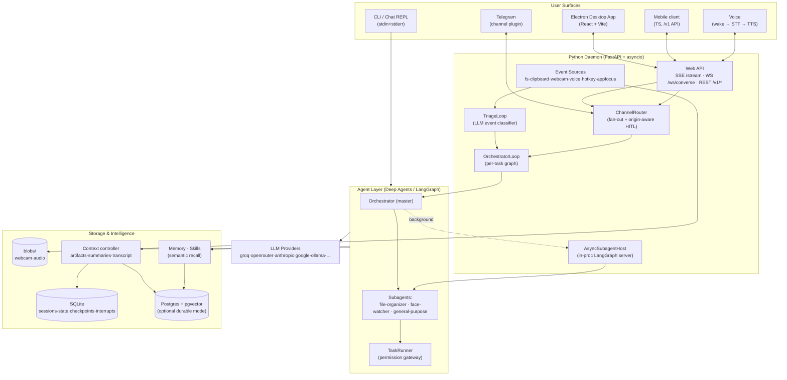

**Reading the map:** environment events flow *up* through Triage into the
Orchestrator; user surfaces talk to the daemon through the Web API and the
ChannelRouter; the Orchestrator delegates to subagents, which reach the filesystem
only through the TaskRunner gateway; everything persists through the storage layer,
which is SQLite by default and Postgres+pgvector when durable mode is on.

---

## 4. Package / Module Layout

```
yuyutsava/
├── cli/                 CLI entry, chat REPL, session/prefs commands, attach
│   └── commands/        chat, chat_repl, sessions, prefs, scenarios, attach
├── core/                the shared engine
│   ├── engine.py          build_cli_deepagent / build_orchestrator (graph builders)
│   ├── streaming.py       astream_agent / astream_agent_iter (drive + interrupts)
│   ├── config.py          all env settings (LLM providers, daemon, docker, search)
│   ├── llm.py             chat_model() provider factory
│   ├── model_router.py    complexity → tier model + price table
│   ├── tool_registry.py   progressive tool discovery (tool_search gateway)
│   ├── *_middleware.py     tool filter, permission, voice-style, retrieval injection
│   ├── policy.py          permissions.json (auto_approve, ws_* daily caps)
│   ├── pricing.py         live price fetch + cache
│   └── docker_sandbox_backend.py
├── agents/
│   ├── orchestrator/      master agent: deps, ask_user tool, prompts, capabilities
│   ├── triage/            LLM event classifier → TriageDecision
│   ├── task_runner/       permission gateway: agent, zones, permissions, executor, tools
│   ├── file_organizer/    subagent
│   ├── face_watcher/      subagent
│   ├── general_purpose/   subagent (overrides deepagents' default)
│   ├── base_sub_agent.py  BaseSubAgent (tool wiring, sync + async graph specs)
│   └── db_tools/          read-only DB introspection tools
├── async_subagents/     in-proc LangGraph host, watcher, mirror, launch index, host lock
├── daemon/
│   ├── main.py            lifecycle: signals, loops, teardown, self-reexec
│   ├── bootstrap.py       build_daemon(): wires every subsystem → DaemonSubsystems
│   ├── triage_loop.py     bus consumer → consent → triage → Tier-1 proposal → queue
│   ├── orchestrator_loop.py  pops tasks → builds graph → streams → HITL → records
│   ├── channels.py        UserChannel ABC + ChannelRouter (fan-out, origin routing)
│   ├── resources.py       ResourceMonitor + AdmissionController (Phase 5)
│   ├── usage.py           UsageRecorder + UsageStore (Phase 4 cost tracking)
│   ├── task_registry.py   first-class task tracking (GET /tasks)
│   ├── conversation_manager.py  lazy stack for /ws/converse
│   └── web/               FastAPI app, routers, schemas, services (SSE hub)
├── channels/            channel plugins (telegram) + registry + config
├── conversation/        ConversationService (I/O-agnostic multi-turn loop)
├── sessions/            session runner (CLI + conversation bookkeeping)
├── context/             offload · compaction · transcript · artifacts · injectors
├── memory/              MemoryStore (pgvector / sqlite), embedder, mem_* tools
├── skills/              SkillRegistry (disk) + SkillStore (semantic index) + tools
├── retrieval/           reusable pgvector engine (shared by memory + skills + ctx)
├── consent/             ConsentRegistry allowlist (once/session/project/persistent)
├── events/              EventBus, SourceRegistry, sources/*, ev_recall tool
├── storage/             SQLite + Postgres backends, routing (spillover), sweeper, paths
│   ├── pg/                pool, migrations (v1–v15), relational threads hub
│   ├── routing/           RoutedStore, StorageHealth, Reconciler
│   ├── events/            events domain store (proposals, decisions, rules, …)
│   └── sessions/          session store (sqlite + pg impls)
├── visuals/             chart/diagram/table/code/math/timeline render + vis_* tools
├── audio_io/            VAD, STT/TTS glue, earcons, announcer (voice)
├── io/                  audio/stt/tts/wake backends
├── mcp/                 MCP client manager + tool adapter (external tool servers)
├── mcp_servers/         bundled MCP servers (deepface face recognition)
├── platform/            OS-invariance: FileLock, HostProfile, elevation, process
├── prefs/               PrefsInjector (user prefs → prompt block)
├── tools/               ws_* web search tools (Tavily, Exa)
├── discovery/           the catalog/keyword/vector search behind tool_search
└── models/              shared pydantic value types (operations, results, interrupts)
```

Naming conventions worth knowing (they show up throughout):

| Prefix | Family | Example |
|---|---|---|
| `tr_*` | TaskRunner filesystem/shell tools | `tr_write_file`, `tr_execute` |
| `ws_*` | Web search | `ws_tavily_search`, `ws_exa_search` |
| `sk_*` | Skills | `sk_read_skill`, `sk_write_skill`, `sk_search_skill` |
| `mem_*` | Memory | `mem_search`, `mem_save`, `mem_pct` |
| `ctx_*` | Context/artifacts | `ctx_fetch_artifact`, `ctx_grep_artifact`, `ctx_recall` |
| `vis_*` | Visuals | `vis_chart`, `vis_diagram`, `vis_table` |
| `ev_*` | Events | `ev_recall` |
| `db_*` | Read-only DB introspection | (bound at runtime) |
| `orch_*` | Orchestrator master tools | `ask_user` |

---

## 5. CLI Mode Architecture

The CLI (`cli/cli.py`) is a thin argparse dispatcher. It hands off `daemon`, `prefs`,
`attach`, and `chat` subcommands, and otherwise resolves a task and runs it.

### 5.1 CLI dispatch

```
yuyutsava <argv>
   │
   ├─ argv[0] == "daemon" ─────────► daemon/main.py            (always-on daemon)
   ├─ argv[0] == "prefs"  ─────────► cli/commands/prefs.py     (get/set user prefs)
   ├─ argv[0] == "attach" ─────────► cli/commands/attach.py    (attach to running daemon)
   ├─ argv[0] == "chat"   ─────────► run_chat_repl (force)     (interactive REPL)
   │
   └─ default → _async_main():
         --list-scenarios / --print-tools / --list-sessions /
         --delete-session / --generate_agent_graph   → short-circuit + exit
         --scenario ID                               → canned prompt
         positional task text                        → run_chat (one-shot)
         (no task)                                   → run_chat_repl (REPL)
```

Short-circuit flags never build an agent (no model, no Docker, no LLM keys): listing
sessions, deleting a session, printing the tool reference, or exporting the state
graph all return before `build_agent`.

### 5.2 The CLI agent stack

`cli/agent_stack.py :: build_agent_stack()` is the single construction path for the
conversational deepagent (it is *not* CLI-only — the daemon's `/ws/converse` reuses
it). It assembles:

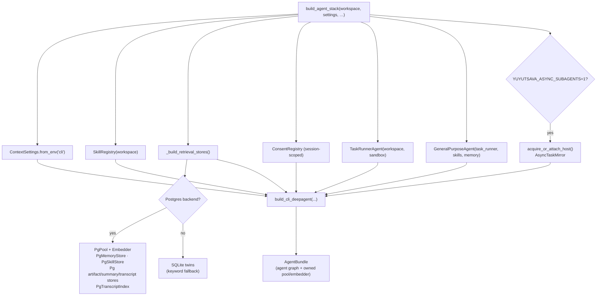

The bundle carries the compiled graph plus any resources it must tear down (Docker
backend, PG pool, embedder, async host attachment). `AgentBundle.aclose()` closes
them in order.

### 5.3 The chat REPL

`cli/commands/chat_repl.py` (the largest single file, ~1.2k lines) is the terminal
experience: it drives `ConversationService`, renders streamed tokens/tool-calls,
handles slash commands (`/new`, `/expand`, `/sessions`, …), prints permission
prompts on stdin, and bridges background-task status banners between turns. It uses
`astream_agent` (the printing variant) via the shared `ConversationService.run_turn`.

### 5.4 One deepagent, layered middleware

`build_cli_deepagent` (in `core/engine.py`) composes the graph. The middleware order
is load-bearing:

```
create_deep_agent(
  model, tools=[tool_search, …all custom tools],
  backend = LocalShellBackend (virtual_mode, workspace-scoped)  ── or DockerSandboxBackend
  system_prompt = local/docker_system_prompt(...) + tool catalog,
  middleware = [
    ToolFilterMiddleware,              # hide tr_*/ws_*/sk_* from the model (lazy discovery)
    FilesystemPromptOverrideMiddleware,# strip deepagents' built-in FS prose
    VoiceStyleMiddleware,              # shorten replies on voice turns
    ToolResultOffloadMiddleware,       # (context) big tool results → artifacts
    YuyutsavaCompactionMiddleware,     # (context) summarize when over token budget
    TranscriptRecorderMiddleware,      # (context) persist verbatim transcript
    PromptInspectorMiddleware,         # (context) debug: dump final prompt
    PermissionMiddleware,              # pause on dangerous shell patterns
    RetrievalInjectionMiddleware,      # inject memory + skills + past-turn recall
    BackgroundTaskCapMiddleware,       # (if async) cap in-flight bg tasks
    AsyncTaskInterruptPatchMiddleware, # (if async) route bg interrupts
    CheckAsyncTaskGuardMiddleware,     # (if async) guard check_async_task
  ],
  subagents = [general-purpose (+ -bg async peers)],
)
```

---

## 6. Daemon Mode Architecture

The daemon is split cleanly: **`bootstrap.py` wires**, **`main.py` runs**.

### 6.1 `bootstrap.build_daemon()` — the wiring blueprint

One async function opens every store, starts every long-lived subsystem, and returns
a frozen `DaemonSubsystems` record. Boot order (each step depends on the previous):

```
storage backend (sqlite | postgres + migrations)
  → embedder (pgvector mode only)
  → context stores (artifacts / summaries / transcript / voice)
  → task registry · usage store · model router
  → memory store (pgvector | sqlite keyword)
  → events Store (RoutedStore spillover in pg mode)
  → visuals + feedback stores (RoutedStore)
  → prefs store · permissions policy · consent registry
  → MCP manager  → checkpointer  → unified TTL sweeper
  → EventBus  → SourceRegistry.start_all()
  → ChannelRouter (+ WebChannel if UI, + TerminalChannel always, + VoiceChannel if --voice)
  → ResourceMonitor + AdmissionController
  → models (triage / orchestrator / subagent / compaction) via role env
  → SkillRegistry + SkillStore (+ SkillIndexer.sync)
  → storage spillover recovery (Reconciler + degrade notifier)
  → SearchConfig (ws_* tools)
  → subagents (file-organizer, face-watcher, general-purpose) + TaskRunner
  → task_queue + LaunchIndex
  → [if YUYUTSAVA_ASYNC_SUBAGENTS] AsyncSubagentHost + AsyncTaskMirror + AsyncTaskHealthWatcher
  → TriageAgent + TriageLoop
  → TaskSubmissionService (+ ComplexityScorer if routing)
  → OrchestratorDeps + OrchestratorLoop
  → DecisionService + channel plugins (Telegram)
  → FastAPI app + uvicorn.Server (bearer auth iff non-loopback)
```

### 6.2 `main.py` — lifecycle

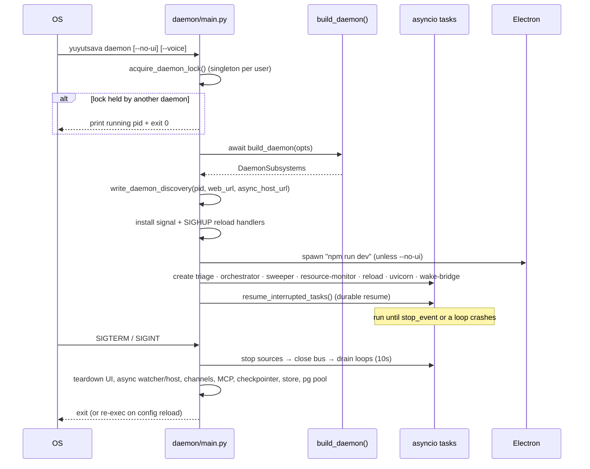

Notable lifecycle features:

- **Singleton lock** (`daemon/singleton.py`): refuses a second daemon per user
  profile; publishes a discovery JSON (pid, URLs, uptime) that `--status` / `--stop`
  and the CLI `attach` command read.
- **Self-reexec on reload:** `POST /system/reload` (or SIGHUP) triggers a graceful
  teardown that returns `_REEXEC_RETCODE`; `main()` then `os.execv`s itself so config
  changes (e.g. new provider keys written by the Settings UI) take effect cleanly.
- **Durable resume:** on boot, any `running`/`queued` task left by a previous instance
  is re-enqueued — `running` tasks continue from their last checkpoint via the
  persisted `thread_id`.

---

## 7. Agent Hierarchy

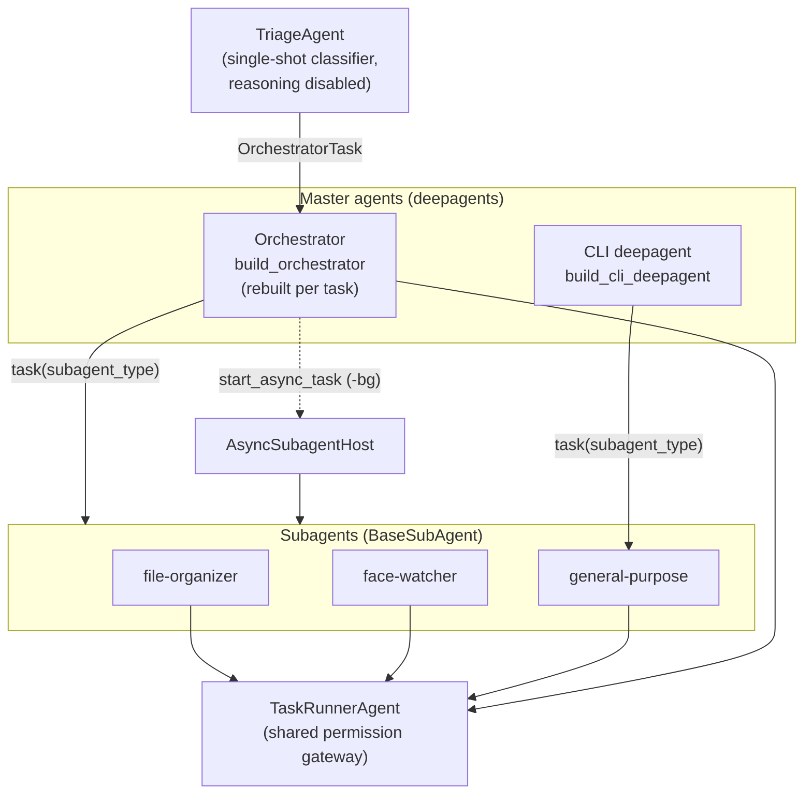

### 7.1 `BaseSubAgent`

Every subagent subclasses `agents/base_sub_agent.py`, which auto-wires a consistent
toolset and produces both a **sync spec** (`as_deepagents_subagent_spec()`) and an
**async spec** (`as_async_subagent_spec(url)`). Tools assembled per subagent:

```
all_tools() = task_runner_tools (tr_*)     # bound to this agent's name for HITL attribution
            + skill_tools     (sk_*)        # read-only, or read+write when can_write_skills
            + memory_tools    (mem_*)       # when a memory store is wired
            + search_tools    (ws_*)        # only those its visible skills declare (requires_tools)
            + mcp_tools                      # scoped to this agent's name
            + visual_tools    (vis_*)        # always
            + extra_tools()                  # domain-specific overrides
```

The subagent's prompt is `system_prompt` + a **workspace-context block** (real
WORKSPACE/SANDBOX/OUTPUT paths, since it can't see the master's prompt) + the
**host passport** (OS profile) + a **tool catalog** for lazy discovery.

### 7.2 The three subagents

| Subagent | Role |
|---|---|
| **file-organizer** | Moves/organises files (Downloads → Inbox), reacts to `fs.changed` events; can write skills. |
| **face-watcher** | Processes webcam frames / face events via the bundled deepface MCP server. |
| **general-purpose** | Catch-all delegate. Registered under the name `general-purpose` to *override* deepagents' built-in default, so `task('general-purpose', …)` hits our tighter spec. It is the CLI's only sync subagent. |

Each also exists as a `-bg` **async peer** (`file-organizer-bg`, etc.) when the async
host is enabled.

### 7.3 The Orchestrator (master)

`build_orchestrator` (in `core/engine.py`) builds the daemon's master. Its definition
(`agents/orchestrator/agent.py`) is just `OrchestratorDeps` (a dependency bag) and the
`ask_user` tool. The master:

- carries a rendered **capabilities block** (what each subagent can do) + a
  semantically-selected **skills block** in its system prompt;
- gets master tools: `ask_user`, `ev_recall`, `sk_*`, `ws_*`, MCP tools, `ctx_*`,
  `mem_*`, `vis_*` — all behind the `tool_search` gateway;
- delegates to subagents via deepagents' `task(subagent_type,…)`, and to background
  work via `start_async_task`;
- runs with a `BudgetMiddleware` token ceiling and a `UsageRecorder` per model call.

It does **not** get a `spawn_subagent` tool — dynamic work is delegated to the
`general-purpose` subagent instead.

---

## 8. The Event → Action Pipeline

This is the heart of daemon mode: how a filesystem change (or clipboard copy, or
webcam face) becomes an action the user approved.

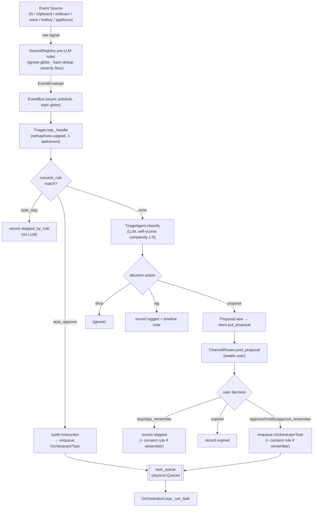

### 8.1 Triage

`agents/triage/agent.py` is a **single-shot classifier** — reasoning is *disabled*
(`disable_reasoning=True`) because thinking models otherwise spend the token budget on
reasoning and truncate the decision JSON. It emits a `TriageDecision`
(`drop`/`log`/`propose`, a subagent hint, a proposed instruction, an urgency, and a
self-scored complexity 1–5). Each event is handled in its own asyncio task so a slow
human decision on one proposal can't stall classification of the next; a semaphore
caps concurrency to protect the LLM budget.

### 8.2 The Orchestrator loop

`daemon/orchestrator_loop.py` pops tasks and, **per task**:

```
OrchestratorLoop._run_task(task):
  1. register/resolve task_id in TaskRegistry (visible to GET /tasks)
  2. pick thread_id:
        subagent_completed wake-up → parent thread (continue that conversation)
        durable resume             → persisted thread (continue from checkpoint)
        normal                     → FRESH thread   (bounded context invariant)
  3. AdmissionController.slot(): heavy tasks wait for a free semaphore + unloaded system
  4. ModelRouter.model_for(complexity): pick tier model (or booted role model)
  5. build_orchestrator(...) with injected prefs + memory + skills blocks
  6. astream_agent_iter(graph, message, ask_handler=channel-routed HITL)
        - broadcast every token/tool_call/tool_result to channels
        - record start_async_task launches into LaunchIndex
        - honor cooperative cancellation between events
  7. record decision + mark_done; write task_outcome to memory
```

The **fresh-thread-per-task** rule (step 2) is the single most important cost
invariant: no matter how long the daemon has been running, each organic task starts
with a clean context window.

---

## 9. Consent: Two Tiers + the Allowlist

YUYUTSAVA gates action at three complementary layers:

```
┌────────────────────────────────────────────────────────────────────────────┐
│ TIER 1 — Proposals            "I intend to do X. May I?"                     │
│   Where: TriageLoop, before any subagent runs                               │
│   Object: Proposal (event-born), decided via ChannelRouter.post_proposal    │
│   Answers: approve · approve_remember · modify · skip · skip_remember · exp. │
│   *_remember writes a ConsentRule (auto_approve/auto_skip) to state.db       │
├────────────────────────────────────────────────────────────────────────────┤
│ TIER 1.5 — Policy             ~/.yuyutsava/permissions.json                  │
│   auto_approve a tr_* tool globally; ws_* daily caps (StorePolicyCapEnforcer)│
├────────────────────────────────────────────────────────────────────────────┤
│ TIER 2 — Asks                 tool-level permission mid-run                  │
│   Where: TaskRunner interrupt() inside a subagent tool call                 │
│   Object: AskPrompt, decided via ChannelRouter.post_ask                     │
│   Backed by: ConsentRegistry allowlist (once/session/project/persistent)    │
└────────────────────────────────────────────────────────────────────────────┘
```

### 9.1 The allowlist (`consent/`)

The `ConsentRegistry` is the reusable engine that stops the **per-file re-approval
storm**. When the user answers a Tier-2 ask with a scope, a `Grant` is recorded; the
next matching operation skips the prompt.

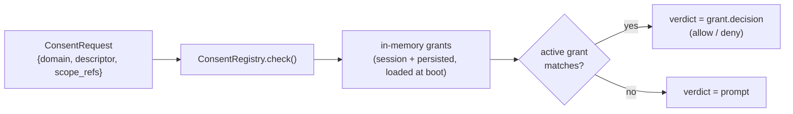

Scopes (`consent/models.py`):

| Scope | Meaning | Persisted? |
|---|---|---|
| `once` | This request only | no |
| `session` | Current thread/session | in-memory |
| `project` | This workspace | yes (`consent_grants`) |
| `persistent` | Everywhere (`*`) | yes |

A key nicety: an in-workspace grant is **widened to the workspace root**, so one
approval covers the operation type across the whole workspace — no per-subfolder
re-asks. **Elevated** (admin/root) commands are exempt: never satisfied by a policy
auto-approve or a cached grant, always asked fresh, never widened.

Decision-word parsing (`parse_consent_decision`) is shared across every surface, so
CLI words (`y`/`session`/`p`), Electron buttons, and resume tokens all map to the same
`(allow, scope)` tuple.

---

## 10. TaskRunner: the Filesystem Permission Gateway

Every filesystem/shell operation — from any agent — flows through one
`TaskRunnerAgent.handle()` (`agents/task_runner/agent.py`). It has no knowledge of
HTTP, CLI, or LangChain; it only classifies zones, applies rules, and (when needed)
calls LangGraph's `interrupt()`.

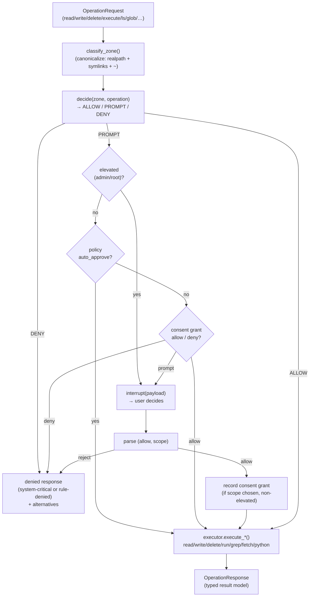

### 10.1 Zones (`task_runner/zones.py`)

Paths are canonicalized (so `/sandbox/../../etc/passwd` resolves to its true target)
then classified by priority:

```
SYSTEM_CRITICAL  → always DENY   (host-specific: POSIX /etc,/bin,…; Windows C:\Windows,…)
SANDBOX          → within sandbox_root  (scratch; tr_execute_in_sandbox cwd)
WORKSPACE        → within workspace_root but outside sandbox
EXTERNAL         → everything else  (needs explicit permission)
```

`system_critical_prefixes` comes from the `HostProfile` (OS-invariance layer), and
macOS `/etc → /private/etc` symlink expansion is handled by checking both the raw and
canonical paths against both raw and canonical prefixes.

### 10.2 Tools (`task_runner/tools.py`)

The gateway is exposed as twelve `tr_*` tools, bound per-agent so HITL interrupts
carry the requesting agent's identity:

```
tr_read_file   tr_write_file   tr_delete_file   tr_ls   tr_glob
tr_execute     tr_execute_in_sandbox            tr_grep  tr_fetch_url
tr_run_python  tr_sysinfo      tr_ask_user
```

`tr_grep`, `tr_fetch_url`, and `tr_run_python` are pure-Python but routed through the
`EXECUTE` operation path so the zone/permission checks are byte-identical to a shell
command (the implementation is selected by `additional_context`). This is what makes
these tools OS-invariant while still honoring the same permission gate.

---

## 11. Async (Background) Subagents

Some tasks are long (a big research job, a bulk file operation). Async subagents run
them **off the master's turn** and wake the master when they finish. This subsystem is
opt-in (`YUYUTSAVA_ASYNC_SUBAGENTS=1`).

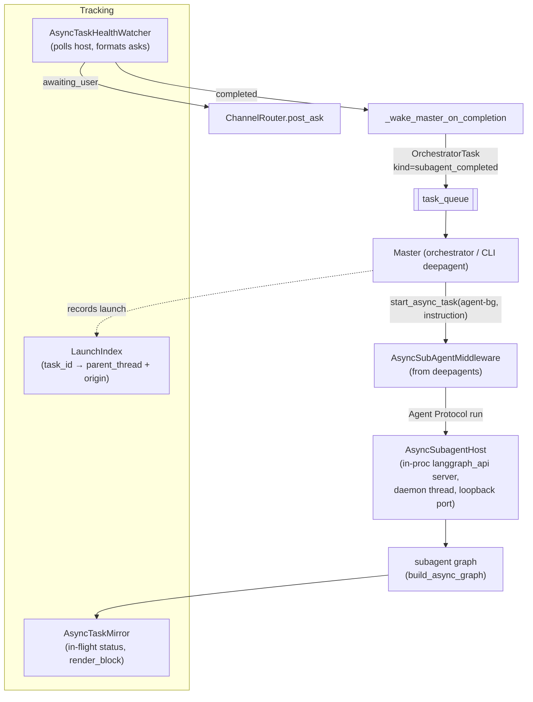

Key pieces:

- **`AsyncSubagentHost`** (`async_subagents/host.py`): runs `langgraph_api`'s
  `run_server` in a **daemon thread** on an internal loopback port. Compiled graphs are
  bridged to the loader via `_lg_graphs` (module attributes resolved on demand). From
  the user's view the daemon is still one process.
- **Host lock (first-come-wins):** if a daemon or another CLI chat already owns the
  host, a new process **attaches to its URL** instead of starting a second one
  (`acquire_or_attach_host`). This is why CLI and daemon share one background host.
- **`LaunchIndex`**: correlates a background `task_id` back to the *conversation that
  launched it* (deepagents' `start_async_task` records no parent), so completion wakes
  the right thread on the right surface.
- **`AsyncTaskMirror`**: cross-turn awareness — its `render_block()` is injected at the
  start of each master turn so the master knows about in-flight background work even
  across fresh `thread_id`s and compactions. Also enforces the concurrency cap
  (`BackgroundTaskCapMiddleware`).
- **`AsyncTaskHealthWatcher`**: polls the host, turns background interrupts into
  cleanly-formatted asks routed through the channel system, and on completion enqueues
  a `subagent_completed` wake-up (which continues the parent thread rather than minting
  a fresh one).

> **Blocking-I/O note.** With the host's `allow_blocking=False`, `langgraph_api`
> installs `blockbuster`, which raises on synchronous blocking I/O run on the event
> loop *process-wide*. The daemon runs **permissive by default** (`allow_blocking=True`)
> because its main loop does benign small file ops; strict mode is an opt-in dev tool
> (`YUYUTSAVA_ALLOW_BLOCKING=0`), and the bootstrap/web/resource paths already wrap
> their few blocking calls in `asyncio.to_thread`.

### Event-loop ownership

The process runs **two asyncio loops**: the main loop (daemon or CLI — the user-facing
uvicorn, orchestrator/triage loops, ConversationManager bundles, sweeper, MCP manager
all live here) and the AsyncSubagentHost's uvicorn loop in the `async-subagent-host`
daemon thread, where the background graphs execute. Cross-*process* attach is URL-only
and never shares Python objects; every hazard is inside the host-owner process, between
its own two loops.

Several resources are **loop-affine** — they bind to the event loop that first uses
them and crash (`RuntimeError: ... attached to a different loop`) or corrupt state when
touched from another: grpc.aio channels inside the Gemini SDK clients, psycopg
`AsyncConnectionPool`s, `httpx.AsyncClient`s, MCP `ClientSession`s (anyio cancel
scopes), and all `asyncio` primitives (Queue/Lock/Event). The rules:

1. **A loop-affine resource is used only on its creation loop.** Anything captured into
   host graphs or their middleware (`_build_host` / `middleware_factory` closures) must
   be plain data, per-loop internally, or built fresh inside `_build_host`.
2. **One `chat_model()` instance per loop.** Every `_build_host` constructs its own
   subagent/compaction models; the `loop_pinned` quirk (`llm/quirks/loop_affinity.py`,
   applied by the vertex + google providers) makes a violation fail immediately with an
   actionable error instead of the cryptic grpc one mid-request.
3. **Shared singletons make their internals per-loop** via `LoopLocal`
   (`yuyutsava/aio/loop_local.py`): `PgPool` opens a lazy secondary pool per extra loop
   (`min_size=0`), `Embedder` keeps one `httpx.AsyncClient` per loop. The Pg stores
   therefore stay freely shareable.
4. **Unduplicatable resources marshal instead:** MCP tool calls from a foreign loop hop
   to the session's home loop via `run_coroutine_threadsafe`
   (`mcp/tool_adapter.py`); plain threads signal a loop via `call_soon_threadsafe`
   (`events/sources/fs.py`).
5. **The checkpointer is exempt:** `build_async_graph` drops it and `langgraph_api`
   injects its own for background runs, so the main-loop `AsyncPostgresSaver` never
   crosses. Teardown of per-loop internals on the host loop is best-effort by design —
   the host thread is a daemon thread that dies with the process.

---

## 12. Streaming & Interrupt Runtime

`core/streaming.py` *drives* the compiled graphs (the engine only builds them). Two
entrypoints share one interrupt-handling core:

| Function | Consumer | Output | Interrupts |
|---|---|---|---|
| `astream_agent` | CLI | prints tokens/tools to stderr | prompts on stdin (`prompt_permission`) |
| `astream_agent_iter` | daemon + conversation | yields typed `StreamEvent`s | `ask_handler` callback (channel-routed) |

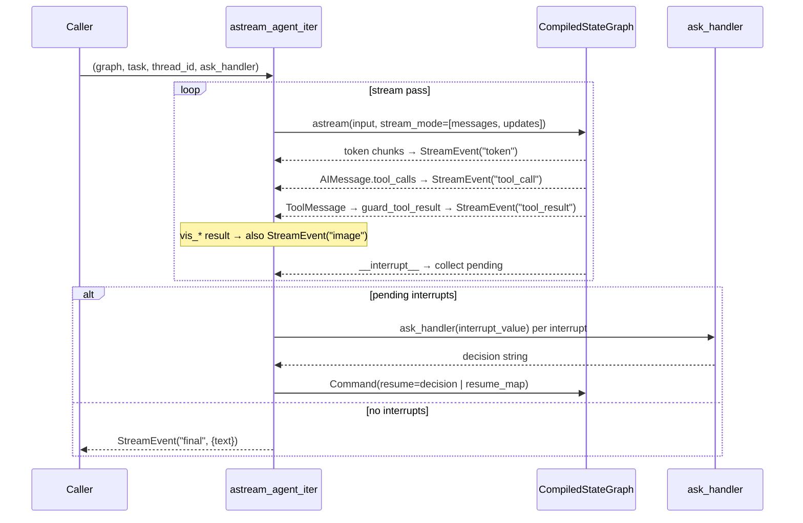

Details that matter:

- **Multi-interrupt correctness:** when more than one interrupt is pending in a pass,
  LangGraph requires `Command(resume={id: value, …})`. The runtime uses the scalar
  form for the common single-interrupt case and the map form otherwise (with careful
  fallbacks for older LangGraph id-less interrupts).
- **Tool-result guarding:** every `ToolMessage` body passes through `guard_tool_result`
  (absolute 100k-char ceiling) before it re-enters state; a 600-char preview is
  streamed, with the full body optionally attached (`keep_full_payloads`) for the
  REPL's `/expand`.
- **Durable resume:** `resume=True` continues a thread from its last checkpoint
  (`input=None`) when resumable state exists, else falls back to a fresh run.
- **Interrupt types** (`models/interrupts.py`): `user_question` (tr_ask_user /
  ask_user), `task_runner_permission` (filesystem gate), and the bare
  `PermissionRequestInterrupt` (dangerous-command middleware). Every interrupt is
  optionally persisted to the audit DB (`InterruptsStore`).

---

## 13. Channels & Communication Surfaces

The daemon talks to the user **only** through `UserChannel` implementations. This is
what lets the same orchestrator serve a terminal, an Electron window, a phone, a voice
overlay, and Telegram without any awareness of transport.

```
                         ┌───────────────────────────────┐
                         │        ChannelRouter          │
                         │  post_event → fan-out to ALL   │
                         │  post_ask / post_proposal →    │
                         │   origin-first, then primary,  │
                         │   then the rest                │
                         └───────────────┬───────────────┘
        ┌──────────────┬─────────────────┼──────────────┬───────────────┐
        ▼              ▼                 ▼              ▼               ▼
  ┌───────────┐  ┌───────────┐    ┌────────────┐  ┌───────────┐  ┌─────────────┐
  │WebChannel │  │Terminal   │    │VoiceChannel│  │CliRemote  │  │Telegram     │
  │(SSE hub)  │  │Channel    │    │(TTS/STT)   │  │Channel    │  │(plugin)     │
  │  primary  │  │ fallback  │    │  optional  │  │ (attach)  │  │             │
  └───────────┘  └───────────┘    └────────────┘  └───────────┘  └─────────────┘
```

Three message flavours (`daemon/channels.py`):

- **`post_event(ChannelEvent)`** — broadcast to *all* channels. Payloads are typed
  frozen dataclasses with a `kind` discriminator: `log`, `token`, `tool_call`,
  `tool_result`, `timeline`, `http_log`, `system_metrics`, and the
  `async_task_*` family. Events carry `task_id`/`session_id` so the SSE stream can be
  filtered per task.
- **`post_proposal(Proposal)`** — Tier-1; blocks until a user decides or it expires.
- **`post_ask(AskPrompt)`** — Tier-2; blocks until a user answers.

**Origin-aware HITL routing** is the clever bit: `SessionOriginMap` records which
channel a run's `thread_id` came from, so a CLI-issued task gets its permission prompt
back *in the same CLI session* even when the Electron renderer is also live. Routing
order for asks/proposals is: origin channel → primary (`web`) → everything else;
channels that `raise NotImplementedError` are skipped.

The **channel-plugin** system (`channels/`) lets external surfaces (Telegram) register
at boot via `ChannelPluginRegistry`; their inbound messages land on the same
`DecisionService`/`TaskSubmissionService` code path as HTTP.

---

## 14. Web API Layer (FastAPI + SSE + WebSocket)

`daemon/web/` is a modular FastAPI app. `app.create_app()` wires routers, attaches the
daemon singletons to `app.state` for `Depends(...)`, and mounts **every API router
twice**: canonically under `/v1` (what `/openapi.json` documents and the mobile TS
client generates from) and unprefixed as a legacy alias (so the Electron renderer keeps
working untouched).

### 14.1 Router map

```
health · server_info · stream · proposals · rules · decisions · sessions
skills · config · logs · cli_attach · tasks · channels · usage · system
converse · visuals · feedback · db (opt-out via env) · static_files
```

### 14.2 The SSE hub

`services/stream_service.py` holds the broadcast machinery:

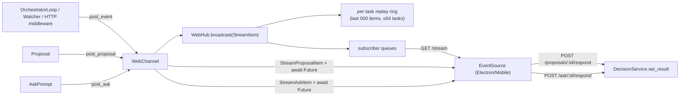

- **`WebHub`** keeps the SSE subscriber queues, the pending proposal/ask **Futures**,
  and a **per-task replay ring** so a mobile client that reconnects mid-task can
  backfill (`GET /tasks/{id}/events`) before resuming the live stream.
- **`WebChannel`** implements `UserChannel`: `post_proposal`/`post_ask` create a Future,
  broadcast the item, and `await` the Future. When *any* surface answers (or it
  expires), `resolve_ask`/`resolve_proposal` broadcasts a `*_resolved` item so the
  card/prompt clears on **every** surface in sync — this is what makes "answer from
  anywhere" consistent.

### 14.3 The converse WebSocket (`WS /ws/converse`)

Interactive text + voice conversations run over one WebSocket, driven by
`ConversationService` (built lazily via `ConversationManager` so the handshake stays
instant). Wire protocol:

```
client → server:   user_text · audio · audio_end · ask_response · interrupt · ping
server → client:   hello · transcript · speech_started · speaking_start/end ·
                   audio_chunk · token(log) · ask · clarify · turn_end · pong · error
```

Voice turns add a `VoicePipeline` (per connection): mic PCM → VAD → STT → agent →
sentence-chunked TTS → PCM back to the client.

---

## 15. The Context Controller

Long conversations blow up token cost. The `context/` package keeps each turn's prompt
bounded through three cooperating middlewares (order is load-bearing — offload runs on
the *tool path* before the compactor ever counts tokens):

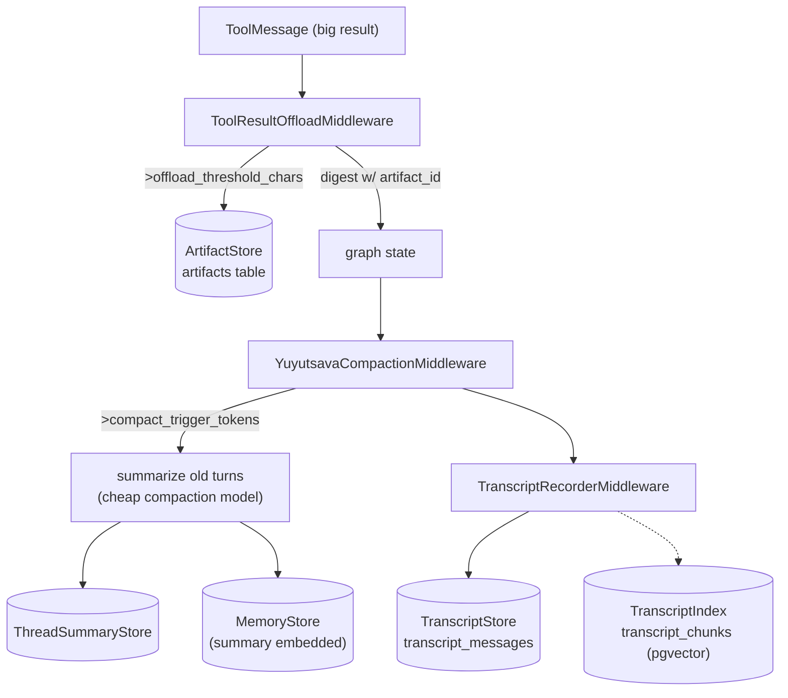

- **Offload** (`offload_middleware.py` + `artifacts.py`): a tool result larger than
  `offload_threshold_chars` is written to the `ArtifactStore` and replaced in state by
  a short digest referencing an `artifact_id`. The agent reads slices back via the
  always-visible `ctx_fetch_artifact` / `ctx_grep_artifact` tools. On Postgres the
  artifact body is also chunked + embedded so `ctx_recall` can semantically search past
  offloaded results.
- **Compaction** (`compaction.py`): when the running prompt exceeds
  `compact_trigger_tokens`, old turns are summarized by a cheap **compaction-role**
  model (`COMPACTION_LLM_PROVIDER=ollama …`), keeping the last `keep_messages`. The
  summary persists to the `ThreadSummaryStore` and is embedded into memory.
- **Transcript** (`transcript_store.py` + `transcript_index.py`): the full verbatim
  conversation is persisted to `transcript_messages` (durable beyond checkpoint sweeps).
  On Postgres each turn is chunked into `transcript_chunks` so a resumed session can
  **recall its own earlier turns** even after the checkpoint is swept (the
  `ConversationInjector`).

Artifacts and transcript are *scratch/durable* respectively: artifacts are swept on a
7-day TTL by the `UnifiedSweeper`; transcript rows are user history.

---

## 16. Memory, Skills & Retrieval (pgvector)

### 16.1 Shared retrieval engine

`retrieval/` is a reusable pgvector engine (chunking, vector literal encoding,
`PgVectorSearch`/`PgVectorTable`, keyword fallback) shared by **memory**, **skills**,
**artifacts (`ctx_recall`)**, and the **transcript index**. One `Embedder` per process
(default `nomic-embed-text`, `vector(768)`) is shared across all of them.

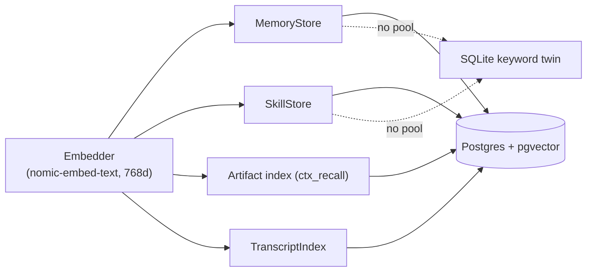

### 16.2 Memory

`memory/store.py` — durable facts, preferences, and **task outcomes**. Default-on when
Postgres is live (`PgMemoryStore` with dedup + min-score); falls back to a SQLite
keyword store otherwise. Tools: `mem_search`, `mem_save`, `mem_pct`. The orchestrator
loop writes a `task_outcome` memory after each successful task, and the
`MemoryInjector` surfaces relevant memories into the master prompt by similarity to the
task text.

### 16.3 Skills

`skills/` — reusable "how-to" procedures on disk (bundled + personal +
workspace-scoped), scanned by `SkillRegistry`, and mirrored into a semantic
`SkillStore` (`SkillIndexer.sync`). The `SkillInjector` injects only the
task-*relevant* skills into the prompt (semantic recall), replacing the old
dump-everything catalogue. A subagent only sees the `ws_*` tools its *visible skills*
declare via `requires_tools` frontmatter — a data-driven, minimal toolset.

### 16.4 Per-turn injection

Because the CLI deepagent is a persistent graph (it can't inject at build time the way
the per-task orchestrator does), `RetrievalInjectionMiddleware` runs the injectors
(`MemoryInjector`, `SkillInjector`, `ConversationInjector`) **each turn** against the
user's latest message.

---

## 17. The Model Layer (Providers, Roles, Routing, Cost)

### 17.1 Providers

`core/config.py` + `core/llm.py` support **twelve** providers behind a structural
`LlmSettings` protocol. OpenAI-compatible ones share the `ChatOpenAI` path; native SDK
ones are lazy-imported (install the matching extra):

```
OpenAI-compatible (ChatOpenAI + base_url):
    groq · openrouter · ollama · openai · openai_compatible
Native SDK (dedicated factory branch):
    anthropic · google/gemini · vertex · bedrock · azure · mistral · cohere
```

### 17.2 Per-role overrides

`llm_settings_from_env(role)` reads `<ROLE>_<NAME>` first, then `<NAME>`. This lets each
daemon role run a different provider/model without touching the others:

```
LLM_PROVIDER=anthropic         ANTHROPIC_MODEL=claude-…       # main / default
TRIAGE_LLM_PROVIDER=ollama     TRIAGE_OLLAMA_MODEL=llama3.2:3b
ORCHESTRATOR_LLM_PROVIDER=groq ORCHESTRATOR_GROQ_MODEL=…
SUBAGENT_… · COMPACTION_… · TIER_LIGHT_… · TIER_STANDARD_… · TIER_HEAVY_…
```

Roles used in the daemon: `triage`, `orchestrator`, `subagent`, `compaction`, and the
three routing tiers.

### 17.3 Complexity-based routing (Phase 4)

`core/model_router.py`. Tasks carry a **complexity score 1–5** (triage self-scores
organic events; a cheap light-tier `ComplexityScorer` scores direct submissions). When
`YUYUTSAVA_MODEL_ROUTING=1`, the score maps to a tier via
`YUYUTSAVA_ROUTING_THRESHOLDS="2,3"`:

```
complexity ≤ 2 → light      (e.g. local Ollama 3B)
complexity ≤ 3 → standard   (e.g. Groq 70B)
else           → heavy      (e.g. Anthropic)
```

Because the orchestrator builds a **fresh graph per task**, per-task model selection is
free. Routing off (default) or a misconfigured tier → the booted role model, byte-for-
byte the pre-routing behaviour (routing must never make a runnable task unrunnable).

### 17.4 Cost accounting

A `UsageRecorder` middleware rides every model call and writes one `llm_usage` row
(`daemon/usage.py`). `estimate_cost_usd` uses the `PRICES` table (USD per 1M
input/output tokens, longest-prefix wins), overridable via
`~/.yuyutsava/model_prices.json`; `core/pricing.py` best-effort fetches live prices and
caches them.

---

## 18. Tool System & Progressive Discovery

Injecting every tool's full JSON schema into the prompt is expensive and confusing. The
`ToolRegistry` (`core/tool_registry.py`) implements **three-tier progressive
discovery**:

```
Tier-0  catalog_block()   cheap "name: blurb" list, always in the system prompt
Tier-1  tool_search(q)    'select:name' exact fetch OR a bounded, ranked keyword search
Tier-2  full JSON schema  materialised one matched tool at a time on expand
```

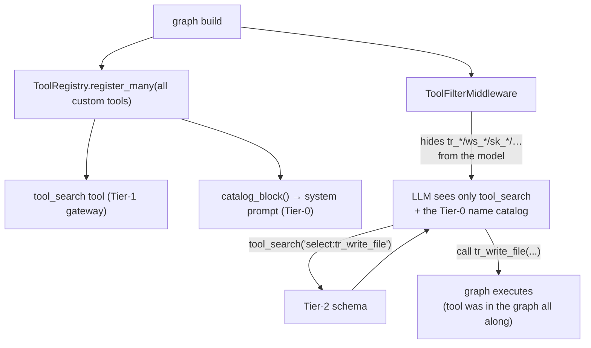

The trick: **all** custom tools are registered in the graph (so LangGraph can execute
them), but `ToolFilterMiddleware` hides everything except `tool_search` from the model.
The model discovers a schema on demand, then calls the tool — which was there for
execution the whole time. `discovery/` provides the keyword + vector search behind
`tool_search`.

---

## 19. Storage Architecture

Two backends, one interface. **SQLite is the zero-config default**; **Postgres +
pgvector** is the durable/semantic mode (`YUYUTSAVA_STORAGE_BACKEND=postgres`).

### 19.1 On-disk SQLite files (`storage/paths.py`)

```
~/.yuyutsava/                          (state_dir, override YUYUTSAVA_HOME)
├── sessions.db        CLI session index
├── state.db           events · proposals · decisions · consent rules/grants ·
│                       quotas · prefs · artifacts · summaries · transcript ·
│                       memories/skills (keyword twins) · usage · tasks · visuals …
├── checkpoints.db     LangGraph AsyncSqliteSaver (graph state across interrupts)
├── interrupts.db      HITL interrupt audit log
├── blobs/             webcam JPEGs, audio clips (swept on TTL)
├── .env               app-managed config (Settings UI writes; loaded last, override)
├── permissions.json · channels_config.json · mcp config · model_prices.json
└── skills/            personal skills
```

### 19.2 Postgres schema (migrations v1–v15)

`storage/pg/migrations.py` — forward-only, numbered, applied under a `pg_advisory_lock`,
version-anchored in `schema_meta`. Tables:

```
artifacts · artifact_chunks · thread_summaries · transcript_messages · transcript_chunks
memories · skills · consent_grants · consent_rules · proposals · decisions · event_payloads
tasks · llm_usage · tool_call_counters · interrupts · sessions · user_prefs
visual_artifacts · message_feedback · voice_messages · threads (relational hub) · schema_meta
```

`memories.embedding` is `vector(768)` (nomic-embed dimensionality). A `threads`
relational hub (v4/v5) ties every child table onto one thread via foreign keys.

### 19.3 Spillover failover (`storage/routing/`)

For REST-path writes made *outside* a checkpointed turn (the 👍/👎 feedback endpoint,
the `/visuals` API, the events store), a Postgres blip would lose the write. `RoutedStore`
wraps a **Postgres primary + a SQLite buffer** sharing one `StorageHealth`:

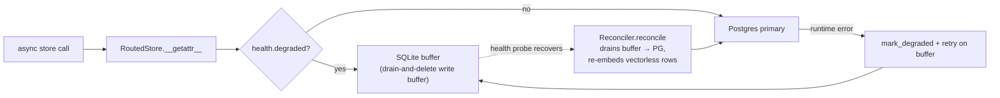

The SQLite buffer is a **drain-and-delete write buffer, not a mirror**: on recovery the
`Reconciler` moves buffered rows back into Postgres and re-embeds any vectorless
memory/skill rows via their `backfill_embeddings()`. Degrade/recover both post a
timeline notice so a Postgres outage is **never silent**.

> Note: the context stores (artifacts/summaries/transcript) are *not* RoutedStore-
> wrapped — they're written only *inside* a checkpointed turn, and if Postgres is down
> the (PG) checkpointer fails the turn anyway, so a buffer would never be reached. They
> stay PG-primary / SQLite-fallback-at-boot.

### 19.4 The unified sweeper

`storage/sweeper.py :: UnifiedSweeper` runs one loop that enforces TTLs across three
kinds of target: stale LangGraph checkpoints, on-disk blobs (webcam frames at ~1h;
deepagents scratch dirs at 24h), and artifact rows (7 days). Enrolled-faces data is
*never* swept — that's user data. Session deletion has its own shared `purge_session`
(`storage/purge.py`) called by both the CLI and `DELETE /sessions/{id}`.

---

## 20. Visuals Subsystem

`visuals/` turns agent output into rendered images. Eight `vis_*` tools are always
available (like `ctx_*`/`mem_*`), to the master and every subagent:

```
vis_chart · vis_diagram · vis_table · vis_code · vis_math · vis_timeline
vis_list_artifacts · vis_show_artifact
```

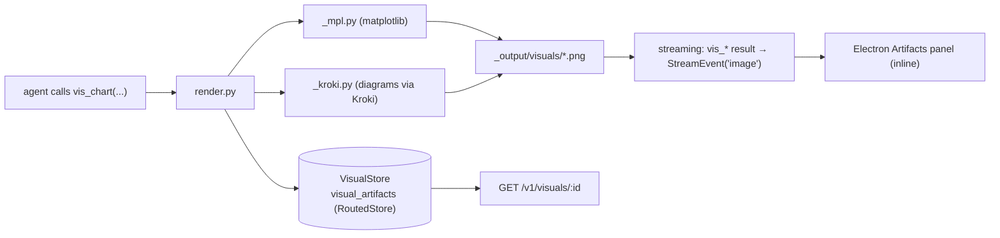

Files land in the workspace `_output/visuals` (so the CLI can point the user at them)
and are indexed in the `VisualStore`, so a chart made by a background subagent shows up
in the UI Artifacts panel exactly like one made by the master. Backends: matplotlib for
charts/tables/math, Kroki (`docker-compose.kroki.yml`) for diagrams.

---

## 21. Voice Subsystem

A Siri-like voice loop reuses the same conversational deepagent. Two halves:
**capture/wake** (mic → wake word → utterance) and **converse** (STT → agent → TTS).

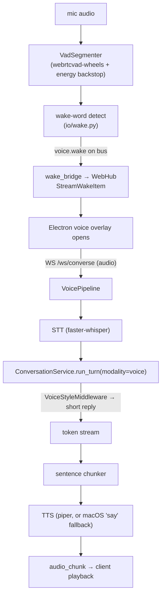

Design points:

- `audio_io/` owns the audio domain (VAD, earcons, announcer, sentence chunking,
  `synthesize_pcm`); `io/` holds the swappable STT/TTS/wake backends built from env.
- **VAD hardening:** `webrtcvad-wheels` (the `pkg_resources`/`setuptools≥81` breakage in
  plain `webrtcvad` caused an energy-VAD flood) + a minimum-utterance guard so tiny
  clips aren't hallucinated into text.
- **Zero-config fallback:** if no `PIPER_MODEL` is set, macOS `say` is used for TTS.
- **Two-stage wake:** an `open` stage pops the overlay instantly on detection; a
  `command` stage carries the same-breath trailing command (seeded as the first turn).
- Voice is **disabled by default** (privacy); enable with `yuyutsava daemon --voice`.

---

## 22. Electron Frontend Architecture

```
electron-app/
├── src/main/                       Electron main process (Node.js)
│   ├── index.js                    app entry
│   ├── daemon.js                   spawn/manage the Python daemon, ping /health
│   ├── ipc-handlers.js             daemon:start/stop/restart/port · settings:get/save
│   ├── tray.js · notifications.js  tray badge, OS notifications
│   ├── settings.js                 settings persistence
│   ├── overlay.js                  voice overlay window
│   └── preload.js                  safe window.electronAPI bridge (no direct Node in renderer)
└── src/renderer/                   React + Vite (renderer process)
    ├── App.jsx · main.jsx          shell
    ├── hooks/  useSSE · useConverse · useSettings · useTheme · useFocus · useNotifications
    ├── api/    sse.js · client.js · converse.js
    ├── audio/  capture.js · index.js (mic capture + playback)
    └── components/
        ├── chat/            ChatPanel · Markdown · MessageImages · MessageActions
        ├── proposals/       ProposalsPanel · ProposalCard · AskCard · CountdownBadge
        ├── background-tasks/ TaskRow · TaskDetail
        ├── artifacts/       ArtifactsPanel · Lightbox · VisualActions
        ├── voice/           VoiceOverlay · VoiceOrb · VoicePanel · WakeWordOnboarding
        ├── sessions/        SessionsPanel · SessionRow
        ├── settings/        SettingsPanel · WatchedDirsEditor · WakeWordsEditor
        └── layout/          Titlebar · ActivityLog · navIcons
```

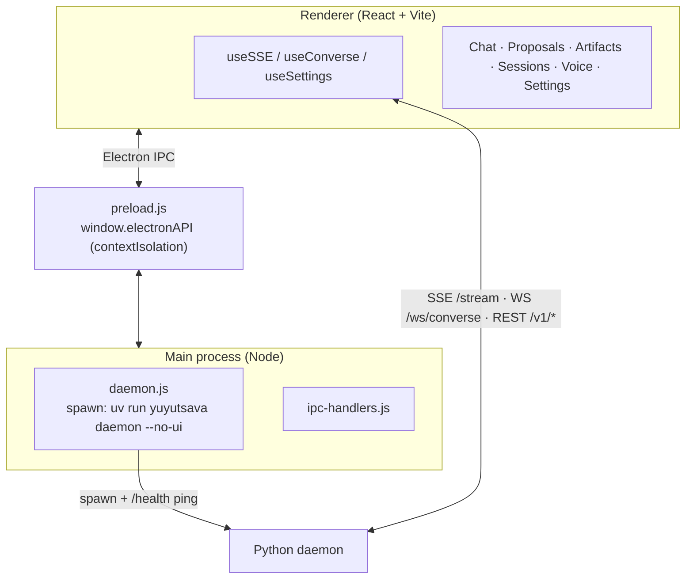

The main process **owns the daemon lifecycle** (spawns it with settings as env vars,
pings `/health`, restarts it). The renderer never touches Node directly — `preload.js`
exposes a narrow `window.electronAPI`. The renderer talks to the daemon over
loopback HTTP: SSE for the live event/proposal/ask stream, WebSocket for
text/voice conversation, REST for everything else. A separate **mobile client**
(TypeScript, in a sibling repo) generates from `/v1/openapi.json` and speaks the same
API over the host's tailnet with bearer auth.

---

## 23. Platform / OS-Invariance Layer

`platform/` is the **only** OS-specific code in the tree. Everything else stays portable
by going through it:

| Module | Responsibility |
|---|---|
| `filelock.py` | Cross-platform advisory file locks (daemon + host singletons) |
| `hostprofile.py` | `HostProfile`: native shell, system-critical prefixes, a "host passport" prompt block injected into agent prompts |
| `elevation.py` | Admin/root elevation detection + elevated-command handling |
| `process.py` | `pid_alive`, `terminate_pid`, `spawn_detached`, `kill_tree` (used to spawn/tear down the Electron subtree cleanly) |

Because of this layer, `tr_grep`/`tr_fetch_url`/`tr_run_python` are pure-Python and
portable, native shell commands go through the `HostProfile`, zone classification uses
per-OS critical prefixes, and Windows Electron packaging works from the same codebase.

---

## 24. Security Design

- **Loopback by default.** The FastAPI app **refuses to bind** to a non-loopback host
  unless bearer-token auth is active (`create_app` raises otherwise) — a network-exposed
  unauthenticated API is structurally impossible.
- **Bearer auth for network binds.** Non-loopback binds (e.g. a Tailscale address for
  the mobile app) require `YUYUTSAVA_API_TOKEN` (auto-generated to
  `~/.yuyutsava/api_token`). The access log drops the query string off-loopback because
  `/stream?token=` would otherwise leak it.
- **CORS locked** to `http://localhost` / `http://127.0.0.1` (any port) unless
  `YUYUTSAVA_CORS_ORIGINS` explicitly overrides.
- **Permission-first execution.** Nothing writes/deletes/executes without a standing
  rule or an explicit approval (Sections 9–10).
- **Sandbox scoping.** `LocalShellBackend` runs in `virtual_mode`, workspace-scoped;
  `DockerSandboxBackend` isolates in an ephemeral container with memory/CPU/PID limits
  and an optional `network: none`.
- **Privacy by default.** Webcam frames are swept after ~1h; voice is off unless
  `--voice`; enrolled-face data is never swept.
- **Singleton locks** prevent duplicate daemons/hosts corrupting shared state.

---

## 25. Startup & Shutdown Sequences

### 25.1 Startup (Electron-launched)

```
1. Electron main reads settings.json (port, API keys, model names)
2. daemon.js pings GET /health
3.   ↳ not reachable → spawn: uv run yuyutsava daemon --no-ui --workspace <cwd>
4. Python daemon:
     a. load .env (project) then ~/.yuyutsava/.env (override)
     b. acquire_daemon_lock (singleton) → write discovery JSON
     c. build_daemon(): storage → stores → policy/consent → MCP → checkpointer
        → sweeper → bus → sources → channels → models → skills → subagents
        → [async host] → triage → orchestrator → web app
     d. install signal + SIGHUP handlers
     e. schedule loops: triage · orchestrator · sweeper · resource-monitor
        · reload · uvicorn · wake-bridge
     f. resume_interrupted_tasks()
5. Electron renderer loads → useSSE opens EventSource GET /stream
6. Server sends event: hello → UI shows "Connected"
7. Daemon streams all activity over SSE in real time
```

### 25.2 Shutdown (ordered teardown)

```
SIGTERM/SIGINT → stop_event.set()
  → registry.stop_all()      (no new events)
  → bus.close()              (wake triage loop's async-for)
  → drain loops (10s timeout, then cancel)
  → _shutdown_ui()           (kill_tree the vite+electron subtree)
  → async_task_watcher.shutdown() → release_host_lock()
  → channel_plugins.stop_all() → channels.shutdown()
  → mcp_manager.stop() → checkpointer_saver.stop() → store.stop()
  → storage_health.stop() → embedder.aclose() → pg_pool.close()
  → release_daemon_lock()
  → (re-exec if a config reload was requested)
```

---

## 26. End-to-End Walkthroughs

### 26.1 A file lands in ~/Downloads (autonomous, daemon)

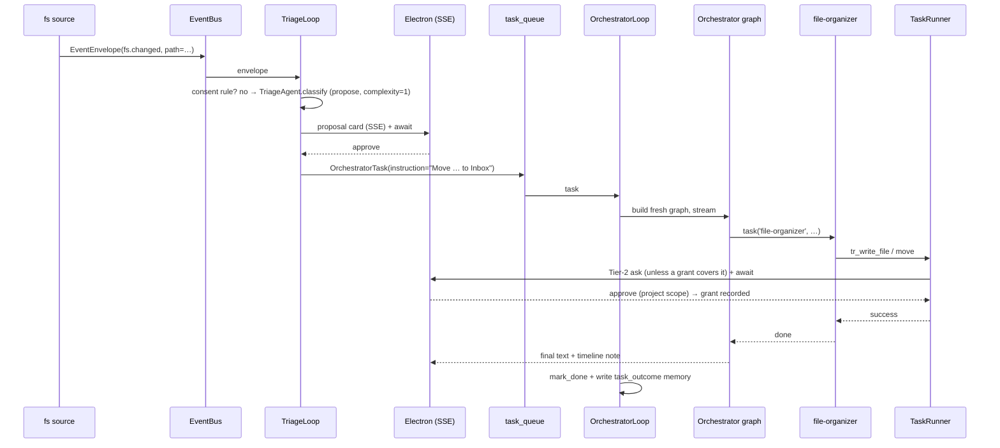

### 26.2 A voice command (daemon)

```
wake word → overlay opens → WS /ws/converse (audio)
  → VAD segments utterance → STT → text
  → ConversationService.run_turn(modality="voice")
      → shared deepagent (VoiceStyleMiddleware trims reply)
      → tokens → sentence chunks → TTS → audio_chunk frames
  → background work? start_async_task → watcher wakes the session on completion
```

### 26.3 A one-shot CLI task

```
yuyutsava "summarise report.pdf"
  → build_agent_stack → build_cli_deepagent (one graph, MemorySaver)
  → astream_agent (prints to stderr, prompts on stdin for permissions)
  → tr_read_file (workspace zone → allowed) → LLM summary → final text to stdout
  → cleanup_local_sandbox (delete _sandbox + deepagents scratch)
```

---

## 27. Key Design Decisions

| Concern | Decision |
|---|---|
| Context cost | **Fresh `thread_id` per daemon task** + offload/compaction for long chats — cost stays flat regardless of uptime. |
| LLM provider | Structural `LlmSettings` protocol → 12 providers, swappable per role via `<ROLE>_` env prefixes. |
| Model economy | Complexity-based routing (light/standard/heavy) — free because the orchestrator rebuilds per task. |
| Permission safety | Three layers: Tier-1 proposals, Tier-1.5 policy, Tier-2 asks backed by a scoped allowlist. |
| Surface independence | Orchestrator talks only to `UserChannel`; new surfaces (voice, Telegram, mobile) plug in without touching agents. |
| Answer-from-anywhere | `WebHub` broadcasts `*_resolved` so a decision on any surface clears the prompt everywhere. |
| Origin-aware HITL | `SessionOriginMap` routes a run's prompts back to the surface that started it. |
| Tool context | Progressive discovery (`tool_search` + `ToolFilterMiddleware`) keeps schemas out of the prompt until needed. |
| Durability | SQLite zero-config default; Postgres+pgvector durable mode; `RoutedStore` spillover so a PG blip never loses REST-path writes. |
| Background work | In-process LangGraph host (first-come-wins), watcher wakes the launching conversation on completion. |
| Long-run resume | Task registry + persisted `thread_id` → interrupted tasks resume from their last checkpoint after a restart. |
| OS invariance | All OS-specific code confined to `platform/`; everything else portable. |
| Single-process feel | Async subagent host runs in a daemon thread on an internal loopback port — invisible to the user. |
| Network safety | Refuse non-loopback bind without bearer auth; CORS locked to loopback by default. |

---

## 28. On-Disk Layout & Config Files

| Path | Purpose |
|---|---|
| `~/.yuyutsava/sessions.db` | CLI/conversation session index |
| `~/.yuyutsava/state.db` | events, proposals, decisions, consent, prefs, artifacts, memory/skill twins, usage, tasks, visuals |
| `~/.yuyutsava/checkpoints.db` | LangGraph checkpointer (graph state across interrupts) |
| `~/.yuyutsava/interrupts.db` | HITL interrupt audit log |
| `~/.yuyutsava/blobs/` | webcam JPEGs, audio clips (TTL-swept) |
| `~/.yuyutsava/.env` | app-managed config (Settings UI writes; loaded last with override) |
| `~/.yuyutsava/permissions.json` | Tier-1.5 policy (auto_approve, ws_* daily caps) |
| `~/.yuyutsava/channels_config.json` | channel plugins (Telegram) |
| `~/.yuyutsava/model_prices.json` | price-table overrides |
| `~/.yuyutsava/api_token` | auto-generated bearer token for non-loopback binds |
| `~/.yuyutsava/skills/` | personal skills |
| `<repo>/yuyutsava/events/events_config.json` | event source config (project artifact, hot-reloadable) |
| `<workspace>/_sandbox/` | ephemeral scratch (deleted after each CLI run) |
| `<workspace>/_output/` | agent deliverables, incl. `_output/visuals/` |

**Key env vars** (non-exhaustive; see `.env.example`):

```
LLM_PROVIDER + provider keys           <ROLE>_LLM_PROVIDER / <ROLE>_<PROVIDER>_MODEL
YUYUTSAVA_STORAGE_BACKEND=postgres     YUYUTSAVA_STORAGE_REQUIRE=1
YUYUTSAVA_MODEL_ROUTING=1              YUYUTSAVA_ROUTING_THRESHOLDS="2,3"
YUYUTSAVA_ASYNC_SUBAGENTS=1            YUYUTSAVA_ALLOW_BLOCKING=0
YUYUTSAVA_MEMORY_ENABLED=0            YUYUTSAVA_DAEMON_HOST / _PORT
YUYUTSAVA_API_TOKEN                    YUYUTSAVA_CORS_ORIGINS
TAVILY_API_KEY / EXA_API_KEY (ws_*)    PIPER_MODEL / STT_PROVIDER (voice)
YUYUTSAVA_EXECUTION=docker + YUYUTSAVA_DOCKER_* (sandbox)
```

---

*This document reflects the current source tree. When you change a subsystem's wiring
(`daemon/bootstrap.py`), a middleware order (`core/engine.py`), a storage migration
(`storage/pg/migrations.py`), or a channel/consent contract, update the corresponding
section here so the map stays true to the territory.*
