# Yuyutsava Daemon — Architecture & Flow Diagrams

---

## 1. System Overview — Component Map

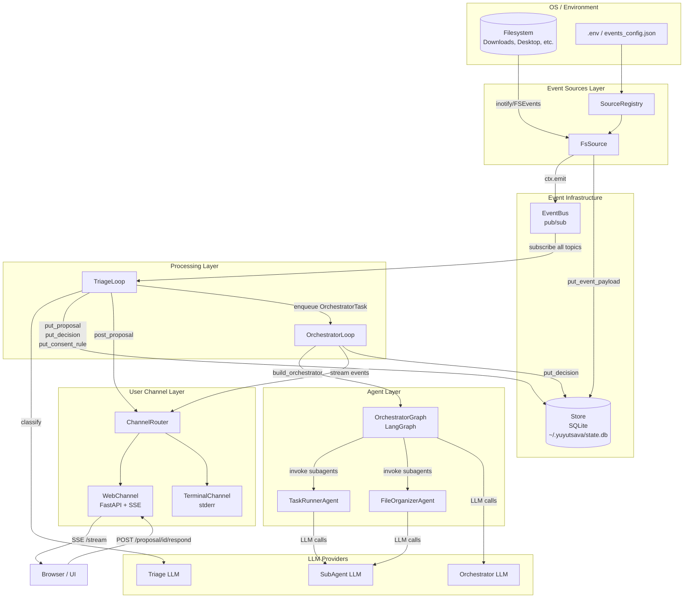

---

## 2. Daemon Boot Sequence

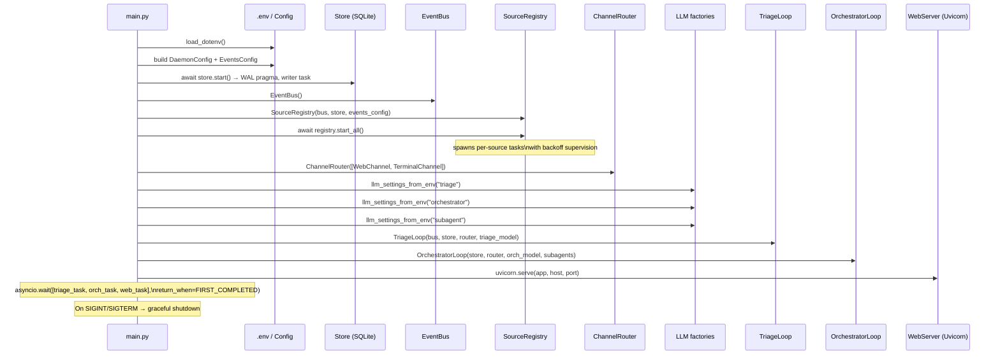

---

## 3. Graceful Shutdown Sequence

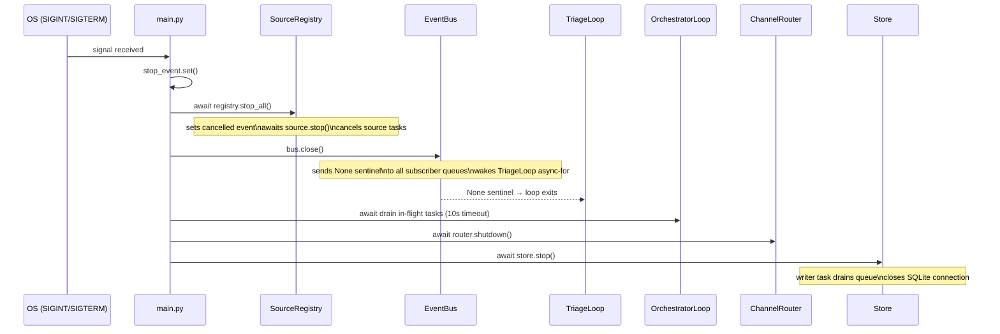

---

## 4. Event Ingestion — Source to Bus

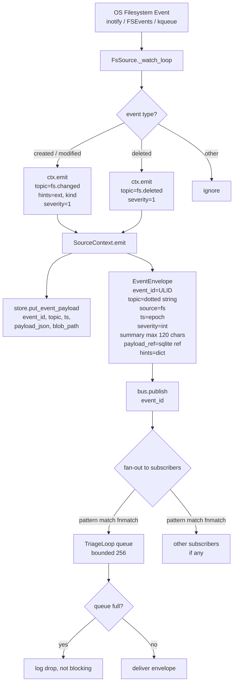

---

## 5. Triage Loop — Full Event Handling Flow

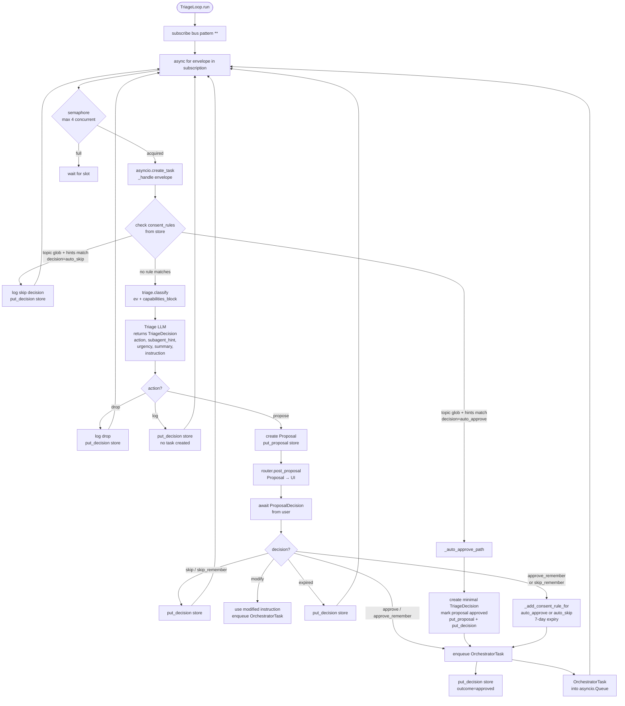

---

## 6. Orchestrator Loop — Task Execution

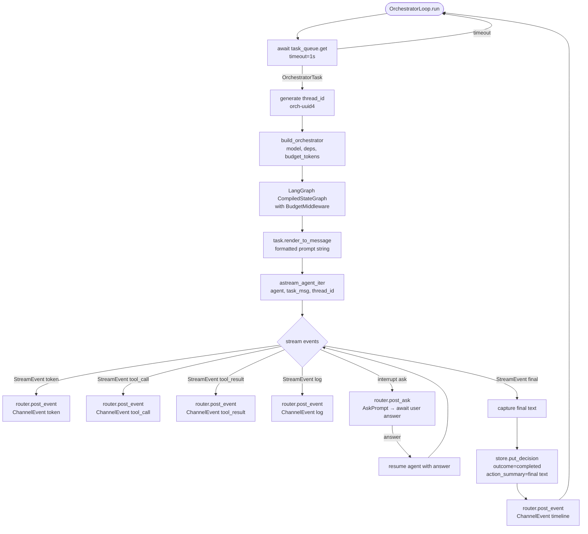

---

## 7. Core Engine — `astream_agent_iter` Internals

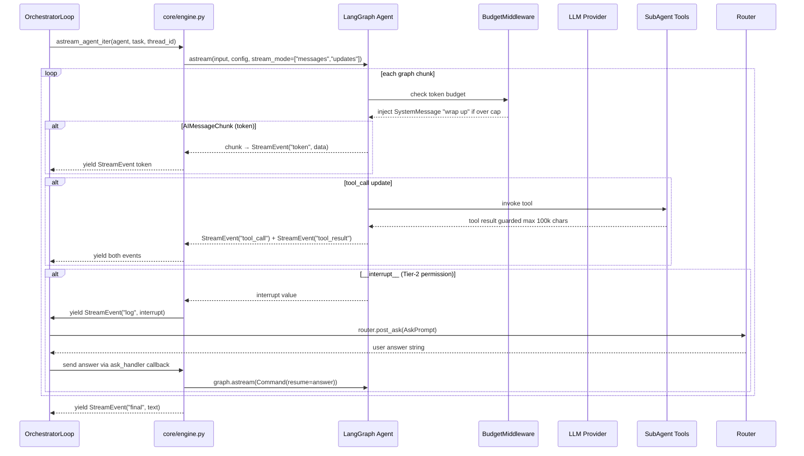

---

## 8. SubAgent Execution — Inside the Orchestrator Graph

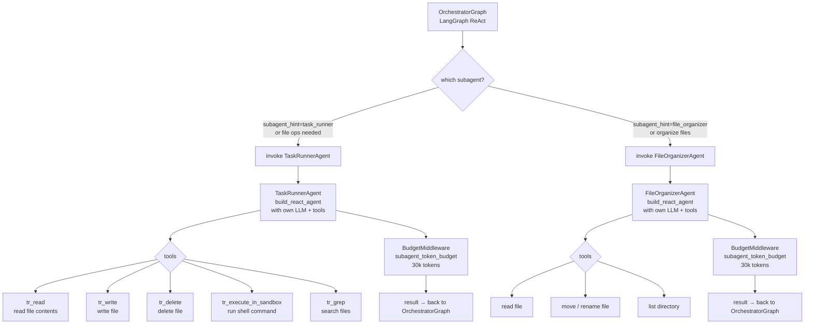

---

## 9. Channel Routing & User Communication

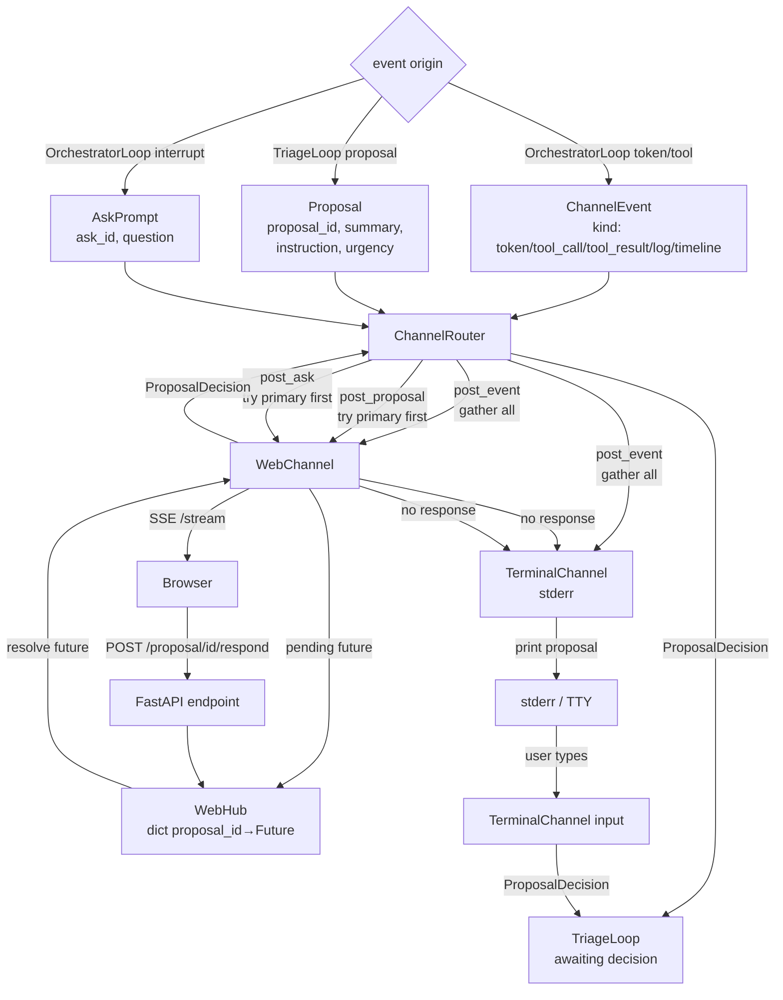

---

## 10. SQLite Store — Data Model & Access Patterns

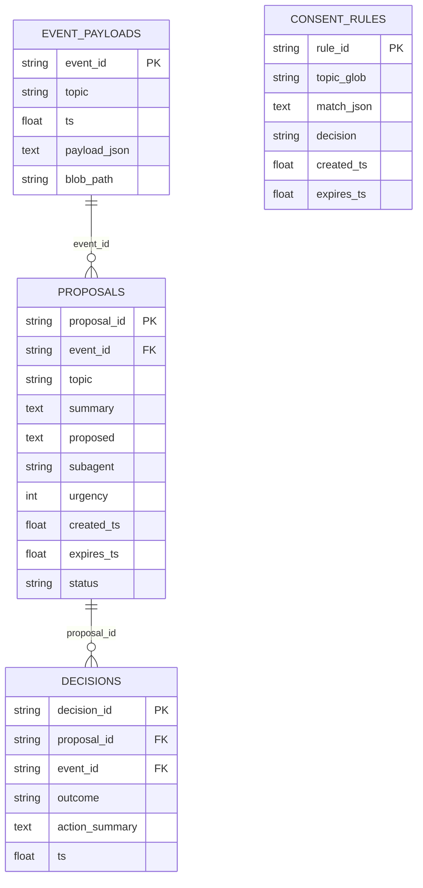

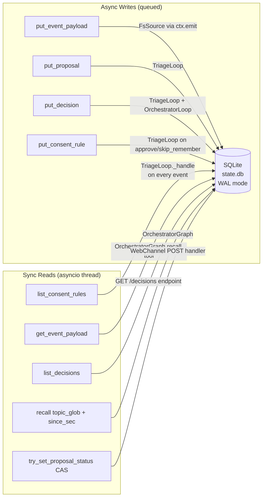

---

## 11. Consent Rule Matching — Triage Decision Tree

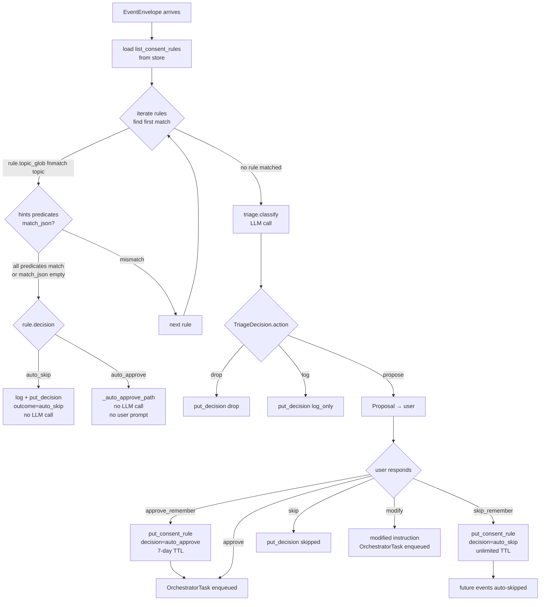

---

## 12. Token Budget Enforcement

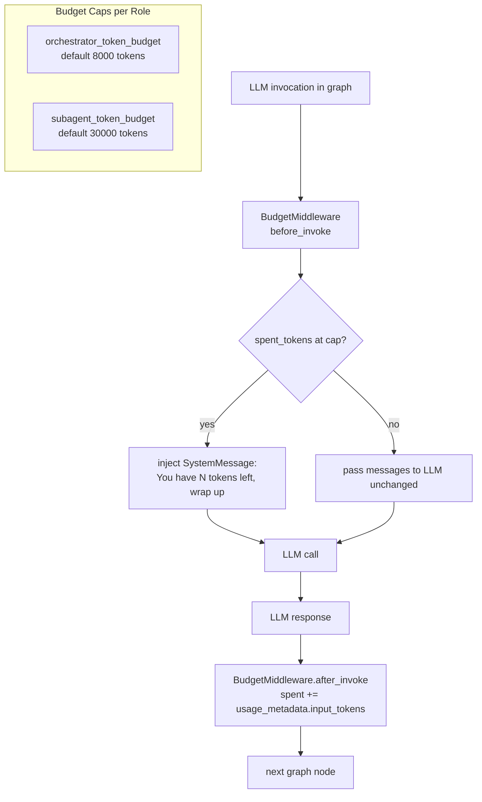

---

## 13. Source Registry — Supervision & Backoff

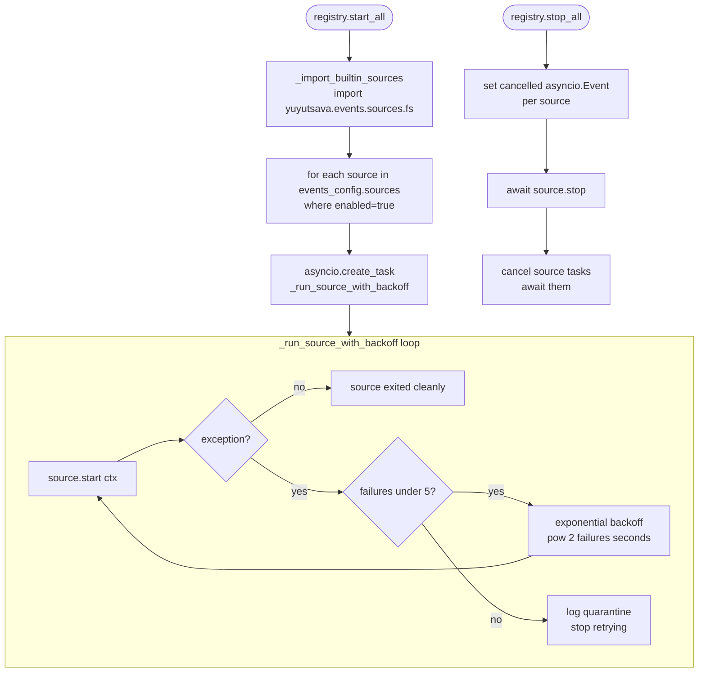

---

## 14. End-to-End Flow — File Downloaded to Task Completed

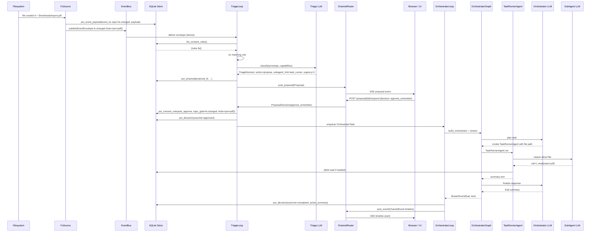

---

## 15. Key Invariants & Design Principles

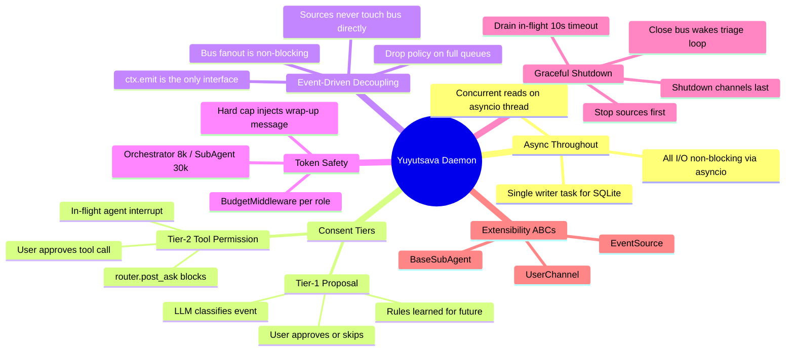
