# YUYUTSAVA Master Plan: Context Controller · Postgres · Channel Plugins · Model Routing · Resource Governor · Mobile API

> **HOW TO USE THIS DOCUMENT (read first, every session)**
>
> This plan will be executed across **multiple chat sessions** (Pro plan limits). Each session may be a fresh model (Opus) with zero memory of previous sessions. Therefore:
>
> 1. **Progress tracking**: Maintain `docs/IMPLEMENTATION_PROGRESS.md` in the repo. At the start of every session, READ it. At the end of every work block, UPDATE it (check off completed items, note any deviations from this plan and WHY). Each phase below has a "Definition of Done" checklist — copy it into the progress file when starting a phase.
> 2. **Do not re-explore the codebase from scratch** — the "Verified Ground Truth" section below was verified against the actual code and installed packages on 2026-06-11. Trust it unless the progress file says it changed.
> 3. **Work one phase at a time, in order** (dependency graph in §Sequencing). Within a phase, follow the numbered sub-steps. Every phase must leave `main`/the working branch shippable (feature flags listed per phase).
> 4. **Quality bar**: production-grade. Type hints everywhere, docstrings matching the existing style (see any file in `yuyutsava/storage/`), unit tests for every new module under `test/` mirroring package paths, no silent failures (log + surface errors via TimelinePayload), follow the codebase conventions in §Conventions exactly.
> 5. Branch naming: `feature/phase-<N>-<slug>` off `yuyutsava-daemon` (current working branch). Commit in small logical units.

---

## 1. Mission & Context

YUYUTSAVA is a **personal AI agent** — a "second hand" to the user — with two entry points sharing one core engine:

- **CLI** (`yuyutsava/cli/`): interactive chat REPL + one-shot tasks.
- **Daemon** (`yuyutsava/daemon/`): runs 24x7, watches the machine (filesystem, clipboard, hotkeys, app focus), triages events with an LLM, asks user consent, and dispatches approved work to an orchestrator agent that can spawn subagents.

The user wants five upgrades, in priority order:

1. **Context Controller (PRIORITY 1)** — production-grade context-window management like Claude Code / Cursor. Today the full message history replays every turn with zero compaction, and huge tool results land verbatim in checkpoints. Requirement: *"even after three cycles the agent should know what is going on"* and *"the user tokens can be saved"* — sensible context, not big vague tool blobs.
2. **Channel Invoke Plugin system** — Telegram / WhatsApp / Gmail / Teams as plugins that can be integrated/disintegrated **on demand at runtime**, with no design lock-in. Channels must both **notify** (outbound) and **invoke** (inbound: submit tasks, answer proposals/asks).
3. **Mobile app (Android)** — connect to the daemon from a phone: see running tasks + progress + live logs, submit tasks, approve asks.
4. **Complexity-based model routing** — the orchestrator delegates to agents and picks the model tier by task complexity (cheap/local for trivial, frontier for complex).
5. **Resource-aware execution** — daemon monitors CPU/memory/disk, estimates task weight, and ensures a heavy task *"should not break anything other going on."*

**Decisions already made with the user (do not re-ask):**

| Decision | Choice |
|---|---|
| Mobile stack | React Native / Expo (TypeScript) |
| Phone↔daemon connectivity | Tailscale (daemon binds tailnet IP, token auth on top) |
| First channel plugin | Telegram bot, long-polling (works behind NAT) |
| Storage | **Postgres primary** (checkpoints + new tables) + pgvector; SQLite stays as zero-config fallback |

---

## 2. Verified Ground Truth (verified 2026-06-11 against code + installed packages)

### 2.1 Installed stack — IMPORTANT, pyproject may mislead

| Package | Installed version | Notes |
|---|---|---|
| langchain | **1.3.1** | `langchain.agents.middleware` exists |
| langgraph | **1.2.1** | (pyproject's "0.4.27" is `langgraph-cli`, not langgraph) |
| langgraph-checkpoint | 4.1.1 | |
| langgraph-checkpoint-sqlite | 3.0.3 | current saver |
| langchain-core | 1.4.0 | |
| deepagents | 0.6.3 | `create_deep_agent(middleware=[...])` accepted |
| fastapi / uvicorn / sse-starlette | present | daemon web server |
| httpx, python-ulid, python-dotenv | present | |
| **langgraph-checkpoint-postgres** | **NOT installed** | new dep, Phase 1 |
| **psycopg[binary,pool]** | **NOT installed** | new dep, Phase 1 |
| **pgvector** | **NOT installed** | new dep, Phase 1 (extra `[memory]`) |
| **psutil** | **NOT installed** | new dep, Phase 5 |

Verified available middleware primitives (`langchain.agents.middleware`):
- `SummarizationMiddleware(model, trigger, keep, token_counter, summary_prompt, trim_tokens_to_summarize)` — trigger forms `("tokens", N)` / `("fraction", f)`, keep `("messages", N)`.
- `ContextEditingMiddleware(edits=[ClearToolUsesEdit(trigger, clear_at_least, keep, clear_tool_inputs, exclude_tools, placeholder)])`.
- `AgentMiddleware` hooks: `before/after_agent`, `before/after_model`, `wrap_model_call`, `wrap_tool_call` + async `a*` variants.

### 2.2 Key files & seams (all paths relative to repo root `$REPO`)

| Seam | Location | Detail |
|---|---|---|
| Middleware wiring (CLI agent) | `yuyutsava/core/engine.py:357` | `middleware = [ToolFilterMiddleware(), FilesystemPromptOverrideMiddleware()]` → passed to `create_deep_agent(middleware=...)` at `:424`/`:447` |
| Middleware wiring (orchestrator) | `yuyutsava/core/engine.py:553` | `master_middleware = [ToolFilterMiddleware(), budget]` → `create_deep_agent` at `:573`; subagent specs get middleware at `:518` |
| Postgres branch point | `yuyutsava/storage/sessions/checkpointer.py:26-30` | `if settings.backend != "sqlite": raise NotImplementedError(... "Add a branch here when you wire Postgres")` |
| Checkpointer lifecycle (daemon) | `yuyutsava/daemon/checkpointing.py` | `CheckpointerSaver` owns AsyncExitStack, hardcodes `AsyncSqliteSaver` |
| Sessions backend config | `yuyutsava/storage/sessions/config.py` | `SessionsSettings.backend` field, env `YUYUTSAVA_SESSIONS_BACKEND` |
| SQLite base + migration lock | `yuyutsava/storage/base.py` | `BaseSqliteStore`, `migration_lock()` / `amigration_lock()`, `_META_TABLE` schema-version pattern |
| **Tool-result guard (BUG CLASS)** | `yuyutsava/core/streaming.py:379-389` | `guard_tool_result()` mutates `ToolMessage.content` on the *streamed* copy — **the checkpoint has already persisted the full blob**. Today's guard protects display only, not context. |
| Tool result limits | `yuyutsava/core/config.py` `LimitsConfig` | `max_tool_result_chars=100_000`, `max_stdout_chars=40_000`, `max_prefs_chars=2_000`, `max_skill_index_chars=8_000` |
| Token budget middleware | `yuyutsava/daemon/budget.py` | `BudgetMiddleware(AgentMiddleware)` uses `aafter_model`, accumulates `usage_metadata.input_tokens` per thread (`_accumulate`); on cap, injects "stop calling tools" SystemMessage. No pruning. |
| Role-based LLM config | `yuyutsava/core/config.py:45` `_env(name, role)` + `llm_settings_from_env(role)` | role prefix → env: `TRIAGE_LLM_PROVIDER`, `ORCHESTRATOR_LLM_PROVIDER`… Providers: Groq / OpenRouter / Anthropic / Ollama |
| Model factory | `yuyutsava/core/llm.py` `chat_model(settings)` | returns ChatAnthropic or ChatOpenAI, max output tokens 4096 |
| Daemon bootstrap order | `yuyutsava/daemon/bootstrap.py` `build_daemon()` | Configs → Store → Prefs → Policy → MCP → Checkpointer → Sweeper → EventBus → SourceRegistry → ChannelRouter → Models → Skills → Subagents → TriageLoop → OrchestratorLoop → WebServer. Returns `DaemonSubsystems` (ordered teardown). Known bug: `DaemonConfig` dataclass default `orchestrator_token_budget=60000` but `from_env` fallback is 8000 — fix while touching. |
| Event bus | `yuyutsava/events/bus.py` `EventBus` | async pub/sub, dotted topics, fnmatch subscriptions, bounded queues (256), drops on overflow |
| Hot-reloadable source registry | `yuyutsava/events/registry.py` `SourceRegistry` + `daemon/bootstrap.py:249` `_hot_reload_events_config` | **the exact pattern to copy for channel plugins**: config-driven start/stop/reload of supervised async tasks |
| Channel routing | `yuyutsava/daemon/channels.py:255` `ChannelRouter` | routes `ChannelEvent` / `Proposal` / `AskPrompt` to `UserChannel` impls (WebChannel, TerminalChannel, VoiceChannel). `session_origin` duck-type map at `:277-281`: `get(session_id) -> channel_name` to prefer a channel for asks. **No register/unregister methods yet** — `daemon/web/routers/cli_attach.py` mutates channel list by hand (precedent to formalize). |
| Web app factory | `yuyutsava/daemon/web/app.py:52-56` | **hard-refuses non-loopback binds**; no auth exists |
| SSE hub | `yuyutsava/daemon/web/services/stream_service.py` `WebHub` | SSE broadcast; `pending_proposals`/`pending_asks` as `asyncio.Future` keyed by id; `StreamItem.to_wire_dict()` is the wire schema |
| Proposal/ask respond | `yuyutsava/daemon/web/routers/proposals.py` | resolves WebHub futures — logic must be extracted to a shared service in Phase 3 |
| Orchestrator loop | `yuyutsava/daemon/orchestrator_loop.py` `_run_task` | pops `OrchestratorTask` from asyncio.Queue, builds **fresh** OrchestratorGraph + fresh thread_id per task (`recursion_limit=40`), streams via ChannelRouter, writes Decision on completion. Fresh-graph-per-task means **per-task model selection is free** (Phase 4). |
| Triage | `yuyutsava/daemon/triage_loop.py` + `yuyutsava/agents/triage/agent.py` | LLM classify → `TriageDecision` → consent rules → Proposal → enqueue OrchestratorTask |
| Tool registry / lazy discovery | `yuyutsava/core/tool_registry.py` + `yuyutsava/core/tool_filter_middleware.py` | tools hidden until `tool_search(pattern)`; prefixes `tr_` `ws_` `sk_` `fo_` `ev_`; `tool_search` itself is exempt from hiding |
| Memory-ish today | `yuyutsava/events/tools.py` `recall(topic, since)` (reads decisions table); `yuyutsava/prefs/injector.py` (≤2000-char prefs block into prompt); skills index ≤8000 chars | orchestrator prompt says "if you need history, call recall" (`yuyutsava/agents/orchestrator/prompts.py`) |
| Sweeper | `yuyutsava/storage/sweeper.py` `UnifiedSweeper` | periodic prune; `_sweep_checkpoints` assumes sqlite saver; has `BlobSweepTarget` pattern to copy for artifacts |
| Sessions store | `yuyutsava/storage/sessions/sqlite_impl.py` | `sessions` table; `touch()` updates message_count/db_row_bytes |
| Async subagents | `yuyutsava/async_subagents/host.py` `AsyncSubagentHost` (in-process langgraph_api inmem server), `mirror.py` `AsyncTaskMirror` | tools: start/check/list/cancel_async_task |
| Docker sandbox limits | `DockerSettings` in `core/config.py` (memory/cpus/pids_limit) | per-task hard cage; Phase 5 governor schedules above it |
| Tracing | langfuse 4 wired | use to verify token plateaus |

### 2.3 Existing storage schema (SQLite)

- `~/.yuyutsava/state.db` — `sessions`, `event_payloads`, `proposals`, `decisions`, `consent_rules`, `tool_call_counters`, `user_prefs`, `schema_meta` (WAL mode, busy_timeout).
- `~/.yuyutsava/checkpoints.db` — LangGraph AsyncSqliteSaver tables (`checkpoints`, `writes`).
- No migrations framework — `_SCHEMA_VERSION` + idempotent alters under `migration_lock()`.

---

## 3. Architecture

### 3.1 Current architecture (as-is)

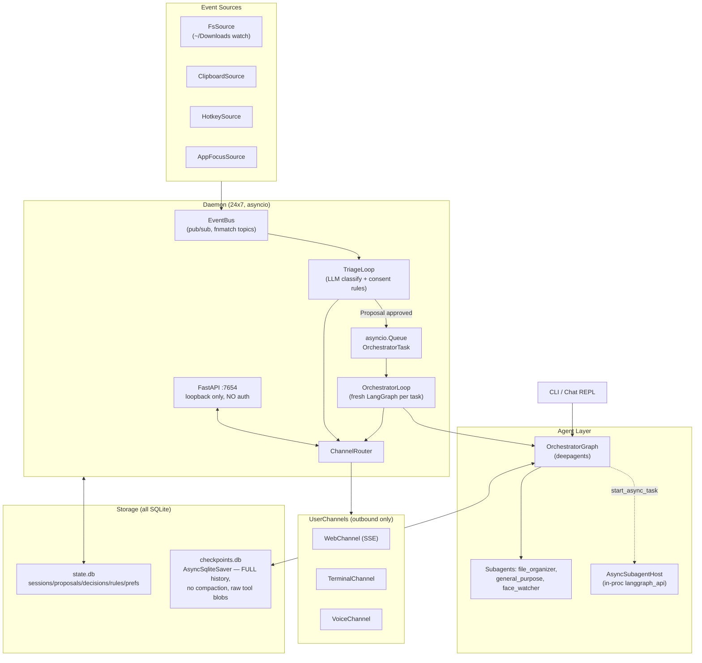

### 3.2 Target architecture (after all phases)

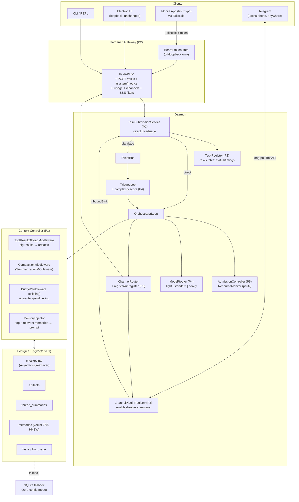

### 3.3 Phase dependency graph

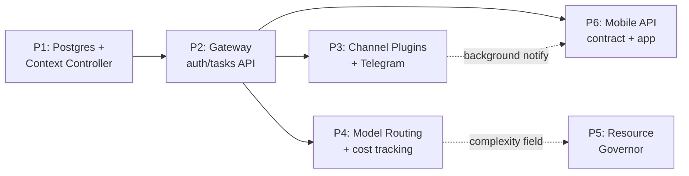

---

## 4. Codebase Conventions (FOLLOW EXACTLY)

1. **Config**: every new subsystem gets a frozen dataclass `XxxSettings` with a `from_env()` classmethod, env vars prefixed `YUYUTSAVA_*`. Role-scoped LLM settings reuse `_env(name, role)` from `core/config.py:45` (e.g. role `compaction` → `COMPACTION_LLM_PROVIDER`).
2. **Storage**: SQLite stores subclass `BaseSqliteStore` (`storage/base.py`), use `migration_lock()`, `_META_TABLE` schema-version. Postgres twin follows same interface; factory dispatches on `StorageSettings.backend`.
3. **Tools**: prefixed (`ctx_*`, `mem_*` are new), registered via ToolRegistry, return JSON `OperationResponse`-style dicts with status/error. Tools needed unconditionally (like `tool_search`) are exempted from `ToolFilterMiddleware` hiding.
4. **Middleware**: subclass `langchain.agents.middleware.AgentMiddleware`, async hooks (`awrap_tool_call`, `aafter_model`…). Look at `daemon/budget.py` for house style.
5. **Lifecycle**: long-running async components expose `run(stop_event)` or `start()/stop()` and are owned by `DaemonSubsystems` (bootstrap order matters; teardown is reverse).
6. **Errors**: never swallow. `logger = logging.getLogger(__name__)` under `yuyutsava.*` namespace; user-visible failures emit `TimelinePayload` via ChannelRouter.
7. **Tests**: under `test/`, mirror package path. Use fake models/fixtures, not live APIs.
8. **NEVER mutate checkpointed messages post-hoc** (the `streaming.py:382` bug class). All context edits must be middleware returning state updates so the checkpointer persists the edited state.

---

# PHASE 1 — Postgres backend + Context Controller  ⟵ START HERE

**Goal:** Bounded, self-compacting context for every agent run (orchestrator, subagents, CLI chat); large tool results offloaded to an artifact store with retrieval tools; rolling per-thread summaries + semantic memory in Postgres/pgvector so cycle-3 (and post-restart) continuity holds. SQLite remains the zero-config fallback for everything.

### Context-flow after Phase 1

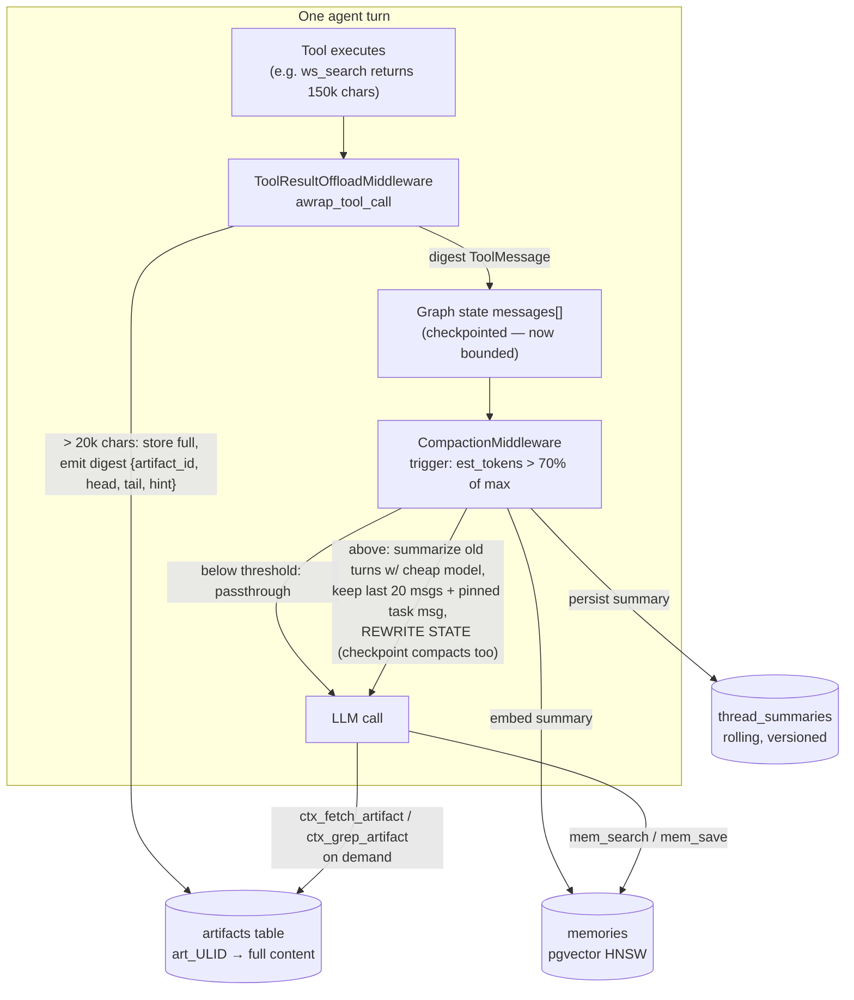

### Compaction sequence (why cycle 3 still knows the plan)

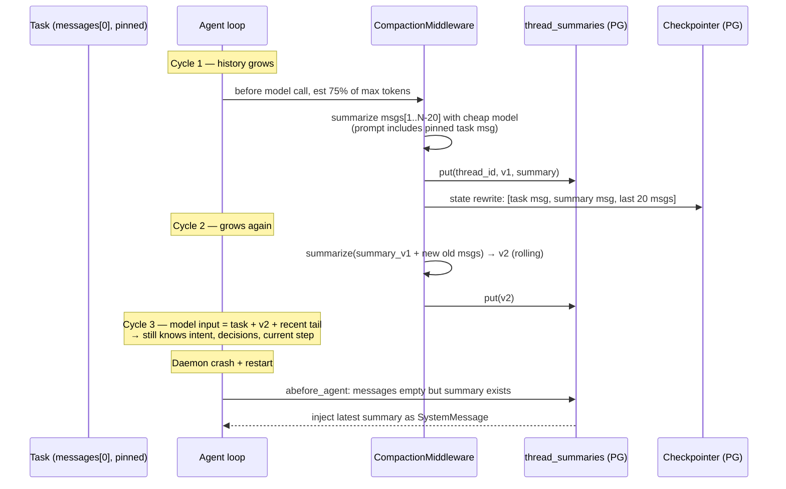

## 1A. Postgres storage plumbing

**New dependencies** (add to `pyproject.toml`): `langgraph-checkpoint-postgres` (verify pin against `langgraph-checkpoint 4.1.1` at install; if conflict, pin langgraph family together), `psycopg[binary,pool]`. New optional extra `memory`: `pgvector`.

**New files:**

1. `yuyutsava/storage/backend.py`
   ```python
   @dataclass(frozen=True)
   class StorageSettings:
       backend: str = "sqlite"          # YUYUTSAVA_STORAGE_BACKEND: sqlite | postgres
       pg_dsn: str = ""                 # YUYUTSAVA_PG_DSN e.g. postgresql://yuyutsava:pw@127.0.0.1:5432/yuyutsava
       pool_min: int = 1                # YUYUTSAVA_PG_POOL_MIN
       pool_max: int = 10               # YUYUTSAVA_PG_POOL_MAX
       require: bool = False            # YUYUTSAVA_STORAGE_REQUIRE=1 → fail fast if PG down
       @classmethod
       def from_env(cls) -> "StorageSettings": ...
       def is_postgres(self) -> bool: ...
   ```
2. `yuyutsava/storage/pg/__init__.py`, `yuyutsava/storage/pg/pool.py` — `PgPool`: owns `psycopg_pool.AsyncConnectionPool`; `async open()/close()`; owned by `DaemonSubsystems` (open before checkpointer, close after in teardown).
3. `yuyutsava/storage/pg/migrations.py` — forward-only numbered migration list (`MIGRATIONS: list[tuple[int, str]]`), applied at boot inside `SELECT pg_advisory_lock(<const>)` … unlock; tracks version in a `schema_meta` table (mirror `BaseSqliteStore._META_TABLE` convention). All Phase 1/2/4 DDL lives here.
4. `infra/docker-compose.postgres.yml` — service `postgres`: image `pgvector/pgvector:pg16`, env POSTGRES_USER/PASSWORD/DB=yuyutsava, volume, healthcheck `pg_isready`. (Mirror style of existing `docker-compose.langfuse.yml` if present at repo root.)

**Modified files:**

5. `yuyutsava/storage/sessions/checkpointer.py` — replace the `NotImplementedError` at `:26` with:
   ```python
   if settings.backend == "postgres":
       async with AsyncPostgresSaver.from_conn_string(storage.pg_dsn) as saver:
           await saver.setup()
           yield saver
           return
   ```
   (import `from langgraph.checkpoint.postgres.aio import AsyncPostgresSaver`; `SessionsSettings` gains the dsn or takes `StorageSettings`).
6. `yuyutsava/daemon/checkpointing.py` — `CheckpointerSaver.__init__(db_path, *, storage: StorageSettings)`; `start()` branches: postgres → AsyncPostgresSaver via the same AsyncExitStack; **fallback behavior**: if PG connect fails and `require=False` → log ERROR + emit timeline event "Postgres unavailable, falling back to SQLite (checkpoints diverge!)" + use sqlite; if `require=True` → raise (daemon refuses to boot).
7. `yuyutsava/daemon/bootstrap.py` — build `StorageSettings.from_env()` first; construct `PgPool` when postgres; run `migrations.apply(pool)`; pass storage into `CheckpointerSaver`; add pool to `DaemonSubsystems`.
8. `yuyutsava/storage/sweeper.py` — `_sweep_checkpoints` currently assumes the sqlite saver: make it dispatch on saver type; postgres branch deletes from the saver's tables by thread_id.
9. Fix while here: `DaemonConfig` `orchestrator_token_budget` dataclass default (60000) vs `from_env` fallback (8000) inconsistency — make both 60000 unless docs say otherwise.

**Scope guard:** the events store (`state.db`: proposals/decisions/rules/prefs) **stays SQLite in Phase 1**. Only checkpoints + the NEW tables (artifacts, thread_summaries, memories) go to PG. CLI without PG runs fully on SQLite (artifact/summary stores have SQLite twins).

## 1B. Context controller — new package `yuyutsava/context/`

10. `yuyutsava/context/config.py` — `ContextSettings.from_env(role=None)` using `_env(name, role)`:
    - `YUYUTSAVA_CONTEXT_MAX_INPUT_TOKENS` — default derived from model name map: anthropic→200_000, groq/llama→128_000, ollama→8_192 (overridable). Keep map in this file.
    - `YUYUTSAVA_CONTEXT_COMPACT_FRACTION` = 0.7
    - `YUYUTSAVA_CONTEXT_KEEP_MESSAGES` = 20
    - `YUYUTSAVA_CONTEXT_OFFLOAD_THRESHOLD_CHARS` = 20_000 (well under `LIMITS.max_tool_result_chars=100_000`)
    - `YUYUTSAVA_CONTEXT_PIN_FIRST_MESSAGES` = 2
11. `yuyutsava/context/artifacts.py` — `ArtifactStore` interface + two impls (PG via PgPool; SQLite via `BaseSqliteStore` subclass adding `artifacts` table to state.db):
    ```sql
    artifacts(artifact_id TEXT PK,      -- "art_" + ULID (python-ulid in deps)
              thread_id TEXT, tool_name TEXT, content TEXT,
              size_chars INT, created_ts)
    ```
    Methods: `put(thread_id, tool_name, content) -> artifact_id`; `get(artifact_id, offset=0, length=20_000) -> str`; `grep(artifact_id, pattern, max_matches=20) -> list[str]` (line-based, regex). TTL sweep: add `ArtifactSweepTarget` to `UnifiedSweeper` (copy `BlobSweepTarget` pattern), default TTL 7 days.
12. `yuyutsava/context/tools.py` — `make_context_tools(store)` → `ctx_fetch_artifact(artifact_id, offset=0, length=20000)`, `ctx_grep_artifact(artifact_id, pattern)`. Register prefix `ctx_*` in ToolRegistry; **add to ToolFilterMiddleware's always-visible exemption set** (same treatment as `tool_search`) — the model must see these without discovery, because digests reference them.
13. `yuyutsava/context/offload_middleware.py` — **the load-bearing fix**:
    ```python
    class ToolResultOffloadMiddleware(AgentMiddleware):
        def __init__(self, store: ArtifactStore, settings: ContextSettings,
                     exclude_tools: frozenset[str] = frozenset({"ctx_fetch_artifact", "ctx_grep_artifact", "write_todos"})): ...
        async def awrap_tool_call(self, request, handler):
            result = await handler(request)
            # result is a ToolMessage (or Command); extract text content
            if tool not excluded and len(content) > settings.offload_threshold_chars:
                aid = await store.put(thread_id, tool_name, content)
                digest = json.dumps({
                  "offloaded": True, "artifact_id": aid, "tool": tool_name,
                  "size_chars": len(content),
                  "head": content[:1500], "tail": content[-500:],
                  "hint": "Full output stored. Use ctx_fetch_artifact(artifact_id, offset, length) or ctx_grep_artifact(artifact_id, pattern)."})
                return ToolMessage(content=digest, ...)  # replaces BEFORE state/checkpoint
            return result
    ```
    Keep `guard_tool_result` in `core/streaming.py` untouched as display backstop for non-wrapped paths.
14. `yuyutsava/context/summary_store.py` — `ThreadSummaryStore` (PG + SQLite twins):
    ```sql
    thread_summaries(thread_id TEXT, version INT, summary TEXT,
                     token_count INT, task_id TEXT NULL, created_ts,
                     PRIMARY KEY (thread_id, version))
    ```
    `latest(thread_id)`, `put(thread_id, summary, token_count, task_id)` (auto-increments version).
15. `yuyutsava/context/compaction.py` — `YuyutsavaCompactionMiddleware(SummarizationMiddleware)`:
    - ctor: `model` = `chat_model(llm_settings_from_env("compaction"))` if `COMPACTION_LLM_PROVIDER` set, else the agent's own model; `trigger=("fraction", settings.compact_fraction)` (SummarizationMiddleware needs the max via its token_counter/profile — pass `max_input_tokens` from ContextSettings); `keep=("messages", settings.keep_messages)`.
    - custom `token_counter`: prefer the last AIMessage `usage_metadata` running total (the `BudgetMiddleware._accumulate` pattern), fall back to `count_tokens_approximately`.
    - override the summarization step (subclass hook or wrap) to: (a) include the **pinned original task message** (`messages[0]`, which is `OrchestratorTask.render_to_message()` output for daemon tasks) in the summary prompt context AND keep it un-summarized at history head; (b) after producing a summary, `await summary_store.put(...)` and (if memory enabled) embed it as a `kind="summary"` memory.
    - summary prompt must demand sections: `## SESSION INTENT` (original goal), `## DECISIONS MADE`, `## WORK COMPLETED`, `## CURRENT STATE / NEXT STEP`, `## OPEN QUESTIONS` — this structure is what keeps cycle-3 coherent.
    - `abefore_agent`: if thread resumes with empty message history but `summary_store.latest(thread_id)` exists → inject summary as SystemMessage (crash recovery).
    - **Correctness requirement**: rely on SummarizationMiddleware's safe cut-points; ADD A TEST that an AIMessage with tool_calls is never separated from its ToolMessages (parallel tool-call fixture). Verify deepagents non-message state (files/todos) is untouched (middleware only edits `messages`).
16. `yuyutsava/context/injector.py` — `MemoryInjector` (mirror `prefs/injector.py` style): given task text, embed + query MemoryStore top-k, build `<relevant-memory>` block capped at new `LimitsConfig.max_memory_chars = 2000`; orchestrator system prompt gains the block (wire where prefs injector is wired).

## 1C. Semantic memory — new package `yuyutsava/memory/`

17. `yuyutsava/memory/config.py` — `MemorySettings.from_env()`: `YUYUTSAVA_MEMORY_ENABLED` (default true when postgres backend, false on sqlite-only), embed model via role `embed` (`EMBED_LLM_PROVIDER` default ollama, `EMBED_MODEL` default `nomic-embed-text`, dim 768; OpenAI-compatible `/embeddings` endpoint).
18. `yuyutsava/memory/embedder.py` — async httpx wrapper: `embed(texts: list[str]) -> list[list[float]]`.
19. `yuyutsava/memory/store.py` — `MemoryStore`:
    ```sql
    CREATE EXTENSION IF NOT EXISTS vector;
    memories(memory_id TEXT PK, kind TEXT,   -- task_outcome | summary | fact | preference
             text TEXT, embedding vector(768),
             source_thread_id TEXT, metadata JSONB, created_ts TIMESTAMPTZ);
    CREATE INDEX memories_embedding_idx ON memories USING hnsw (embedding vector_cosine_ops);
    ```
    `add(kind, text, source_thread_id, metadata)`, `search(query_text, k=5, kinds=None) -> list[MemoryHit]`. SQLite twin: same table minus embedding; `search` degrades to LIKE keyword match (documented limitation).
20. `yuyutsava/memory/tools.py` — `mem_search(query, k=5)`, `mem_save(text, kind="fact")`; prefix `mem_*`, normal ToolRegistry discovery.
21. **Write paths**: (a) every compaction summary (from 1B); (b) task outcomes — in `OrchestratorLoop._run_task` where `put_decision(outcome="orchestrator_done")` is written, also `memory.add(kind="task_outcome", text=instruction + " → " + final_text[:1000])`; (c) agent-explicit `mem_save` (add one line to orchestrator prompt: save durable user/project facts).
22. **Read paths**: `MemoryInjector` at task start (embeds `task.summary + instruction`); on-demand `mem_search`. Extend the existing "if you need history, call recall" line in `agents/orchestrator/prompts.py` to mention `mem_search`.

## 1D. Wiring

23. `core/engine.py build_orchestrator()` — master middleware becomes `[ToolFilterMiddleware(), ToolResultOffloadMiddleware(...), YuyutsavaCompactionMiddleware(...), BudgetMiddleware(...)]` (order matters: offload before compaction; budget last as absolute ceiling). Subagent specs (`:518`) get offload + compaction too. Add `make_context_tools()` to master tools.
24. `core/engine.py` CLI builder (`:357` area) — same additions; CLI chat threads live longest and benefit most.
25. `daemon/bootstrap.py` — construct ArtifactStore / ThreadSummaryStore / MemoryStore / MemoryInjector after the checkpointer; thread through `OrchestratorDeps` (new fields) and `DaemonSubsystems`.
26. `BudgetMiddleware` is NOT removed — compaction reduces per-call input, budget remains cumulative spend ceiling.

## Phase 1 Definition of Done

- [ ] `docker compose -f infra/docker-compose.postgres.yml up -d` brings up pgvector PG16; daemon boots with `YUYUTSAVA_STORAGE_BACKEND=postgres` and creates all tables via migrations.
- [ ] Daemon boots with PG stopped: loud fallback to SQLite (or refuses when `YUYUTSAVA_STORAGE_REQUIRE=1`).
- [ ] Unit: tool returning 150k chars → ToolMessage in state < 3k chars; `ctx_fetch_artifact`/`ctx_grep_artifact` retrieve content; excluded tools pass through.
- [ ] Unit: compaction trigger math; AIMessage+tool_calls never split (parallel tool-call fixture); summary row written with all 5 sections.
- [ ] Integration: scripted fake-model agent through 3 compaction cycles — cycle-3 model input contains `## SESSION INTENT` + original task text; checkpoint size bounded (assert via saver query).
- [ ] kill -9 daemon mid-task on PG backend → restart → thread resumes; empty-history resume injects latest summary.
- [ ] Manual: long CLI session with repeated `ws_*` searches; langfuse shows input-token plateau, not linear growth.
- [ ] `docs/IMPLEMENTATION_PROGRESS.md` updated.

---

# PHASE 2 — Gateway hardening: auth, tailnet bind, task submission, task registry

**Goal:** Daemon API safely reachable over Tailscale with bearer auth; first-class task submission + status (prereq for Telegram inbound + mobile).

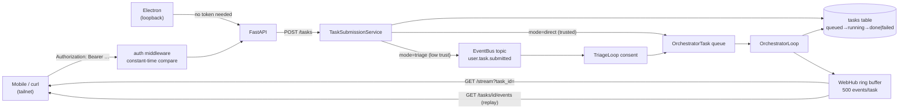

**New files:**
1. `yuyutsava/daemon/web/auth.py` — `AuthSettings.from_env()`: `YUYUTSAVA_API_TOKEN`; if unset AND bind non-loopback → generate once to `~/.yuyutsava/api_token` (chmod 0600), log it. FastAPI dependency/middleware: constant-time compare (`secrets.compare_digest`) of `Authorization: Bearer <t>`; `?token=` accepted ONLY on `/stream` (EventSource cannot set headers). Loopback binds: auth optional → Electron unchanged. Strip token from `_broadcast_http_log` access lines.
2. `yuyutsava/daemon/task_submission.py` — `TaskSubmissionService`:
   - `submit_direct(instruction, origin, session_hint=None) -> task_id`: mint task_id (`tsk_<ULID>`), record in TaskRegistry, build auto-approved Proposal + `OrchestratorTask`, put on existing queue. User-initiated = implicit Tier-1 consent; Tier-2 tool asks still fire normally.
   - `submit_via_triage(instruction, origin)`: publish `EventEnvelope(topic="user.task.submitted", source=origin)` on EventBus → flows through TriageLoop consent (for lower-trust origins).
3. `yuyutsava/daemon/task_registry.py` — `TaskRegistry`: in-memory dict + persisted table (PG migration + SQLite twin):
   ```sql
   tasks(task_id TEXT PK, origin TEXT, instruction TEXT,
         status TEXT,           -- queued | running | done | failed | cancelled
         thread_id TEXT, complexity INT NULL,
         created_ts, started_ts, finished_ts,
         deferred_ms INT DEFAULT 0,   -- filled by P5
         result_summary TEXT, error TEXT)
   ```
4. `yuyutsava/daemon/web/routers/tasks.py` — `POST /tasks {instruction, mode: "direct"|"triage"} → {task_id}`; `GET /tasks?status=&limit=&cursor=`; `GET /tasks/{id}`; `POST /tasks/{id}/cancel` (sets registry flag; OrchestratorLoop checks between stream events — coarse v1, document it); `GET /tasks/{id}/events` (ring-buffer replay).

**Modified:**
5. `daemon/web/app.py:52-56` — replace loopback refusal: non-loopback allowed **iff** auth enabled; install auth middleware; CORS from `YUYUTSAVA_CORS_ORIGINS`.
6. `daemon/orchestrator_loop.py _run_task` — drive TaskRegistry status transitions; store thread_id (join key for logs).
7. `ChannelEvent` payloads gain optional `task_id`/`session_id`; `_broadcast` tags them; `routers/stream.py` supports `?task_id=`/`?session_id=` filter (filter in SSE responder; hub unchanged).
8. `WebHub` — per-task ring buffer (last 500 StreamItems).

**Decision recorded:** NO WebSocket — SSE + POST suffices for mobile; revisit only if client→server streaming needed. Token-in-query on `/stream` acceptable: Tailscale ACLs are the outer wall, token is defense-in-depth.

## Phase 2 Definition of Done
- [ ] 401 without token / 200 with token (httpx tests); loopback without token still works (Electron unaffected).
- [ ] `POST /tasks` mode=direct → task runs end-to-end → `GET /tasks/{id}` shows `done` with result_summary.
- [ ] mode=triage path produces a Proposal through TriageLoop.
- [ ] Bind to tailnet IP (`YUYUTSAVA_DAEMON_HOST=100.x.y.z`), hit from second device.
- [ ] `GET /tasks/{id}/events` replays after reconnect; `?task_id=` filter scopes the SSE stream.
- [ ] Progress file updated.

---

# PHASE 3 — Channel Invoke Plugin system + Telegram reference plugin

**Goal:** Channels become runtime-managed plugins: outbound (existing `UserChannel` contract) + inbound (invoke tasks, answer proposals/asks), enable/disable at runtime with no restart and no design lock-in.

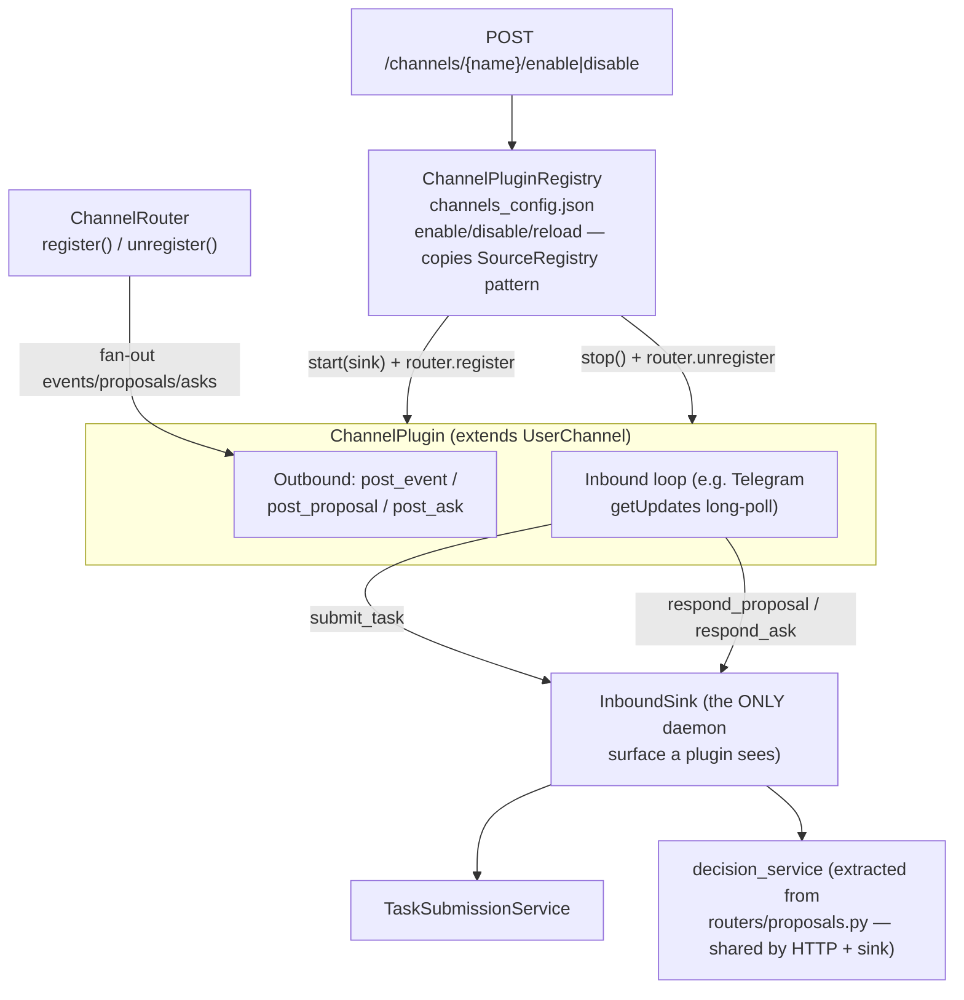

### Telegram inbound/outbound sequence

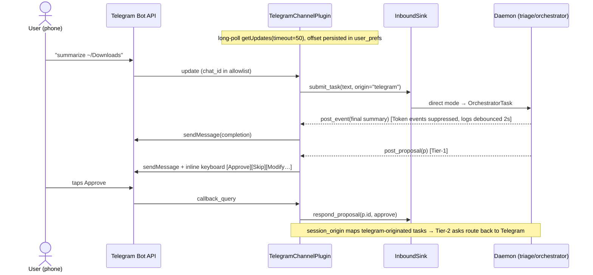

**New package `yuyutsava/channels/`** (framework + plugins; `daemon/channels.py` keeps ChannelRouter):

1. `yuyutsava/channels/plugin.py` —
   - `class ChannelPlugin(UserChannel)`: abstract `plugin_id: str`, `capabilities: frozenset[str]` ({"notify","proposal","ask","invoke"}), `async start(inbound: InboundSink)`, `async stop()`, `classmethod from_config(params: dict) -> ChannelPlugin`.
   - `class InboundSink`: constructor-injected facade — `submit_task(text, origin) -> task_id` (→TaskSubmissionService direct), `respond_proposal(proposal_id, decision, edited=None)`, `respond_ask(ask_id, response)`, `list_pending()`, `daemon_status() -> str`.
2. `yuyutsava/daemon/web/services/decision_service.py` — EXTRACT the proposal/ask respond logic from `routers/proposals.py` so the HTTP router and InboundSink call ONE implementation (no duplicated future-resolution logic).
3. `yuyutsava/channels/registry.py` — `ChannelPluginRegistry`, modeled line-for-line on `events/registry.py SourceRegistry`: reads `~/.yuyutsava/channels_config.json` `{"channels": {"telegram": {"enabled": true, ...params}}}` (same shape as EventsConfig); `start_all()`, `reload(cfg)`, `enable(name)`, `disable(name)`; static plugin map v1: `{"telegram": TelegramChannelPlugin}`. Enable = instantiate → `await plugin.start(sink)` → `channels.register(plugin)`; disable = `channels.unregister(name)` → `await plugin.stop()`. Guarantee idempotence (double-enable = no-op) and **never two pollers for one bot token**.
4. `yuyutsava/daemon/channels.py` — add `ChannelRouter.register(channel: UserChannel)` / `unregister(name: str)` (formalizes what `routers/cli_attach.py` does by hand — refactor cli_attach to use them).
5. `yuyutsava/daemon/web/routers/channels.py` — `GET /channels` (list + enabled + capabilities), `POST /channels/{name}/enable`, `POST /channels/{name}/disable` (writes config + calls registry; hot).
6. `daemon/bootstrap.py` — construct registry after ChannelRouter + TaskSubmissionService; `start_all()` before loops; add to DaemonSubsystems teardown.

**Telegram plugin `yuyutsava/channels/telegram/`:**

7. `client.py` — minimal httpx Bot API client, NO python-telegram-bot dep. Methods: `get_updates(offset, timeout=50)`, `send_message(chat_id, text, reply_markup=None, parse_mode="HTML")`, `edit_message_text`, `answer_callback_query`, `set_my_commands`, `get_me`. Exponential backoff on network errors (1s→60s cap).
8. `channel.py` — `TelegramChannelPlugin`:
   - Config: `YUYUTSAVA_TELEGRAM_BOT_TOKEN` (env ONLY, never in config json), `YUYUTSAVA_TELEGRAM_CHAT_IDS` (comma allowlist; messages from other chats dropped + logged WARNING).
   - **Outbound**: `post_event` — suppress `TokenPayload` entirely; debounce `LogPayload`/`TimelinePayload` into 2s batches; always send completions/final summaries (respects Telegram limits ~1 msg/s/chat). `post_proposal` — inline keyboard `[Approve][Skip][Modify…]`, `asyncio.Future` keyed by proposal_id (WebHub `pending_proposals` pattern), honor `p.expires_ts`. `post_ask` — keyboard from options or force-reply for free text.
   - **Inbound poll loop**: `callback_query` → `sink.respond_proposal/respond_ask`; allowlisted plain text → `sink.submit_task(text, origin="telegram")`; commands: `/tasks` (pending+running formatted), `/status` (daemon health line). Persist `getUpdates` offset in `user_prefs` table (key `telegram.offset`) so restart resumes without replay.
   - Set `ChannelRouter.session_origin` mapping for telegram-originated tasks so Tier-2 asks prefer Telegram (duck-type hook already at `channels.py:277-281`).

## Phase 3 Definition of Done
- [ ] `FakeChannelPlugin` lifecycle tests: enable→appears in router fan-out; disable→removed + stopped; double-enable idempotent; registry reload applies config diff.
- [ ] decision_service extraction: HTTP proposal respond still passes existing tests.
- [ ] Real test bot: task completion notification arrives; proposal approved via button; "summarize ~/Downloads" from phone → task runs → completion message back.
- [ ] Daemon restart → poller resumes from persisted offset (no duplicate processing).
- [ ] Messages from non-allowlisted chat are ignored + logged.
- [ ] Progress file updated.

---

# PHASE 4 — Complexity-based model routing + cost tracking

**Goal:** Triage scores complexity 1–5; orchestrator + subagents run on tier-appropriate models; every LLM call's spend recorded.

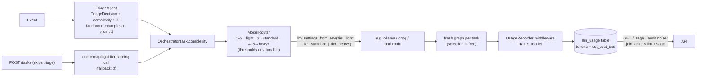

**New files:**
1. `yuyutsava/core/model_router.py` —
   - `ModelTier = Literal["light","standard","heavy"]`.
   - `ModelRouter`: built from `llm_settings_from_env("tier_light")` / `tier_standard` / `tier_heavy` (env: `TIER_LIGHT_LLM_PROVIDER`, `TIER_LIGHT_OLLAMA_MODEL`, `TIER_HEAVY_ANTHROPIC_MODEL`, … — the `_env(name, role)` prefix mechanism handles this with ZERO new config machinery).
   - `model_for(complexity: int) -> BaseChatModel`: thresholds from `YUYUTSAVA_ROUTING_THRESHOLDS="2,3"` (≤2→light, ≤3→standard, else heavy); models lazily built via `chat_model()` + cached.
   - Feature flag `YUYUTSAVA_MODEL_ROUTING=1`; OFF → return the existing role models (`orchestrator`/`subagent`) — byte-identical current behavior.
   - `PRICES: dict[str, tuple[float,float]]` static USD per 1M in/out tokens keyed by model-name prefix; overridable via `~/.yuyutsava/model_prices.json`.
2. `yuyutsava/daemon/usage.py` — `UsageRecorder(AgentMiddleware)`: `aafter_model` reads `usage_metadata` (input AND output tokens — extend the `BudgetMiddleware._accumulate` pattern), writes:
   ```sql
   llm_usage(id PK, ts, thread_id TEXT, task_id TEXT, role TEXT, model TEXT,
             input_tokens INT, output_tokens INT, est_cost_usd REAL)
   ```
3. `yuyutsava/daemon/web/routers/usage.py` — `GET /usage?since=&group_by=task|model|day`.

**Modified:**
4. `agents/triage/agent.py` — `TriageDecision` gains `complexity: int = 3`; triage prompt gains one paragraph with anchored examples ("move one file = 1; rename batch = 2; summarize a doc = 3; multi-step research with web search = 4; build/refactor code across files = 5").
5. `daemon/triage_loop.py` — carry complexity onto `OrchestratorTask` (new field, default 3).
6. `daemon/task_submission.py` — direct submissions: optional client `complexity` override, else one short scoring completion on the light model (fallback 3 on any failure).
7. `daemon/orchestrator_loop.py _run_task` — `model = router.model_for(task.complexity)`; `OrchestratorDeps.subagent_model` likewise per task. Record complexity + chosen model in TaskRegistry.
8. `core/engine.py` — append `UsageRecorder` to master + subagent middleware.

**Tradeoff recorded:** triage self-scoring is cheap but noisy → audit empirically with `llm_usage × tasks` join ("complexity-1 tasks that burned 50k tokens"), tune prompt/thresholds from data.

## Phase 4 Definition of Done
- [ ] Unit: tier mapping, threshold parsing, flag-off passthrough returns existing role models.
- [ ] Integration (two Ollama models configured as light/standard): complexity-1 task demonstrably hits light model (assert `llm_usage.model`).
- [ ] Cost rows sum correctly for a scripted run with known token counts.
- [ ] `GET /usage` returns grouped aggregates.
- [ ] Progress file updated.

---

# PHASE 5 — Resource-aware execution (monitor + admission control)

**Goal:** Daemon knows system load, estimates task weight, defers heavy tasks under load so they *never break in-flight work*; metrics surfaced to API/mobile.

New dependency: `psutil`.

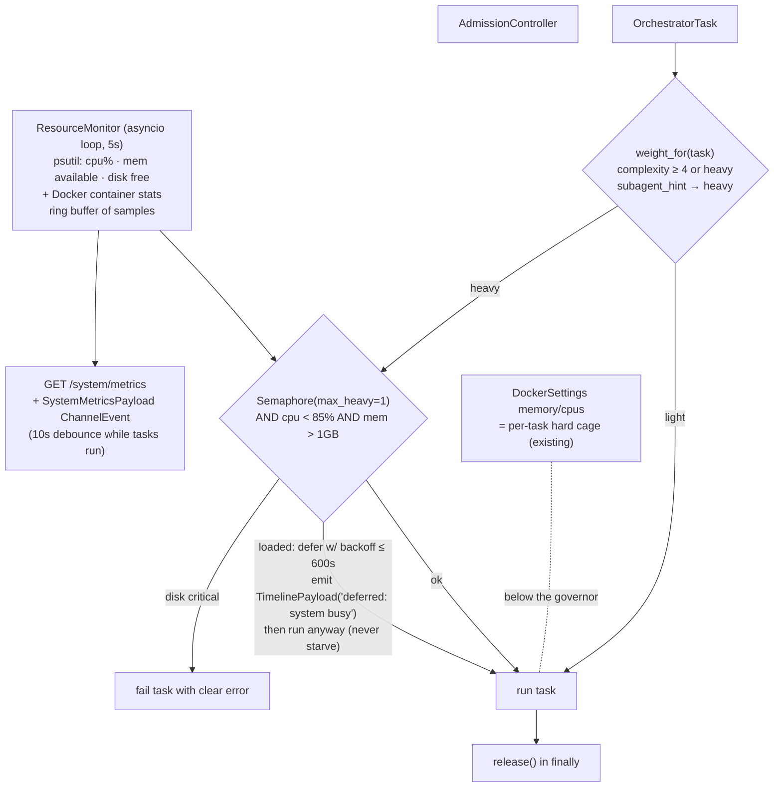

**New file `yuyutsava/daemon/resources.py`:**
1. `ResourceSettings.from_env()` — `YUYUTSAVA_RES_CPU_HIGH_PCT=85`, `YUYUTSAVA_RES_MEM_MIN_MB=1024`, `YUYUTSAVA_RES_DISK_MIN_GB=5`, `YUYUTSAVA_MAX_HEAVY_TASKS=1`, `YUYUTSAVA_RES_SAMPLE_SEC=5`, `YUYUTSAVA_RES_DEFER_MAX_SEC=600`.
2. `ResourceSnapshot` dataclass: cpu_pct, mem_available_mb, disk_free_gb, per_container (when sandbox active), ts.
3. `ResourceMonitor` — asyncio loop, lifecycle like `UnifiedSweeper.run(stop_event)`; ring of last N samples; `snapshot()`; `loaded() -> bool`.
4. `AdmissionController` — `weight_for(task)` (complexity ≥4 or subagent_hint in configured heavy set → "heavy"; v1 honest-coarse, refine later with historical task durations from `tasks` table); `slot(task)` async context manager: heavy → acquire `Semaphore(max_heavy_tasks)` AND pass load check, defer with backoff up to defer_max_sec emitting `TimelinePayload("deferred: system busy (cpu 93%)")`, then run anyway — never starve; fail only when disk critical. Record `deferred_ms` in TaskRegistry.

**Integration:**
5. `daemon/orchestrator_loop.py _run_task` — wrap body in `async with admission.slot(task):`.
6. `daemon/bootstrap.py` + `daemon/main.py` — construct + schedule monitor alongside triage/orchestrator loops; add to DaemonSubsystems.
7. `yuyutsava/daemon/web/routers/system.py` — `GET /system/metrics` (current snapshot + ring + per-task attribution); debounced `SystemMetricsPayload` ChannelEvent every 10s while any task runs (mobile live view without polling).

## Phase 5 Definition of Done
- [ ] Unit: admission math with fake snapshot provider — loaded system: heavy defers then runs, light passes immediately; semaphore caps concurrent heavies; disk-critical fails task.
- [ ] Integration: busy-loop the machine, submit complexity-5 task → observe `deferred:` timeline event then execution; `deferred_ms` recorded.
- [ ] `GET /system/metrics` returns sane values on macOS (cpu, mem, disk).
- [ ] Progress file updated.

---

# PHASE 6 — Mobile API contract + RN/Expo app skeleton

**Goal:** Freeze the backend contract; build the app skeleton in a separate repo (`yuyutsava-mobile`).

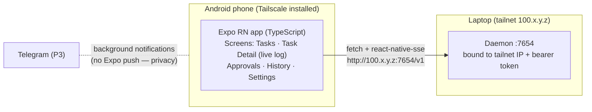

**Backend additions (small — everything else shipped in P2/P4/P5):**
1. `/v1` router prefix with legacy unprefixed aliases kept (Electron unchanged).
2. Pagination (`limit`/`cursor`) on `GET /tasks`, `/sessions`, `/decisions`.
3. `GET /v1/server-info` — version + capability/feature flags (model_routing, memory, channels list) so the app degrades gracefully.
4. `docs/api_v1.md` — document every endpoint + the SSE wire schema (the `StreamItem.to_wire_dict()` envelopes, e.g. `{"type":"event","kind":"token","data":{...}}`, proposal/ask shapes, task lifecycle states).

**API contract (consumed by app):**

| Endpoint | Purpose |
|---|---|
| `GET /health` | unauthenticated reachability probe |
| `GET /v1/server-info` | capabilities for graceful degradation |
| `POST /v1/tasks` | submit `{instruction, mode}` → `{task_id}` |
| `GET /v1/tasks?status=&limit=&cursor=` | task list |
| `GET /v1/tasks/{id}` | status/timings/complexity/result |
| `GET /v1/tasks/{id}/events` | ring-buffer replay (late join / reconnect) |
| `GET /v1/stream?token=&task_id=` | live SSE |
| `POST /v1/proposals/{id}/respond`, `/v1/asks/{id}/respond` | approvals |
| `GET /v1/sessions`, `GET /v1/decisions` | history |
| `GET /v1/system/metrics`, `GET /v1/usage` | dashboards |
| `GET /v1/channels`, `POST /v1/channels/{n}/enable\|disable` | settings screen |

**App skeleton (separate repo `yuyutsava-mobile`):** Expo + TypeScript; TS client generated from `/openapi.json` (FastAPI serves it). Screens: **Tasks** (live list + submit box), **Task Detail** (SSE log view with replay-fill on reconnect), **Approvals** (proposals/asks with buttons), **History**, **Settings** (server URL = tailnet IP, token). Connectivity: plain fetch + `react-native-sse`; no TLS inside tailnet (token still required).

**Decision recorded:** NO Expo push — it routes through Expo's cloud (task summaries would leave the machine). SSE while foregrounded + **Telegram (P3) is the background notifier**. Revisit only if insufficient.

## Phase 6 Definition of Done
- [ ] `/v1` endpoints live, legacy aliases intact (Electron smoke test passes).
- [ ] `docs/api_v1.md` complete incl. SSE wire schema; TS client generates from `/openapi.json`.
- [ ] Contract tests (httpx golden tests) against every `/v1` endpoint.
- [ ] Manual: phone on LTE + Tailscale — submit task, watch live logs, approve a Tier-2 ask, kill app mid-stream, reopen → replay fills gap.
- [ ] Progress file updated.

---

## Sequencing summary

Execute in order: **P1 → P2 → P3 → P4 → P5 → P6**. (P4 can start any time after P2; P5 ideally after P4 for the complexity field but can ship with hint-only weighting.)

## Top risks (re-read before each phase)

1. **Checkpoint mutation bug class** — never edit messages post-hoc (`streaming.py:382` precedent); all context edits via middleware state updates. P1B is the root-cause fix; `guard_tool_result` stays as display backstop only.
2. **Compaction mid-tool-call** — SummarizationMiddleware safe cut-points + explicit parallel-tool-call test; `keep=20` generous.
3. **`langgraph-checkpoint-postgres` pin** vs checkpoint 4.1.1 — verify at install; pin langgraph family together if conflict.
4. **PG down at boot** — loud SQLite fallback (timeline event) vs `YUYUTSAVA_STORAGE_REQUIRE=1` fail-fast; fallback checkpoints are invisible to PG, hence "loud".
5. **Telegram: one poller per bot token** — registry guarantees single instance; offset persisted in `user_prefs`.
6. **Token in `/stream` query string** — acceptable inside tailnet (defense-in-depth); strip from access logs.
7. **Triage complexity noise** — audit via `llm_usage × tasks`; thresholds env-tunable; never block on scoring failure (default 3).

## Critical files index (most-touched)

- `yuyutsava/core/engine.py` — middleware wiring for all agent builders (P1, P4)
- `yuyutsava/daemon/bootstrap.py` — every new subsystem constructed/threaded here (all phases)
- `yuyutsava/daemon/orchestrator_loop.py` — model selection, admission, task registry, memory writes (P1, P2, P4, P5)
- `yuyutsava/storage/sessions/checkpointer.py` + `yuyutsava/daemon/checkpointing.py` — Postgres branch (P1)
- `yuyutsava/daemon/channels.py` — ChannelRouter register/unregister; UserChannel contract (P3)
- `yuyutsava/daemon/web/app.py` — auth + non-loopback bind (P2)
- `yuyutsava/core/config.py` — LimitsConfig additions, `_env(name, role)` reuse (P1, P4)
