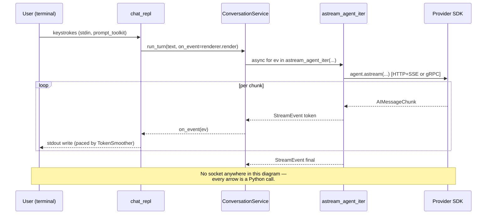
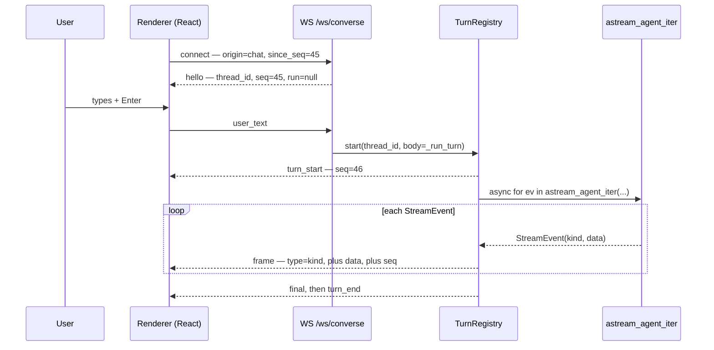
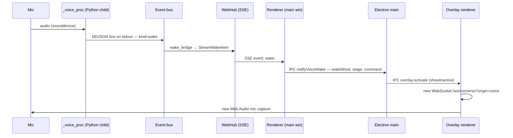

# YUYUTSAVA Transport Layer

> **Scope of this document.** This is the wire-level reference: *how a user's input
> physically reaches the LLM, and how the model's output physically gets back.* It
> answers "where do we use stdin, where do we use SSE, where do we use WebSocket, and
> how" for every surface — CLI, Electron UI, voice, and background tasks.
>
> It is deliberately narrow. `Architecture.md` is the system map (what the subsystems
> are and why); `DAEMON_ARCHITECTURE.md` covers daemon internals; `docs/api_v1.md` is
> the REST contract. This document covers only the pipes between them.
>
> It is written in three layers. **Layer 1** is a one-page mental model — read it and
> stop if that is all you need. **Layer 2** walks each surface end to end with real
> frames. **Layer 3** is the exhaustive frame-by-frame reference. Every claim carries a
> `file:line` citation, and code is quoted verbatim from the tree.

---

## Table of Contents

**Layer 1 — The Mental Model**
1. [One Driver, Four Sinks](#1-one-driver-four-sinks)
2. [The Five Transports](#2-the-five-transports)
3. [The Map](#3-the-map)
4. [Which Transport Carries My Turn?](#4-which-transport-carries-my-turn)
5. [The Three Short Answers](#5-the-three-short-answers)

**Layer 2 — Per-Surface Walkthroughs**

6. [The CLI: A Transport That Isn't One](#6-the-cli-a-transport-that-isnt-one)
7. [The Electron UI: Three Concurrent Transports](#7-the-electron-ui-three-concurrent-transports)
8. [Voice: Two Independent Paths](#8-voice-two-independent-paths)
9. [Background Tasks: Why SSE and not WebSocket](#9-background-tasks-why-sse-and-not-websocket)

**Layer 3 — Full Reference**

10. [SSE Reference](#10-sse-reference)
11. [WebSocket Reference](#11-websocket-reference)
12. [The Full Call Chain](#12-the-full-call-chain)
13. [stdio & Subprocess Pipes](#13-stdio--subprocess-pipes)
14. [The REST Surface](#14-the-rest-surface)
15. [The Last Hop: Backend → LLM Provider](#15-the-last-hop-backend--llm-provider)
16. [Gotchas & Asymmetries](#16-gotchas--asymmetries)

---
---

# Layer 1 — The Mental Model

## 1. One Driver, Four Sinks

There is exactly **one** piece of code in this repo that drives a language model:

```python
# yuyutsava/core/streaming.py:466
async for event in agent.astream(
    current_input, config=cfg, stream_mode=["messages", "updates"],
):
```

That call lives inside `_drive_graph()` ([`core/streaming.py:427`](../yuyutsava/core/streaming.py#L427)),
which is wrapped by `astream_agent_iter()` ([`core/streaming.py:519`](../yuyutsava/core/streaming.py#L519)) —
an **async generator that yields typed `StreamEvent` objects**:

```python
# yuyutsava/core/streaming.py:281-296
@dataclass(frozen=True)
class StreamEvent:
    """Structured event yielded by ``astream_agent_iter``.

    ``kind``:
      - ``token``       data={"text": str}
      - ``tool_call``   data={"name": str, "args": dict}
      - ``tool_result`` data={"name": str, "preview": str}
      - ``image``       data={"visual_id","url","kind","title","mime"}
      - ``log``         data={"text": str}
      - ``final``       data={"text": str}   (last assistant message)
    """
    kind: str
    data: dict
```

**Every surface in the system consumes this same generator.** What differs is only the
*sink* — what each surface does with each `StreamEvent`:

| Surface | Sink | Result |
|---|---|---|
| CLI REPL | `renderer.render(ev)` | ANSI text on stdout |
| Electron chat/voice | `run.emit({"type": ev.kind, **ev.data})` | JSON frame on a WebSocket |
| Background task | `_broadcast(channels, ev, ...)` | SSE event to every subscriber |
| One-shot CLI | `print(...)` | text on stderr |

So the transport question is never "how does the agent stream?" — it always streams the
same way. The question is **which sink is attached, and what wire (if any) sits behind
it.**

The single most surprising consequence: **the CLI has no wire at all.** `yuyutsava chat`
builds the agent in-process and iterates the generator directly in the same Python
process that read your keystroke. No socket, no serialization, no daemon. See [§6](#6-the-cli-a-transport-that-isnt-one).

---

## 2. The Five Transports

| # | Transport | Direction | Carries | Primary code |
|---|---|---|---|---|
| **1** | **In-process async generator** (no wire) | — | the entire CLI conversation | [`core/streaming.py:519`](../yuyutsava/core/streaming.py#L519) |
| **2** | **SSE** — `GET /stream` | daemon → clients | channel events, HITL asks, wake word, settings, background-task progress | [`daemon/web/routers/stream.py:43`](../yuyutsava/daemon/web/routers/stream.py#L43) |
| **3** | **WebSocket** — `WS /ws/converse` | daemon ↔ clients | live agent turns, in-band HITL, mic PCM up, TTS PCM down | [`daemon/web/routers/converse.py:310`](../yuyutsava/daemon/web/routers/converse.py#L310) |
| **4** | **HTTP / REST** | clients → daemon, daemon → provider | ~50 CRUD endpoints, polling, LLM provider SDK calls | [`daemon/web/app.py:111`](../yuyutsava/daemon/web/app.py#L111), [`llm/providers/`](../yuyutsava/llm/providers/) |
| **5** | **stdio pipes** (subprocess stdin/stdout) | parent ↔ child process | MCP JSON-RPC, wake-word NDJSON, daemon logs | [`mcp/loader.py:165`](../yuyutsava/mcp/loader.py#L165), [`events/sources/voice.py:91`](../yuyutsava/events/sources/voice.py#L91) |

Two facts that surprise people:

- There is **exactly one SSE endpoint** and **exactly one WebSocket endpoint** in the
  whole daemon. Everything else is plain request/response JSON or a `FileResponse`.
  There is no `StreamingResponse` anywhere in the app.
- The Electron main process spawns the Python daemon as a child, but that pipe is
  **log-only** — `stdio: ['ignore', 'pipe', 'pipe']`. Its stdin is ignored. All real
  traffic goes back out over loopback HTTP/WS/SSE.

---

## 3. The Map

```
┌──────────────────────────────────────────────────────────────────────────────┐
│  SURFACES                                                                     │
│                                                                               │
│   Terminal          Electron renderer            Electron renderer            │
│   (CLI REPL)        (main window)                (voice overlay window)       │
│      │                    │                              │                    │
└──────┼────────────────────┼──────────────────────────────┼────────────────────┘
       │                    │                              │
       │            ┌───────┴────────┐            ┌────────┴────────┐
       │            │ fetch   (REST) │            │ fetch  (REST)   │
       │            │ EventSource    │            │ EventSource     │
       │            │ WebSocket ×N   │            │ WebSocket       │
       │            └───────┬────────┘            └────────┬────────┘
       │                    │                              │
       │                    └──────────────┬───────────────┘
       │                                   │  loopback 127.0.0.1:7654
   ┌───┴────────────┐            ┌─────────┴──────────────────────────────┐
   │ IN-PROCESS     │            │  DAEMON  (uvicorn / FastAPI)           │
   │ no wire        │            │                                        │
   │                │  HTTP+SSE  │   GET  /stream        ── SSE ───────►  │
   │  (HITL only) ──┼───────────►│   WS   /ws/converse   ◄── frames ──►   │
   │                │            │   REST /tasks /todos /sessions …       │
   └───┬────────────┘            └─────────┬──────────────────────────────┘
       │                                   │
       │       ┌───────────────────────────┘
       │       │
   ┌───┴───────┴──────────────────────────────────────────────────────────┐
   │  THE COMMON CORE                                                      │
   │     astream_agent_iter()  →  _drive_graph()  →  agent.astream(...)    │
   │                              yields StreamEvent(kind, data)           │
   └───────────────────────────────┬───────────────────────────────────────┘
                                   │
   ┌───────────────────────────────┴───────────────────────────────────────┐
   │  PROVIDER SDK        Anthropic / OpenAI  →  HTTP/1.1 + SSE (httpx)     │
   │                      Vertex / Google     →  gRPC server-streaming      │
   └───────────────────────────────────────────────────────────────────────┘

   SIDE CHANNELS (stdio pipes, not user-facing)
     daemon ──► MCP servers            bidirectional JSON-RPC over stdin/stdout
     daemon ──► _voice_proc (mic)      NDJSON on child stdout
     daemon ──► webcam source          NDJSON on child stdout
     Electron main ──► daemon          stdout/stderr → log pane (stdin ignored)
```

---

## 4. Which Transport Carries My Turn?

| You typed into… | Input transport | Turn transport | Output transport |
|---|---|---|---|
| `yuyutsava chat` (TTY) | prompt_toolkit on **stdin** | **none** — in-process generator | ANSI on **stdout** |
| `echo … \| yuyutsava chat` | blocking `input()` on **stdin** | **none** — in-process generator | ANSI on **stdout** |
| `yuyutsava "do a thing"` | **argv** (not stdin) | **none** — in-process generator | text on **stderr** |
| Electron chat box | keyboard → React | **WebSocket** `user_text` | **WebSocket** `token`/`final` |
| Electron voice overlay | mic → AudioWorklet | **WebSocket** `audio` (base64 PCM) | **WebSocket** `audio_chunk` (base64 PCM) |
| "Hey Yuyutsava" wake word | mic → **Python subprocess** | NDJSON stdout → bus → **SSE** → IPC → new **WebSocket** | **WebSocket** |
| `POST /tasks` (background) | **HTTP** JSON body | orchestrator loop | **SSE** |
| `yuyutsava attach` | — | — | **SSE** (approvals only) |

---

## 5. The Three Short Answers

### Where do we use stdin?

Two different senses, and it matters which you mean.

**(a) The user's keyboard.** `sys.stdin` appears in exactly **one** functional place in
the entire `yuyutsava` package — the REPL's TTY probe at
[`cli/commands/chat_repl.py:808`](../yuyutsava/cli/commands/chat_repl.py#L808).
Everything else that reads the keyboard goes through blocking `input()` calls for
human-in-the-loop prompts (see [§6.2](#62-the-hitl-readers-that-steal-stdin)).

There is **no "pipe a task in" mode.** A one-shot task comes from argv, not stdin
([`cli/cli.py:48-52`](../yuyutsava/cli/cli.py#L48-L52)). `echo "hi" | yuyutsava chat`
does work, but only because the REPL falls back to `input()` and treats each piped line
as one turn.

**(b) Subprocess pipes.** Four child processes talk to their parent over stdin/stdout:
MCP servers (bidirectional JSON-RPC), the wake-word mic process (NDJSON out), the webcam
source (NDJSON out), and the Docker sandbox exec. See [§13](#13-stdio--subprocess-pipes).

### Where do we use SSE?

**One endpoint**, [`GET /stream`](../yuyutsava/daemon/web/routers/stream.py#L43), built on
`sse_starlette`. It is the daemon's **broadcast firehose**: anything that any surface
might want to know about, without being tied to one conversation. Eight event names
(`hello`, `event`, `proposal`, `ask`, `ask_resolved`, `proposal_resolved`, `wake`,
`settings`).

Two kinds of consumer: the Electron renderer (three separate `EventSource`s) and the CLI
in attach mode (`yuyutsava attach`, hand-rolled SSE parse over `httpx`).

### Where do we use WebSocket?

**One endpoint**, [`WS /ws/converse`](../yuyutsava/daemon/web/routers/converse.py#L310).
It is the **conversation** transport: bidirectional, per-thread, ordered, replayable.

Crucially it is **one socket per conversation, not one multiplexed socket**. Open the
chat pane, a voice overlay and two TODO-card tinker threads and you have four live
sockets, keyed `origin|agent|card|resumeId`
([`renderer/conversations/store.js:35-37`](../electron-app/src/renderer/conversations/store.js#L35-L37)).

---
---

# Layer 2 — Per-Surface Walkthroughs

## 6. The CLI: A Transport That Isn't One

### 6.1 Reading input

`yuyutsava` dispatches on `sys.argv[1:]` ([`cli/cli.py:269-284`](../yuyutsava/cli/cli.py#L269-L284)).
The task text is an argv rest-arg:

```python
# yuyutsava/cli/cli.py:48-52
p.add_argument(
    "task",
    nargs="*",
    help="Natural-language task (omit if using --scenario).",
)
```

No task (or an explicit `chat` subcommand) drops into the REPL:

```python
# yuyutsava/cli/cli.py:356-363
task = " ".join(args.task).strip()
# No task + no scenario → drop into the interactive chat REPL.
# Also when invoked explicitly via `yuyutsava chat`.
if force_chat or not task:
    from yuyutsava.cli.commands.chat_repl import run_chat_repl
    return await run_chat_repl(...)
```

The REPL then forks on whether stdin is a terminal:

```python
# yuyutsava/cli/commands/chat_repl.py:805-836
# prompt_toolkit needs a TTY on stdin; when run with piped input
# (tests, automation), fall back to plain blocking `input()` in a
# thread so the REPL still works.
is_tty = sys.stdin.isatty()
prompt_session: PromptSession[str] | None = (
    PromptSession(
        history=FileHistory(str(history_path)),
        multiline=False,
        wrap_lines=True,
        completer=_SlashCompleter(),
        complete_while_typing=True,
    ) if is_tty else None
)

async def _read_input() -> str:
    if prompt_session is not None:
        with patch_stdout():
            return await prompt_session.prompt_async(ANSI(f"\n{_CYAN}>{_RESET} "))
    # Non-TTY: run blocking input() in a worker thread.
    loop = asyncio.get_running_loop()
    return await loop.run_in_executor(None, lambda: input(f"\n{_CYAN}>{_RESET} "))
```

The blocking `input()` runs in a thread-pool executor rather than on the event loop —
otherwise a single keystroke wait would freeze every background task in the process.

EOF on a pipe ends the session cleanly:

```python
# yuyutsava/cli/commands/chat_repl.py:846-852
try:
    user_input = await _read_input()
except (EOFError, KeyboardInterrupt):
    # Ctrl+D or Ctrl+C at the empty prompt: clean exit.
    print(file=sys.stderr)
    break
```

### 6.2 The HITL readers that steal stdin

Mid-turn, when the graph raises an interrupt, something has to ask the human. On the CLI
that means grabbing stdin back from the renderer:

| Where | Call |
|---|---|
| [`cli/commands/chat_repl.py:345-407`](../yuyutsava/cli/commands/chat_repl.py#L345-L407) | `make_ask_handler` — `renderer.pause()`, then `input("> ")` in an executor, retried 3× |
| [`core/streaming.py:209,236,266`](../yuyutsava/core/streaming.py#L209) | one-shot path — `await asyncio.to_thread(input, "  Allow? [y/N]: ")` |
| [`cli/async_hitl.py:249`](../yuyutsava/cli/async_hitl.py#L249) | `CliHitlBridge.post_ask` — same executor pattern |

This is why `--no-permission-check` exists: automated pipelines have no stdin to prompt
on ([`cli/cli.py:193-201`](../yuyutsava/cli/cli.py#L193-L201)).

### 6.3 From keystroke to model — no wire

The REPL builds the agent stack once, in-process
([`chat_repl.py:709`](../yuyutsava/cli/commands/chat_repl.py#L709)), then hands each turn
to the shared `ConversationService` — the *same* class the WebSocket handler uses:

```python
# yuyutsava/conversation/service.py:210-228
bundle = await self._ensure_bundle()
self._turns_ran += 1
final = ""
steps = 0
async for ev in astream_agent_iter(
    bundle.agent,
    text,
    thread_id=self.thread_id,
    recursion_limit=recursion_limit or self.recursion_limit,
    ask_handler=ask_handler,
    ...
):
    if ev.kind == "final":
        final = ev.data.get("text", "") or final
    else:
        steps += 1
    result = on_event(ev)
```

`on_event` is the renderer. That is the whole transport: a Python function call.

### 6.4 Writing output

Renderer selection is gated on **stdout**'s TTY-ness (a different check from the input
fork): `RichChatRenderer` (rich `Live`, [`cli/render/renderer.py`](../yuyutsava/cli/render/renderer.py))
on a terminal, plain ANSI otherwise
([`cli/render/console.py:31-46`](../yuyutsava/cli/render/console.py#L31-L46)).

```python
# yuyutsava/cli/render/plain.py:114-125
async def render(self, ev: StreamEvent) -> None:
    if ev.kind == "token":
        if not self._in_ai_stream:
            # Open the AI line with a small chip; no big separator block.
            print(f"\n{_CYAN}🤖{_RESET}  ", end="", flush=True)
            self._in_ai_stream = True
        text = ev.data.get("text", "")
        if self._smoother is not None:
            self._smoother.feed(text)
        else:
            print(text, end="", flush=True)
        return
```

`TokenSmoother` ([`cli/stream_smoother.py:30-152`](../yuyutsava/cli/stream_smoother.py#L30-L152))
is a background asyncio task that paces characters to `sys.stdout.write` at
`YUYUTSAVA_REPL_SMOOTH_CPS` (default 180). It is **disabled when stdout is not a TTY**
so piped output stays byte-identical.

### 6.5 The one place the CLI does open a socket

Background-subagent approvals. If a daemon is running, the REPL discovers it and attaches
over HTTP+SSE — for **approvals only**, never for tokens:

```python
# yuyutsava/cli/commands/chat_repl.py:746-758
if bundle.async_host_url is not None:
    from yuyutsava.daemon.singleton import read_daemon_discovery
    disco = read_daemon_discovery()
    daemon_web = disco.get("web_url") if isinstance(disco, dict) else None
    if daemon_web:
        from yuyutsava.cli.async_hitl import CliRemoteHitl
        from yuyutsava.cli.remote_attach import CliAttachClient
        cli_remote = CliRemoteHitl(
            CliAttachClient(base_url=_loopback_url(str(daemon_web)),
                            label="yuyutsava-chat")
        )
        await cli_remote.start()
```

The SSE reader is hand-rolled over `httpx` (no `sse_starlette` on the client side):

```python
# yuyutsava/cli/remote_attach.py:88-105
async def stream(self) -> AsyncIterator[StreamFrame]:
    """Yield ``StreamFrame``s from the daemon's /stream SSE endpoint."""
    async with self._client.stream("GET", "/stream", timeout=None) as resp:
        resp.raise_for_status()
        current_event = "message"
        async for raw in resp.aiter_lines():
            if not raw:
                continue
            if raw.startswith("event:"):
                current_event = raw.split(":", 1)[1].strip()
                continue
            if raw.startswith("data:"):
                payload = raw.split(":", 1)[1].strip()
                ...
                yield StreamFrame(event=current_event, data=data)
```

### 6.6 CLI sequence



---

## 7. The Electron UI: Three Concurrent Transports

The renderer lives in [`electron-app/src/renderer/`](../electron-app/src/renderer/) (Vite +
React, two HTML entries: `index.html` = main window, `overlay.html` = always-on-top voice
overlay).

### 7.1 Finding the daemon

The renderer learns the port over Electron IPC, then never uses IPC for data again:

```js
// electron-app/src/renderer/api/client.js:1-12
let _base = 'http://127.0.0.1:7654'
export async function initBase() {
  try {
    const port = await window.electronAPI.getDaemonPort()
    _base = `http://127.0.0.1:${port}`
  } catch { /* running outside Electron (browser dev) — keep default */ }
}
```

The Electron **main** process spawns the daemon and keeps a log pipe — note `stdin` is
`'ignore'`, so this pipe carries no commands:

```js
// electron-app/src/main/daemon.js:164-181
const isPosix = process.platform !== 'win32'
_proc = spawn('uv', ['run', 'yuyutsava', 'daemon', '--no-ui', '--workspace', workspace], {
  env,
  cwd: codeRoot,
  stdio: ['ignore', 'pipe', 'pipe'],
  detached: isPosix,
})

_proc.stdout.on('data', d => _log(d.toString()))
_proc.stderr.on('data', d => _log(d.toString()))
```

`detached: true` puts the child in its own POSIX process group so `kill(-pid)` reaches
both `uv` and the Python grandchild; Windows uses `taskkill /T` instead
([`daemon.js:190-203`](../electron-app/src/main/daemon.js#L190-L203)).

### 7.2 Transport A — REST (`fetch`)

[`api/client.js`](../electron-app/src/renderer/api/client.js) wraps ~50 endpoints over a
single `_json()` helper. No axios anywhere in the tree. Used for everything that isn't a
live stream: sessions, todos, artifacts, skills, settings, config, feedback.

### 7.3 Transport B — SSE (`EventSource`)

```js
// electron-app/src/renderer/api/sse.js:22-24
const url = `${getBase()}/stream`
this._es = new EventSource(url)
```

Eight named listeners follow ([`sse.js:26-62`](../electron-app/src/renderer/api/sse.js#L26-L62)),
one per server event name. Reconnect is exponential, reset **on `hello`** rather than on
socket open:

```js
// electron-app/src/renderer/api/sse.js:64-77
this._es.onerror = () => {
  this._es?.close()
  this._es = null
  this.handlers.onDisconnected?.()
  if (!this._stopped) this._scheduleReconnect()
}
_scheduleReconnect() {
  setTimeout(() => { if (!this._stopped) this._open() }, this._retryDelay)
  this._retryDelay = Math.min(this._retryDelay * 2, 10000)
}
```

`SSEClient` is **instantiated three times**, not shared:

| Consumer | File | Why separate |
|---|---|---|
| `SSEProvider` (app-wide) | [`hooks/useSSE.jsx:168`](../electron-app/src/renderer/hooks/useSSE.jsx#L168) | events, logs, proposals, asks, bg-tasks, wake, tray |
| `useRuntimeSettings` | [`hooks/useRuntimeSettings.js:38`](../electron-app/src/renderer/hooks/useRuntimeSettings.js#L38) | self-subscribing, so the overlay (no `SSEProvider`) still gets `settings` |
| `useStandaloneAsks` (overlay) | [`hooks/useAsks.jsx:139`](../electron-app/src/renderer/hooks/useAsks.jsx#L139) | ask-only; mounting `SSEProvider` here would make the overlay pop at itself |

### 7.4 Transport C — WebSocket (one per conversation)

```js
// electron-app/src/renderer/api/converse.js:60-69
_wsUrl() {
  const base = getBase().replace(/^http/, 'ws')
  const qs = new URLSearchParams({ origin: this.origin })
  if (this.resumeId) qs.set('resume_id', this.resumeId)
  if (this.agent) qs.set('agent', this.agent)
  if (this.card) qs.set('card', this.card)
  if (this.mode) qs.set('mode', this.mode)
  if (this._sinceSeq !== null) qs.set('since_seq', String(this._sinceSeq))
  return `${base}/ws/converse?${qs}`
}
```

Sending is trivially thin:

```js
// electron-app/src/renderer/api/converse.js:131-142
sendText(text, context = null) {
  return this._send({ type: 'user_text', text, ...(context ? { context } : {}) })
}
answerAsk(text, askId = null) {
  return this._send({ type: 'ask_response', text, ...(askId ? { ask_id: askId } : {}) })
}
interrupt() { return this._send({ type: 'interrupt' }) }
sendAudio(int16) { return this._send({ type: 'audio', pcm: int16ToBase64(int16) }) }
endAudio() { return this._send({ type: 'audio_end' }) }
```

### 7.5 A worked example: one chat message on the wire

You type `what time is it?` and hit enter. Here is what actually crosses the socket.

**Client → server** (one frame):

```json
{"type": "user_text", "text": "what time is it?"}
```

**Server → client** (frames in order; `seq` is the monotonic per-thread counter):

```json
{"type":"turn_start","run_id":"01J…","text":"what time is it?","kind":"text","seq":41}
{"type":"tool_call","name":"tr_run_python","args":{"code":"…"},"seq":42}
{"type":"tool_result","name":"tr_run_python","preview":"2026-08-11 14:03:11","seq":43}
{"type":"token","text":"It","node":"agent","ns":"","seq":44}
{"type":"token","text":"'s ","node":"agent","ns":"","seq":45}
{"type":"token","text":"2:03","node":"agent","ns":"","seq":46}
{"type":"final","text":"It's 2:03 pm.","seq":47}
{"type":"turn_end","status":"ok","seq":48}
```

Now unplug the network for two seconds. The socket closes, `_scheduleReconnect` fires,
and the client reconnects at `…/ws/converse?origin=chat&since_seq=45`. The daemon replays
frames 46, 47, 48 out of its ring and then resumes live. Nothing is lost and nothing is
duplicated — see [§11.4](#114-seq-replay-and-the-viewer-model).

### 7.6 UI sequence



---

## 8. Voice: Two Independent Paths

Voice is the most transport-dense part of the system, and the two paths share almost
nothing.

### 8.1 Path A — interactive conversation (mic in the browser)

**Capture happens in the renderer**, not in Python. An AudioWorklet loaded from a Blob
URL runs on the audio thread and emits fixed Int16 frames:

```js
// electron-app/src/renderer/audio/capture.js:1-15
// Captures mono PCM at 16 kHz (the rate the daemon's VAD/STT expect) and emits
// fixed-size Int16 frames to a callback, which the WS layer base64-encodes and
// streams as {type:"audio"} messages. …
// autoGainControl is intentionally OFF: AGC boosts
// quiet input toward a target level, which would amplify residual echo and defeat
// the daemon's energy-gated barge-in (see VadSegmenter barge_energy_threshold).

const FRAME_SAMPLES = 480 // 30 ms @ 16 kHz — matches the daemon VAD frame size
```

**Uplink is base64 PCM inside JSON text frames — not binary WebSocket frames.** This is
the single most commonly misremembered detail in the system:

```js
// electron-app/src/renderer/api/converse.js:141
sendAudio(int16) { return this._send({ type: 'audio', pcm: int16ToBase64(int16) }) }
```

Decoded server-side at [`converse.py:942-950`](../yuyutsava/daemon/web/routers/converse.py#L942-L950).

**Downlink TTS uses the same trick.** The daemon synthesises PCM and chops it into
~0.5 s frames:

```python
# yuyutsava/daemon/web/routers/converse.py:633-645
async def _send_audio(pcm: bytes, rate: int) -> None:
    for i in range(0, len(pcm), _AUDIO_FRAME_BYTES):
        if cancel.is_set():
            return
        frame = pcm[i : i + _AUDIO_FRAME_BYTES]
        # Ephemeral: fanned out live to every viewer, never ringed (a
        # turn's PCM is megabytes). The persisted WAV is the replay path.
        run.emit({
            "type": "audio_chunk",
            "pcm": base64.b64encode(frame).decode("ascii"),
            "sample_rate": rate,
        })
        await asyncio.sleep(0)  # let the pumps drain between frames
```

Prose is sentence-chunked by `SentenceChunker` ([`audio_io/sentence.py`](../yuyutsava/audio_io/sentence.py))
before synthesis, so audio starts playing on sentence one rather than at the end of the
turn.

**Which side of the wire each piece runs on:**

| Piece | Side | Code |
|---|---|---|
| Mic capture, resample, framing | **Renderer** (Web Audio) | [`renderer/audio/capture.js`](../electron-app/src/renderer/audio/capture.js) |
| VAD segmentation | **Daemon** | [`audio_io/vad.py`](../yuyutsava/audio_io/vad.py) via [`voice_pipeline.py:64`](../yuyutsava/daemon/web/voice_pipeline.py#L64) |
| STT | **Daemon** | [`io/stt.py`](../yuyutsava/io/stt.py) |
| TTS synthesis → PCM | **Daemon** | [`audio_io/synth.py:25-37`](../yuyutsava/audio_io/synth.py#L25-L37) |
| TTS playback | **Renderer** | [`renderer/audio/index.js:159-177`](../electron-app/src/renderer/audio/index.js#L159-L177) |
| Earcons | **Renderer** (oscillators) | [`audio/index.js:16-22`](../electron-app/src/renderer/audio/index.js#L16-L22), mirroring [`audio_io/earcons.py:38-44`](../yuyutsava/audio_io/earcons.py#L38-L44) |
| Announcer (`say()` on daemon speakers) | **Daemon only** | [`audio_io/announcer.py`](../yuyutsava/audio_io/announcer.py) — used by `VoiceChannel`, *not* the Electron path |

Playback deliberately lives on the client because the daemon may be remote — the
rationale is stated in the file header at
[`renderer/audio/index.js:1-13`](../electron-app/src/renderer/audio/index.js#L1-L13).

The half-duplex gate is enforced client-side: when barge-in is off, mic frames are
dropped rather than sent while the agent is speaking
([`store.js:653-658`](../electron-app/src/renderer/conversations/store.js#L653-L658)).

### 8.2 Path A′ — dictation (same socket, no agent)

`?mode=dictate` short-circuits before any conversation machinery is touched:

```python
# yuyutsava/daemon/web/routers/converse.py:310-318
@router.websocket("/ws/converse")
async def converse(ws: WebSocket) -> None:
    manager = getattr(ws.app.state, "conversation_manager", None)
    await ws.accept()
    # Transcribe-only dictation shares the endpoint (and its auth handling) but
    # none of the conversation machinery — no manager, no session, no turns.
    if ws.query_params.get("mode") == "dictate":
        await _dictate(ws)
        return
```

Same mic frames, VAD → STT only, replies `transcript` frames and a terminal
`dictate_done`. The client owns the resulting text; the TODO note editor inserts it for
the user to edit and never auto-submits.

### 8.3 Path B — wake word (mic in Python, five hops to the socket)

Completely separate. A dedicated subprocess owns the microphone, because `sounddevice` +
`openwakeword` are native and blocking, and a driver crash must not take the daemon down:

```python
# yuyutsava/events/sources/voice.py:91-96
self._proc = await asyncio.create_subprocess_exec(
    *cmd,
    stdout=asyncio.subprocess.PIPE,
    stderr=asyncio.subprocess.PIPE,
    env={**os.environ},
)
```

The wire is **line-delimited JSON on the child's stdout** (`ready`, `heartbeat`, `wake`,
`error`), read with an 8-second heartbeat watchdog
([`voice.py:122,149-153`](../yuyutsava/events/sources/voice.py#L122)).

From there the signal is relayed across four more transports before a socket exists:



The bridge is gated on the runtime toggle and deliberately drops the captured WAV:

```python
# yuyutsava/daemon/wake_bridge.py:45-61
if not runtime_settings.voice().wake_enabled:
    logger.info("wake bridge: dropped — voice mode is off")
    continue
# ``stage`` distinguishes the instant overlay-pop ("open") from the
# trailing same-breath command ("command"); the command text rides in
# ``hints`` …
await hub.broadcast(StreamWakeItem(
    wake_word=ev.hints.get("wake_word", ""),
    transcript=command,
    stage=stage,
    command=command,
    ts=ev.ts,
))
```

So the wake word travels: **native mic → stdout pipe → in-process bus → SSE → IPC → IPC →
a brand-new WebSocket**. Six transports for one utterance.

---

## 9. Background Tasks: Why SSE and not WebSocket

A background task has no socket to belong to. It is submitted over REST, runs on the
orchestrator loop, and may outlive every open UI window — so its output goes to the
broadcast firehose instead of a per-thread channel.

```python
# yuyutsava/daemon/orchestrator_loop.py:361-365
async for ev in astream_agent_iter(
    graph, message, thread_id=thread_id, recursion_limit=40,
    ask_handler=ask_handler, run_name="orchestrator", resume=resume,
):
    await _broadcast(self._channels, ev, task_id=task_id or None, session_id=thread_id)
```

`_broadcast` translates `StreamEvent` → `ChannelPayload` → `ChannelEvent` → every
registered channel, of which `WebChannel` is the one that reaches SSE.

Clients scope the firehose with query params rather than opening a dedicated stream:
`GET /stream?task_id=…` filters at the responder
([`stream.py:23-40`](../yuyutsava/daemon/web/routers/stream.py#L23-L40)), and
`GET /tasks/{id}/events` replays the last 500 items for a client that reconnects
mid-task.

> ⚠️ **Known asymmetry.** `_broadcast` maps only four of the seven event kinds — see
> [§16.3](#163-the-sse-path-drops-event-kinds-the-ws-path-forwards).

---
---

# Layer 3 — Full Reference

## 10. SSE Reference

### 10.1 The endpoint

```python
# yuyutsava/daemon/web/routers/stream.py:43-60
@router.get("/stream", summary="SSE stream of channel events", include_in_schema=False)
async def stream(
    request: Request,
    hub=Depends(get_hub),
    task_id: str | None = None,
    session_id: str | None = None,
) -> EventSourceResponse:
    async def gen():
        yield {"event": "hello", "data": json.dumps({"ts": time.time()})}
        async for item in hub.subscribe():
            if await request.is_disconnected():
                return
            if not item_matches(item, task_id, session_id):
                continue
            wire = item.to_wire_dict()
            yield {"event": wire["type"], "data": json.dumps(wire, default=str)}

    return EventSourceResponse(gen())
```

**Framing:** `event:` is the item's `type` discriminator; `data:` is the entire wire dict
as JSON. On the wire:

```
event: event
data: {"type":"event","kind":"tool_call","task_id":"t_01J…","session_id":"s_…","data":{"name":"tr_grep","args":{…}}}

event: ask
data: {"type":"ask","ask_id":"…","title":"Allow shell command?","body":"…","options":["approve","reject"]}
```

### 10.2 Event names (the outer `type`)

From the `StreamItem` union at
[`services/stream_service.py:185`](../yuyutsava/daemon/web/services/stream_service.py#L185):

| Event | Payload | Meaning |
|---|---|---|
| `hello` | `{ts}` | connection established (also resets client backoff) |
| `event` | `{type, kind, task_id, session_id, data}` | a channel event — see 10.3 |
| `proposal` | proposal record | the agent proposes an action |
| `ask` | ask record | HITL question awaiting an answer |
| `ask_resolved` | `{ask_id}` | answered elsewhere; clear your card |
| `proposal_resolved` | `{proposal_id}` | ditto for proposals |
| `wake` | `{wake_word, transcript, stage, command, ts}` | wake word fired |
| `settings` | runtime settings snapshot | a toggle changed; re-sync without polling |

### 10.3 Inner `kind` values (inside an `event`)

From the `ChannelPayload` union at [`daemon/channels.py:178`](../yuyutsava/daemon/channels.py#L178):

`log` · `token` · `tool_call` · `tool_result` · `timeline` · `http_log` ·
`system_metrics` · `async_task_started` · `async_task_progress` ·
`async_task_awaiting_user` · `async_task_completed`

Note `http_log`: every non-`/stream` HTTP request is fanned back onto the SSE hub by
middleware ([`app.py:174-197`](../yuyutsava/daemon/web/app.py#L174-L197)) — a transport
that feeds itself, which is why `/stream` is excluded from it.

### 10.4 The hub: queues, drops, and rings

```python
# yuyutsava/daemon/web/services/stream_service.py:221-251
async def subscribe(self) -> AsyncIterator[StreamItem]:
    q: asyncio.Queue[StreamItem] = asyncio.Queue(maxsize=256)
    ...

async def broadcast(self, item: StreamItem) -> None:
    task_id = getattr(item, "task_id", None)
    if task_id:
        ring = self._task_rings.get(task_id)
        if ring is None:
            ring = deque(maxlen=TASK_RING_SIZE)
            self._task_rings[task_id] = ring
            while len(self._task_rings) > MAX_TRACKED_TASKS:
                self._task_rings.popitem(last=False)
        ring.append(item)
    async with self._lock:
        subs = list(self._subscribers)
    for q in subs:
        try:
            q.put_nowait(item)
        except asyncio.QueueFull:
            # Drop silently for slow tabs.
            pass
```

**SSE is lossy by design.** A subscriber more than 256 items behind starts losing frames
with no notification. That is acceptable because SSE carries *notifications*, not
conversation content — the authoritative record is in the database, and the replay ring
(`TASK_RING_SIZE = 500`, `MAX_TRACKED_TASKS = 64`,
[`stream_service.py:200-206`](../yuyutsava/daemon/web/services/stream_service.py#L200-L206))
covers the reconnect case via `GET /tasks/{id}/events`.

Contrast this with the WebSocket path, whose per-viewer queues are **unbounded** for
prose precisely because conversation frames must never be dropped ([§11.4](#114-seq-replay-and-the-viewer-model)).

### 10.5 Producers and consumers

**Producer:** `WebChannel(UserChannel)` at
[`stream_service.py:286`](../yuyutsava/daemon/web/services/stream_service.py#L286), registered
into the router during bootstrap
([`bootstrap.py:1177-1178`](../yuyutsava/daemon/bootstrap.py#L1177-L1178)).

**Consumers:** the three renderer `EventSource`s ([§7.3](#73-transport-b--sse-eventsource))
and the CLI's `CliAttachClient` ([§6.5](#65-the-one-place-the-cli-does-open-a-socket)).

---

## 11. WebSocket Reference

The authoritative protocol spec is the module docstring at
[`routers/converse.py:1-69`](../yuyutsava/daemon/web/routers/converse.py#L1-L69). This
section expands it.

### 11.1 Connect

`WS /ws/converse` (and `/v1/ws/converse`). Query parameters:

| Param | Values | Effect |
|---|---|---|
| `origin` | `cli` (default), `chat`, `voice`, `dictate`, … | tags the conversation surface |
| `agent` | `master` (default) \| `tinker` | which bundle to route to |
| `card` | TODO card id | required with `agent=tinker` |
| `resume_id` | thread id | resume a specific conversation |
| `continue` | `1`/`true`/`yes` | resume the most recent |
| `since_seq` | integer | last frame the client rendered; replay everything after it |
| `mode` | `dictate` | transcribe-only sub-protocol |
| `token` | bearer token | see [§16.4](#164-the-auth-middleware-is-http-only) |

### 11.2 Client → server frames

All JSON **text** frames, read with `ws.receive_text()`
([`converse.py:886-1015`](../yuyutsava/daemon/web/routers/converse.py#L886-L1015)).

| `type` | Fields | Handler | Notes |
|---|---|---|---|
| `ping` | — | `:896` | replies `pong` |
| `ask_response` | `text`, `ask_id?` | `:900` | routed through `DecisionService.respond_ask` so an answer here is indistinguishable from one given in the Inbox |
| `interrupt` | — | `:923` | `registry.cancel(thread_id)` |
| `user_text` | `text`, `context?` | `:927` | `context` is wrapped in `<selection-context>` server-side |
| `audio` | `pcm` (base64 int16 16 kHz mono) | `:942` | one VAD frame |
| `audio_end` | — | `:1007` | flush the VAD tail |

### 11.3 Server → client frames

Two classes, and the distinction matters.

**(a) Connection-scoped** — written directly to *this* socket, **carry no `seq`**, are
never replayed:

```python
# yuyutsava/daemon/web/routers/converse.py:381-388
async def _send(obj: dict) -> None:
    """Connection-scoped write: ``hello``, ``pong``, mic state, replay.

    Frames that belong to the *turn* never come through here directly —
    they go onto the run's channel and reach every viewer via the pump.
    """
    async with send_lock:
        await ws.send_text(json.dumps(obj, default=str))
```

| `type` | Fields |
|---|---|
| `hello` | `session_id`, `thread_id`, `origin`, `agent`, `card_id`, `resuming`, `seq`, `run`, `barge_in`, `voice` |
| `pong` | — |
| `speech_started` | — (VAD heard the user) |
| `transcript` | `text` (final STT of the user's utterance) |
| `clarify` | low-confidence ASR re-prompt |
| `dictate_done` | dictation-mode terminator |
| `error` | `message` |
| `turn_end` | sent bare when rejecting a busy thread |

**(b) Turn-scoped** — emitted onto the thread's channel, fanned to **every** viewer of
that thread, stamped with a monotonic `seq`:

| `type` | Fields | Source |
|---|---|---|
| `turn_start` | `run_id`, `text`, `kind` (`text`\|`voice`) | [`turn_registry.py:292`](../yuyutsava/daemon/turn_registry.py#L292) |
| `token` | `text`, `node`, `ns` | [`streaming.py:628`](../yuyutsava/core/streaming.py#L628) |
| `tool_call` | `name`, `args` | [`streaming.py:636`](../yuyutsava/core/streaming.py#L636) |
| `tool_result` | `name`, `preview`, `full?` | [`streaming.py:647`](../yuyutsava/core/streaming.py#L647) |
| `image` | `visual_id`, `url`, `kind`, `title`, `mime` | [`streaming.py:651`](../yuyutsava/core/streaming.py#L651) |
| `artifact` | `artifact_id`, `attachment_id`, `url`, `kind` | [`streaming.py:655`](../yuyutsava/core/streaming.py#L655) |
| `log` | `text` | [`streaming.py:661`](../yuyutsava/core/streaming.py#L661) |
| `final` | `text` | [`streaming.py:675`](../yuyutsava/core/streaming.py#L675) |
| `ask` / `ask_resolved` | ask payload / `ask_id` | `_ask_handler`, [`converse.py:504`](../yuyutsava/daemon/web/routers/converse.py#L504) |
| `speaking_start` / `audio_chunk` / `speaking_end` | — / `pcm`+`sample_rate` / — | [`converse.py:633`](../yuyutsava/daemon/web/routers/converse.py#L633) |
| `turn_end` | `status` | [`turn_registry.py`](../yuyutsava/daemon/turn_registry.py) |

The conversion from `StreamEvent` to frame is one line — the frame *is* the event,
flattened:

```python
# yuyutsava/daemon/web/routers/converse.py:495-502
def _event_sink(run: TurnRun):
    async def _sink(ev: StreamEvent) -> None:
        # Link any background task this turn launches back to this
        # conversation thread, so its completion wakes the master here
        # (subagent_completed).
        manager.record_async_launch(ev, thread_id=thread_id, origin=origin)
        run.emit({"type": ev.kind, **ev.data})
    return _sink
```

### 11.4 `seq`, replay, and the viewer model

The socket is **a viewer, not the owner** of the conversation
([`converse.py:9-15`](../yuyutsava/daemon/web/routers/converse.py#L9-L15)). Turns belong to
the `TurnRegistry` and are addressed by `thread_id`; a socket attaches on connect and
merely *detaches* on disconnect. Closing a tinker pane, switching TODO cards or reloading
the renderer does not kill the agent — only `interrupt` or
`POST /conversations/{thread_id}/cancel` does.

```python
# yuyutsava/daemon/turn_registry.py:151-162
def emit(self, frame: dict[str, Any]) -> int:
    self.seq += 1
    out = dict(frame)
    out["seq"] = self.seq
    ephemeral = out.get("type") in EPHEMERAL_TYPES
    if not ephemeral:
        self.ring.append(out)
    for q in list(self.subscribers):
        if ephemeral and q.qsize() > EPHEMERAL_BACKLOG:
            continue
        q.put_nowait(out)
    return self.seq
```

Attach is race-free by construction:

```python
# yuyutsava/daemon/turn_registry.py:164-185
def attach(self, since_seq=None):
    """Subscribe a viewer and hand back the frames it missed.

    ``since_seq=None`` means "I have no prior state": replay only the
    *in-flight* turn (so reopening a pane mid-answer shows it) rather than
    the whole ring, which the client already has as session history.
    Otherwise replay everything after ``since_seq``.

    Race-free by construction: the queue is registered *before* the ring is
    snapshotted and there is no ``await`` between them, so no frame can land
    in exactly one of the two.
    """
```

The handler mirrors that ordering — it attaches **before** sending `hello`:

```python
# yuyutsava/daemon/web/routers/converse.py:390-394
# Attach as a viewer BEFORE the handshake goes out, so a frame emitted
# between "read the ring" and "start the pump" can't fall through the gap.
_chan, replay, sub_q, floor = registry.attach(thread_id, _since_seq(ws))
```

Ring and queue policy:

| Constant | Value | Meaning |
|---|---|---|
| `TURN_RING_SIZE` | 500 | frames retained per thread for replay |
| `MAX_TRACKED_THREADS` | 64 | channels swept oldest-idle-first past this |
| `FINISHED_RETENTION_SEC` | 300 | a finished run's channel lingers, so a late reconnect still gets its `turn_end` |
| `EPHEMERAL_TYPES` | `{"audio_chunk"}` | fanned live, never ringed |
| `EPHEMERAL_BACKLOG` | 48 | a viewer this far behind on audio stops receiving audio; prose is never dropped |

The subscriber queues are **unbounded** — "prose must never be dropped, and a viewer whose
socket has genuinely died is detached by its pump task's teardown"
([`turn_registry.py:145-147`](../yuyutsava/daemon/turn_registry.py#L145-L147)).

### 11.5 Client-side session management

One `ConverseClient` per conversation, held in a module-level `Map` keyed
`origin|agent|card|resumeId`
([`store.js:35-37`](../electron-app/src/renderer/conversations/store.js#L35-L37)), with
`MAX_SESSIONS = 24` and `IDLE_DISCONNECT_MS = 10 min`.

Reconnect backoff resets on the app-level `hello`, not on `onopen` — and the comment
explains exactly why:

```js
// electron-app/src/renderer/api/converse.js:80-95
// True once THIS attempt's `hello` frame lands. The WS transport can
// "succeed" (onopen fires) even when the server immediately rejects the
// session at the app layer and closes it — resetting the backoff there
// defeated it entirely (every attempt looked like a fresh success). Only
// `hello` is a real app-level success signal; an `error` frame arriving
// before it means the resume was rejected outright, not a mid-turn failure.
let helloReceived = false
```

Three consecutive pre-`hello` errors while resuming retire the thread
(`MAX_RESUME_FAILURES = 3`, [`converse.js:148`](../electron-app/src/renderer/api/converse.js#L148)),
surfacing "this chat is no longer available" instead of an infinite retry loop.

### 11.6 Where the renderer maps frames

[`renderer/conversations/store.js:401-595`](../electron-app/src/renderer/conversations/store.js#L401-L595)
is the single `switch`. Every frame type in [§11.3](#113-server--client-frames) has a case
there; `transcript` and `dictate_done` are additionally handled in
[`hooks/useDictation.js:47-50`](../electron-app/src/renderer/hooks/useDictation.js#L47-L50).

Note what is **not** a WS frame: `todo`. The TODO board is REST plus a 5-second poll
([§14.2](#142-polling)). Background-task progress is **SSE**, not WS.

---

## 12. The Full Call Chain

One user message, from keystroke to model and back, with every hop named.

```
Electron: ConverseClient.sendText()                 renderer/api/converse.js:133
  │  WS text frame  {"type":"user_text","text":…}
  ▼
converse() receive loop                             routers/converse.py:927
  └─ _start_turn(text, spoken=False)                converse.py:754
      └─ ConversationManager.start_turn()           daemon/conversation_manager.py:388
          └─ TurnRegistry.start()                   daemon/turn_registry.py:257
              ├─ busy gate: active(thread_id) → reject with turn_end     :276
              ├─ run.emit({"type":"turn_start", …})                      :292
              └─ asyncio.create_task(self._drive(run, body))             :299
                  └─ TurnRegistry._drive                                 :310
                      └─ body(run)  ==  converse._run_turn        converse.py:555
                          └─ ConversationService.run_turn(
                                 text,
                                 on_event=_event_sink(run),
                                 ask_handler=_ask_handler(run))
                                                    conversation/service.py:186
                              ├─ bundle = await self._ensure_bundle()    :210
                              └─ async for ev in astream_agent_iter(…)   :214
                                  └─ core/streaming.py:519
                                      └─ _drive_graph(agent, input, cfg, ask)
                                                     core/streaming.py:427
                                          └─ agent.astream(
                                                 current_input, config=cfg,
                                                 stream_mode=["messages","updates"])
                                                     core/streaming.py:466
                                              ══ LangGraph → BaseChatModel
                                                 → provider SDK (HTTP+SSE | gRPC) ══
                                  ◄─ yields StreamEvent(kind, data)
                              └─ on_event(ev) → _event_sink       converse.py:496
                                  └─ run.emit({"type": ev.kind, **ev.data})
                                      └─ ThreadChannel.emit()   turn_registry.py:151
                                          seq += 1 · ring.append · put_nowait per viewer
  ▲
  └─ _pump() drains sub_q → _send(frame) → ws.send_text()  converse.py:427-443
```

**HITL branches out sideways and lands on the other transport.** When the graph
interrupts mid-turn, `_ask_handler` ([`converse.py:504`](../yuyutsava/daemon/web/routers/converse.py#L504))
builds an `AskPrompt`, routes it through `ChannelRouter.post_ask`
([`daemon/channels.py:341`](../yuyutsava/daemon/channels.py#L341)) → `WebChannel.post_ask`
([`stream_service.py:315`](../yuyutsava/daemon/web/services/stream_service.py#L315)), which
parks an `asyncio.Future` and broadcasts an SSE `ask` item. So **a single turn can be
streaming tokens on a WebSocket while its permission prompt travels over SSE**, and the
answer can come back from a completely different surface.

Swap the sink and the same chain serves the CLI (`renderer.render`) or a background task
(`_broadcast` → SSE). Nothing above `on_event` changes.

---

## 13. stdio & Subprocess Pipes

### 13.1 MCP

The only place an MCP transport is established:

```python
# yuyutsava/mcp/loader.py:165-180
async with AsyncExitStack() as stack:
    try:
        if spec.transport == "stdio":
            params = StdioServerParameters(
                command=spec.command,
                args=list(spec.args),
                env=dict(spec.env) if spec.env else None,
            )
            read, write = await stack.enter_async_context(stdio_client(params))
        else:
            read, write = await stack.enter_async_context(sse_client(spec.url))

        session = await stack.enter_async_context(ClientSession(read, write))
        await session.initialize()
        listing = await session.list_tools()
```

Only **stdio** and **SSE** are supported — no streamable-HTTP, and
`langchain-mcp-adapters`/`MultiServerMCPClient` are not used anywhere
([`mcp/tool_adapter.py`](../yuyutsava/mcp/tool_adapter.py) hand-rolls the `BaseTool`
wrapper).

**Transport is inferred from config shape, not declared:**

```python
# yuyutsava/mcp/config.py:54-56
@property
def transport(self) -> str:
    return "sse" if self.url else "stdio"
```

A worked `~/.yuyutsava/mcp_config.json`:

```json
{
  "mcpServers": {
    "deepface": {
      "command": "python",
      "args": ["-m", "yuyutsava.mcp_servers.deepface.server"],
      "env": { "DEEPFACE_HOME": "$HOME/.deepface" }
    },
    "some-remote": {
      "url": "https://mcp.example.com/sse"
    }
  }
}
```

The first entry gets stdio (child process, bidirectional JSON-RPC over its stdin/stdout);
the second gets SSE. `$VAR` in `env` is expanded
([`config.py:127-129`](../yuyutsava/mcp/config.py#L127-L129)). Absent file ⇒ zero servers.

Each server runs in its own dedicated `asyncio.Task` so the anyio cancel scope exits in
the task that entered it — the docstring is explicit about why:

```python
# yuyutsava/mcp/loader.py:160-164
"""Own the transport + session for one MCP server, end to end.

Lives as a dedicated task so the AsyncExitStack opened here is also
closed here — required by the anyio cancel scopes the MCP SDK uses.
"""
```

**MCP is daemon-only.** The CLI stack deliberately has no manager:

```python
# yuyutsava/cli/agent_stack.py:285-287
# … No MCP manager in this stack (daemon-only subsystem); the
# tinker-bg graph simply gets no MCP tools when the CLI owns the host.
```

So `yuyutsava chat` gets **zero** MCP tools. The in-tree server
([`mcp_servers/deepface/server.py:103-109`](../yuyutsava/mcp_servers/deepface/server.py#L103-L109))
uses a bare `mcp.run()`, i.e. FastMCP's default stdio transport.

### 13.2 Every pipe in the tree

| Where | Pipes | Code |
|---|---|---|
| Electron → daemon | `['ignore','pipe','pipe']` — **log-only**, stdin ignored | [`main/daemon.js:164-181`](../electron-app/src/main/daemon.js#L164-L181) |
| MCP stdio servers | full bidirectional JSON-RPC | [`mcp/loader.py:173`](../yuyutsava/mcp/loader.py#L173) |
| Wake-word mic source | NDJSON on child stdout, 8 s heartbeat | [`events/sources/voice.py:91-153`](../yuyutsava/events/sources/voice.py#L91-L153) |
| Webcam source | same NDJSON pattern | [`events/sources/webcam.py:101-165`](../yuyutsava/events/sources/webcam.py#L101-L165) |
| Docker sandbox exec | `stdin/stdout/stderr = PIPE` + `communicate()` | [`core/docker_sandbox_backend.py:338-370`](../yuyutsava/core/docker_sandbox_backend.py#L338-L370) |
| Generic capture helper | stdout/stderr PIPE, one-shot | [`platform/process.py:185-190`](../yuyutsava/platform/process.py#L185-L190) |
| Daemon → Electron/vite UI | **deliberately not piped** — DEVNULL, own session | [`platform/process.py:106-143`](../yuyutsava/platform/process.py#L106-L143) |
| Task runner exec | `create_subprocess_exec` with explicit argv | [`agents/task_runner/executor.py:92,192`](../yuyutsava/agents/task_runner/executor.py#L92) |

---

## 14. The REST Surface

### 14.1 Shape

The app factory is [`daemon/web/app.py:73`](../yuyutsava/daemon/web/app.py#L73):

```python
# yuyutsava/daemon/web/app.py:111
app = FastAPI(
    title="YUYUTSAVA daemon", version="0.2.0",
    docs_url="/docs", redoc_url="/redoc", openapi_url="/openapi.json",
)
```

**Every router is mounted twice** — canonical `/v1` plus an unprefixed legacy alias:

```python
# yuyutsava/daemon/web/app.py:231-233
for r in api_routers:
    app.include_router(r, prefix="/v1")
    app.include_router(r, include_in_schema=False)
```

Routers, by area: `health`, `server_info`, `stream`, `proposals`, `rules`, `decisions`,
`sessions`, `skills`, `config`, `settings`, `logs`, `cli_attach`, `tasks`, `channels`,
`usage`, `system`, `converse`, `visuals`, `feedback`, `todos` (21 routes), `artifacts`,
`db` (env-gated), `static_files`.

**For endpoint-level detail see [`docs/api_v1.md`](api_v1.md)** — this document does not
duplicate the contract. The transport-relevant summary: everything except `GET /stream`
and `WS /ws/converse` is plain request/response JSON or a `FileResponse`; there is no
`StreamingResponse` in the app.

The server runs under uvicorn ([`bootstrap.py:1534`](../yuyutsava/daemon/bootstrap.py#L1534)),
started alongside the daemon loop ([`daemon/main.py:202,434`](../yuyutsava/daemon/main.py#L202)).
A bind-policy guard refuses a non-loopback bind without bearer auth
([`app.py:103`](../yuyutsava/daemon/web/app.py#L103)).

### 14.2 Polling

Where no push transport exists, the UI polls on a timer. There is no long-polling.

| What | File | Interval |
|---|---|---|
| TODO board list | [`todos/TodosPanel.jsx:254`](../electron-app/src/renderer/components/todos/TodosPanel.jsx#L254) | 5 s (paused while a card is open) |
| Sessions list | [`sessions/SessionsPanel.jsx:142`](../electron-app/src/renderer/components/sessions/SessionsPanel.jsx#L142) | 5 s |
| Background-task transcript | [`background-tasks/TaskDetail.jsx:139`](../electron-app/src/renderer/components/background-tasks/TaskDetail.jsx#L139) | 1.5 s, only while live |
| Daemon status (via IPC) | [`settings/SettingsPanel.jsx:101`](../electron-app/src/renderer/components/settings/SettingsPanel.jsx#L101) | 3 s |
| Tray status (main process) | [`main/index.js:199`](../electron-app/src/main/index.js#L199) → `GET /health` | 4 s |

### 14.3 Electron main's own HTTP client

The main process does not go through the renderer; it has a raw `http.request` client for
config endpoints ([`main/ipc-handlers.js:9-35`](../electron-app/src/main/ipc-handlers.js#L9-L35))
and a health probe used by `waitUntilReady` (400 ms × up to 45 s on restart,
[`main/daemon.js:255-285`](../electron-app/src/main/daemon.js#L255-L285)).

---

## 15. The Last Hop: Backend → LLM Provider

No hand-written HTTP calls to any model. Each provider module returns a LangChain
`BaseChatModel`; the SDK owns the socket.

| Provider | Class | Underlying transport |
|---|---|---|
| [`llm/providers/anthropic.py:16`](../yuyutsava/llm/providers/anthropic.py#L16) | `ChatAnthropic` | HTTP/1.1 via `httpx`; **SSE** for streaming |
| [`llm/providers/vertex.py:14`](../yuyutsava/llm/providers/vertex.py#L14) | `ChatVertexAI` | **gRPC** (`grpc.aio`), server-streaming RPC |
| [`llm/providers/google.py:15`](../yuyutsava/llm/providers/google.py#L15) | `ChatGoogleGenerativeAI` | same loop-bound async client family |
| [`llm/providers/openai_compat.py:41`](../yuyutsava/llm/providers/openai_compat.py#L41) | `ChatOpenAI` | HTTP/1.1 `httpx`, SSE streaming |
| `azure.py`, `bedrock.py`, `cohere.py`, `mistral.py` | — | HTTPS (Bedrock = sigv4 over `botocore`) |

The gRPC nature of Vertex/Google is load-bearing, not trivia — it forces a whole
loop-affinity discipline:

> a `grpc.aio` `PredictionServiceAsyncClient` … binds permanently to the event loop
> running at creation time
> — [`llm/quirks/loop_affinity.py:6`](../yuyutsava/llm/quirks/loop_affinity.py#L6)

declared as a capability at [`vertex.py:19`](../yuyutsava/llm/providers/vertex.py#L19):
`capabilities = frozenset({Capability.LOOP_AFFINE})`.

**Other outbound transports worth knowing about:**

- Embeddings: `httpx.AsyncClient`, one per event loop
  ([`memory/embedder.py:44`](../yuyutsava/memory/embedder.py#L44)).
- Diagram rendering: HTTP POST to Kroki ([`visuals/_kroki.py`](../yuyutsava/visuals/_kroki.py)).
- **A second in-process ASGI server**: async subagents run on a LangGraph Agent Protocol
  server started in a daemon thread with its own uvicorn loop on an ephemeral loopback
  port ([`async_subagents/host.py:19,214-228`](../yuyutsava/async_subagents/host.py#L19)).
  The CLI reaches it over HTTP as `bundle.async_host_url`.
  `RemoteAsyncSubagentSpec` ([`async_subagents/remote.py:24`](../yuyutsava/async_subagents/remote.py#L24))
  points the master at *remote* Agent Protocol servers over HTTPS.

---

## 16. Gotchas & Asymmetries

### 16.1 The CLI has no wire

Worth repeating because it inverts the usual mental model. `yuyutsava chat` runs the agent
in the same process that read your keystroke
([`chat_repl.py:709`](../yuyutsava/cli/commands/chat_repl.py#L709),
[`conversation/service.py:214`](../yuyutsava/conversation/service.py#L214)). The only
CLI↔daemon traffic is HITL approvals over HTTP+SSE. If you are debugging "why doesn't the
CLI see X", the answer is usually that X lives in the daemon and the CLI never asked.

### 16.2 One turn, two transports

Tokens stream out on the WebSocket while the same turn's permission prompt is parked as
an `asyncio.Future` and broadcast on SSE ([§12](#12-the-full-call-chain)). Answering from
the Inbox, the overlay, or the CLI all resolve the same record.

### 16.3 The SSE path drops event kinds the WS path forwards

```python
# yuyutsava/daemon/orchestrator_loop.py:531-549
payload = None
if ev.kind == "token":
    payload = TokenPayload(text=ev.data.get("text", ""))
elif ev.kind == "tool_call":
    payload = ToolCallPayload(...)
elif ev.kind == "tool_result":
    payload = ToolResultPayload(...)
elif ev.kind == "log":
    payload = LogPayload(text=ev.data.get("text", ""))
if payload is not None:
    await channels.post_event(ChannelEvent(...))
```

Four kinds are mapped. **`image`, `artifact` and `final` are silently dropped** for
background tasks, while the WebSocket path forwards all seven. A background task that
produces a visual or an artifact will not surface it on `/stream`. Documented here as a
known asymmetry, not fixed.

### 16.4 The auth middleware is HTTP-only

```python
# yuyutsava/daemon/web/auth.py:123-132
def install_auth_middleware(app: FastAPI, settings: AuthSettings) -> None:
    """Register the bearer-check middleware on *app*. …"""

    @app.middleware("http")
```

Starlette's `@app.middleware("http")` only sees HTTP scopes, so **WebSocket connections
bypass the bearer check entirely**, even on a network bind. This contradicts the
docstring at [`converse.py:67`](../yuyutsava/daemon/web/routers/converse.py#L67), which
states that `?token=` is consumed by the middleware. Loopback binds are unaffected in
practice; a Tailscale/LAN bind is the exposure. Treat as a security note.

Related: `_PUBLIC_PATHS = {"/health","/v1/health"}` and
`_QUERY_TOKEN_PATHS = {"/stream","/v1/stream"}`
([`auth.py:37-41`](../yuyutsava/daemon/web/auth.py#L37-L41)) — the query-token exemption
exists because `EventSource` cannot set an `Authorization` header. Access logging is
disabled when auth is enforced, so tokens don't leak into logs
([`bootstrap.py:1534`](../yuyutsava/daemon/bootstrap.py#L1534)).

### 16.5 No client keep-alive

The server implements `ping`/`pong` ([`converse.py:896-898`](../yuyutsava/daemon/web/routers/converse.py#L896-L898)),
but **no renderer code ever sends a ping**. Idle sockets rely on the reconnect path
instead. Fine on loopback; something to revisit if the daemon is ever reached through a
proxy with an idle timeout.

### 16.6 SSE is lossy, WebSocket is not

`WebHub.broadcast` drops for slow subscribers past a 256-item queue
([§10.4](#104-the-hub-queues-drops-and-rings)); `ThreadChannel.emit` uses unbounded queues
for prose and drops **only** `audio_chunk` past `EPHEMERAL_BACKLOG`
([§11.4](#114-seq-replay-and-the-viewer-model)). Do not put conversation content on SSE.

### 16.7 `audio_chunk` is the only ephemeral frame

It is fanned live and never ringed, because a turn's PCM is megabytes. Replay of spoken
replies goes through the persisted WAV
(`_persist_voice_message` → `write_voice_wav`, [`converse.py:585-611`](../yuyutsava/daemon/web/routers/converse.py#L585-L611))
and an `audio_url` on the history row — not through the frame ring.

### 16.8 Voice PCM is base64-in-JSON, not binary frames

Both directions. `{"type":"audio","pcm":"<base64>"}` up,
`{"type":"audio_chunk","pcm":"<base64>","sample_rate":16000}` down. There are no binary
WebSocket frames anywhere in the system. This costs ~33% bandwidth over loopback, which
is not the bottleneck.

### 16.9 The Selector-loop constraint on new pipe transports

> a Selector loop cannot `create_subprocess_exec`
> — [`yuyutsava/aio/run.py:19`](../yuyutsava/aio/run.py#L19)

The CLI runs on a Selector event loop, so subprocess spawning is pushed off-loop into a
thread ([`platform/process.py:157-185`](../yuyutsava/platform/process.py#L157-L185),
[`agents/task_runner/executor.py:114`](../yuyutsava/agents/task_runner/executor.py#L114)).
**Any new pipe transport added on the CLI path hits this** — spawn off-loop or it will
fail only under the CLI and work fine under the daemon.

### 16.10 Every route exists twice

`/tasks` and `/v1/tasks` are the same handler ([`app.py:231`](../yuyutsava/daemon/web/app.py#L231)).
`/v1` is canonical; the bare form is a legacy alias hidden from the OpenAPI schema. When
grepping for a route, expect two mounts and one definition.

---

## Appendix: Quick Grep Map

| Looking for | Grep |
|---|---|
| the only SSE endpoint | `EventSourceResponse` |
| the only WS endpoint | `@router.websocket` |
| the only model driver | `agent.astream(` |
| where a `StreamEvent` becomes a frame | `run.emit({"type": ev.kind` |
| where a `StreamEvent` becomes SSE | `_broadcast(self._channels` |
| where a `StreamEvent` becomes terminal text | `async def render(self, ev: StreamEvent)` |
| MCP transport selection | `spec.transport == "stdio"` |
| subprocess pipes | `create_subprocess_exec`, `stdio: [` |
| the user's keyboard | `sys.stdin`, `input(` |
