# Yuyutsava Daemon — Architecture & Flow Diagrams

> **Scope.** Diagram-first companion to [`Architecture.md`](overview.md),
> focused on the **daemon's runtime flows**. Architecture.md is the prose
> reference and covers both operating modes; this file is the picture book for
> boot, event ingestion, triage, orchestration and shutdown. For the wire-level
> view of the SSE/WebSocket surfaces drawn below — frame catalogs, `seq`/replay
> semantics, the voice PCM path — see [`docs/Transport.md`](transport.md).
>
> **Updated** after the Phase 0–4 architecture remediation
> (`docs/architecture/review/`). The structural changes that show up here:
> `build_daemon` split into seven builders, the fourteen middleware classes
> replaced by one `LangChainPolicyAdapter` over plain policies, the two stream
> drivers merged into `_drive_graph` + two sinks, and the SQLite/Postgres store
> twins collapsed onto one `Dialect` adapter.

---

## 1. System Overview — Component Map

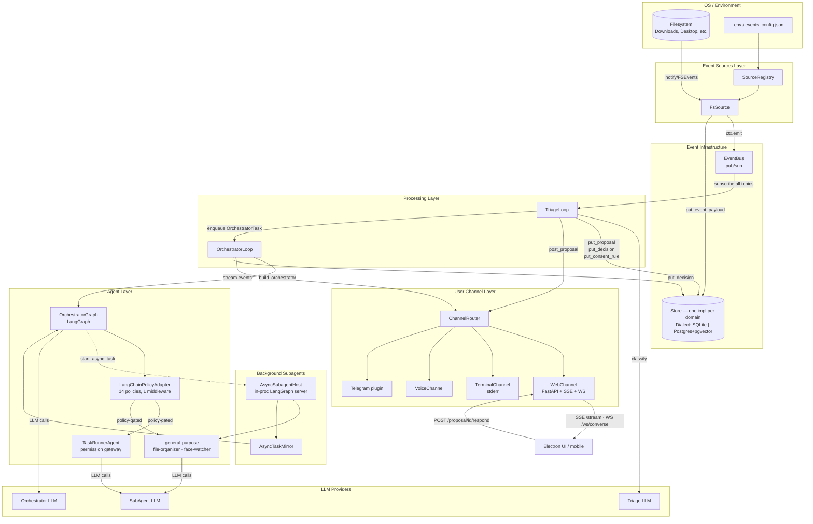

---

## 2. Daemon Boot Sequence

`main.py` **runs**; `bootstrap.build_daemon()` **wires**. The wiring used to be one
927-line function; ADR-003 split it into seven named builders, each independently
testable and under 200 lines.

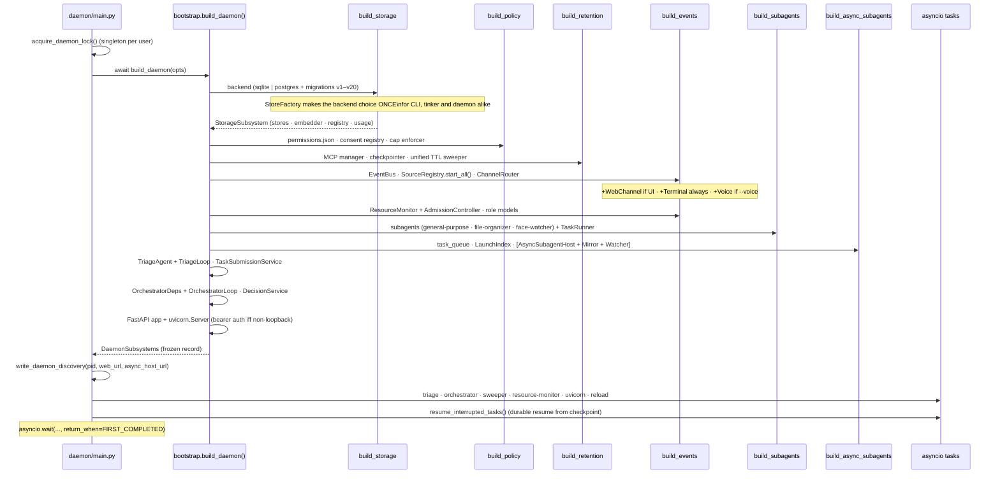

> **A boot bug this shape hides.** An extraction once stranded an import inside a
> Postgres-only branch: every test suite stayed green and the daemon only failed
> on a live PG boot. `test/daemon/test_bootstrap_no_unbound_names.py` now catches
> that statically, along with the mirror-image case (a local import shadowing a
> module-level one), across `bootstrap.py` and `engine.py`.

---

## 3. Graceful Shutdown Sequence

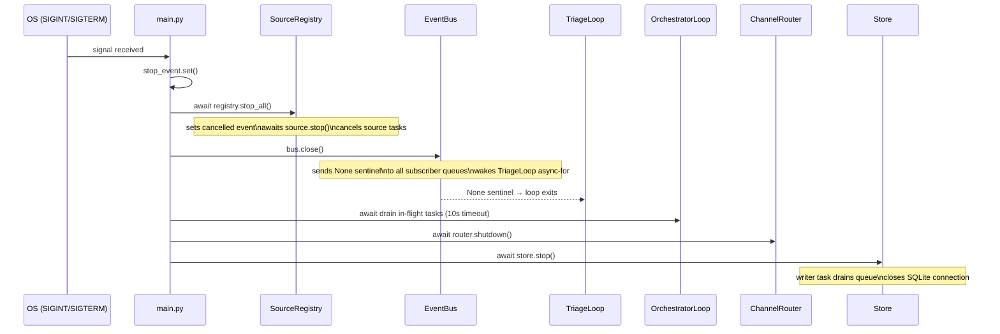

---

## 4. Event Ingestion — Source to Bus

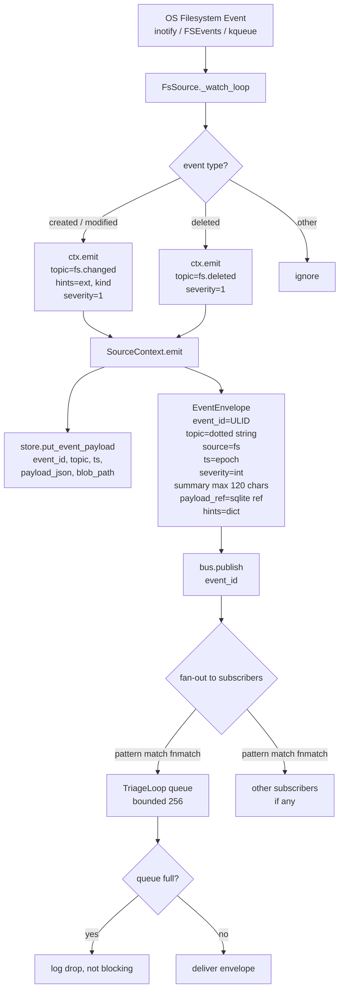

---

## 5. Triage Loop — Full Event Handling Flow

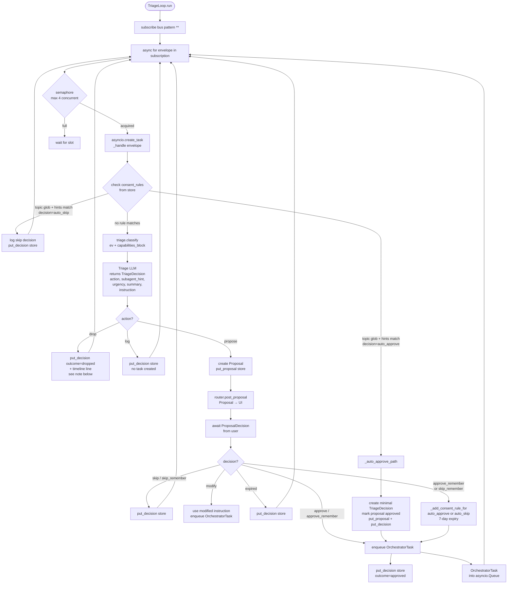

> **`drop` used to be silent.** Every other outcome wrote a decision row and a
> timeline line; `drop` alone did `return`. For a `mode=triage` submission that
> meant the task registry row sat `queued` forever with **no evidence anywhere
> that triage had seen it** — indistinguishable, from the UI, from a broken
> daemon. Found by submitting one against a running daemon and watching nothing
> happen. It now records `outcome="dropped"` with the classifier's reason.
>
> The registry row still stays `queued` — that is deliberate v1 behaviour
> (`task_submission.submit_via_triage`), and whether a dropped task belongs in a
> terminal state is a product decision, not a bug fix.

---

## 6. Orchestrator Loop — Task Execution

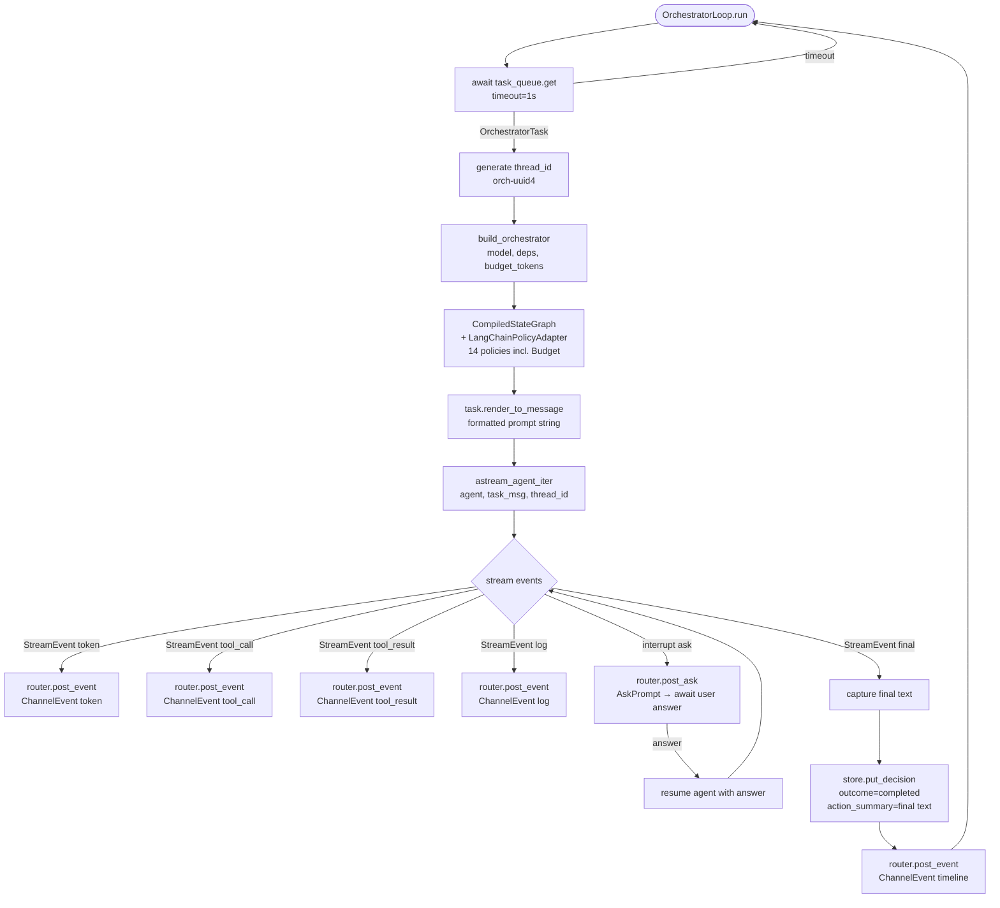

---

## 7. Core Engine — the stream driver

`core/streaming.py` used to hold **two** ~226-line drivers that were ~90%
identical. ADR-004 collapsed them into one driver plus two sinks: `_drive_graph`
owns the loop, interrupt collection and the resume handshake; `astream_agent_iter`
turns its items into `StreamEvent`s and `astream_agent` prints them.

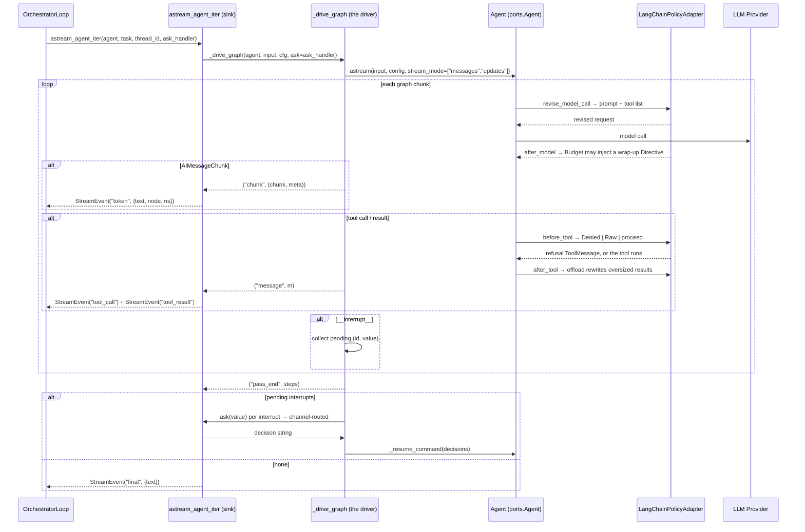

**Why one driver mattered.** The multi-interrupt resume protocol was implemented
in both copies and they had drifted: only the daemon one handled interrupts
arriving with **no ids**; the CLI one built `Command(resume={})` and discarded
every answer the user had just typed. `_resume_command` is now the single
implementation.

`_drive_graph` is annotated against `ports.Agent` (`astream` + `aget_state`), not
`CompiledStateGraph` — so its whole parity suite runs against a scripted double
that is not a graph.

---

## 8. SubAgent Execution — Inside the Orchestrator Graph

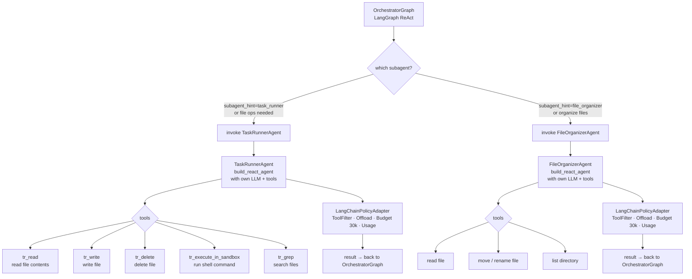

---

## 9. Channel Routing & User Communication

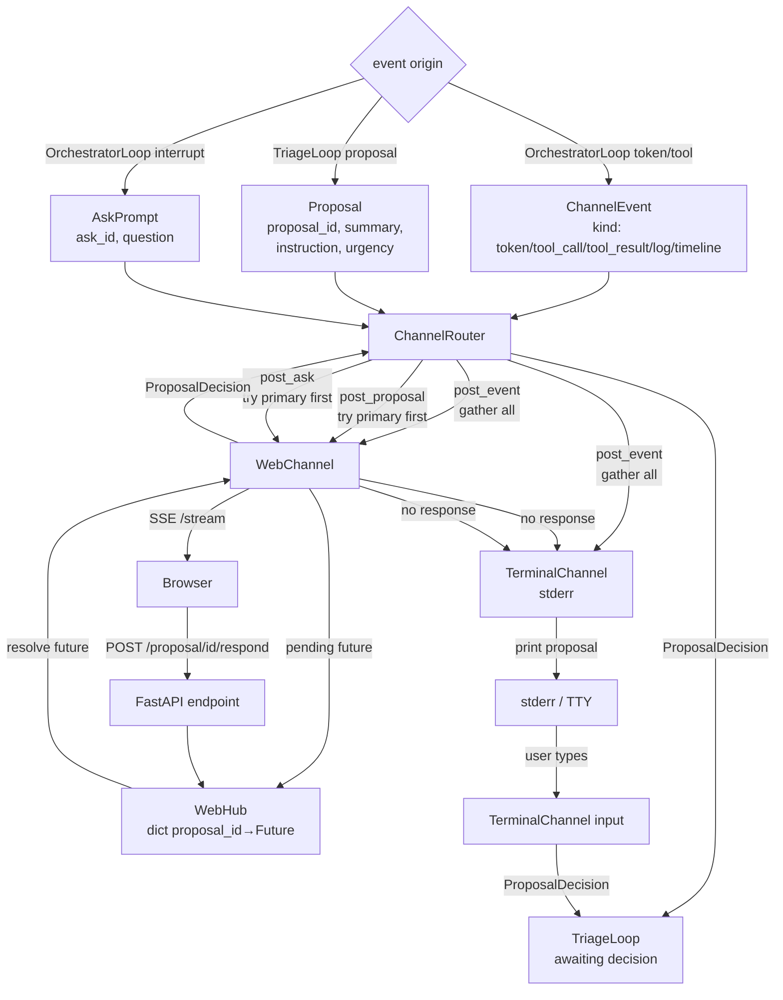

---

## 10. The Store — Data Model & Access Patterns

> **One implementation, two backends.** Each domain below used to have a
> hand-written SQLite store *and* a Postgres twin — 19 pairs that drifted
> silently. `storage/dialect.py` names the five things that actually differ
> (placeholder, timestamp, JSON, parent-row FK, vector support) and each domain
> now has one implementation over it. Timestamps are `TIMESTAMPTZ` on Postgres
> since migration v20; the events schema gained matching foreign keys in SQLite v5.

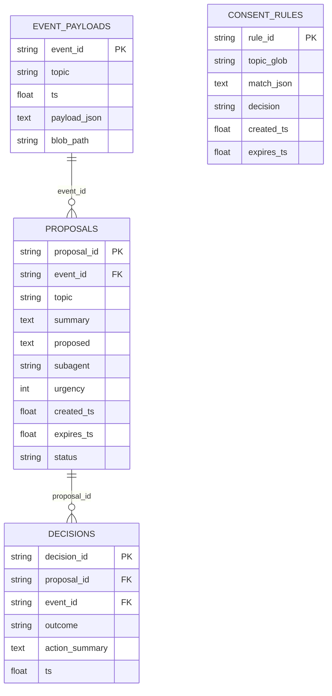

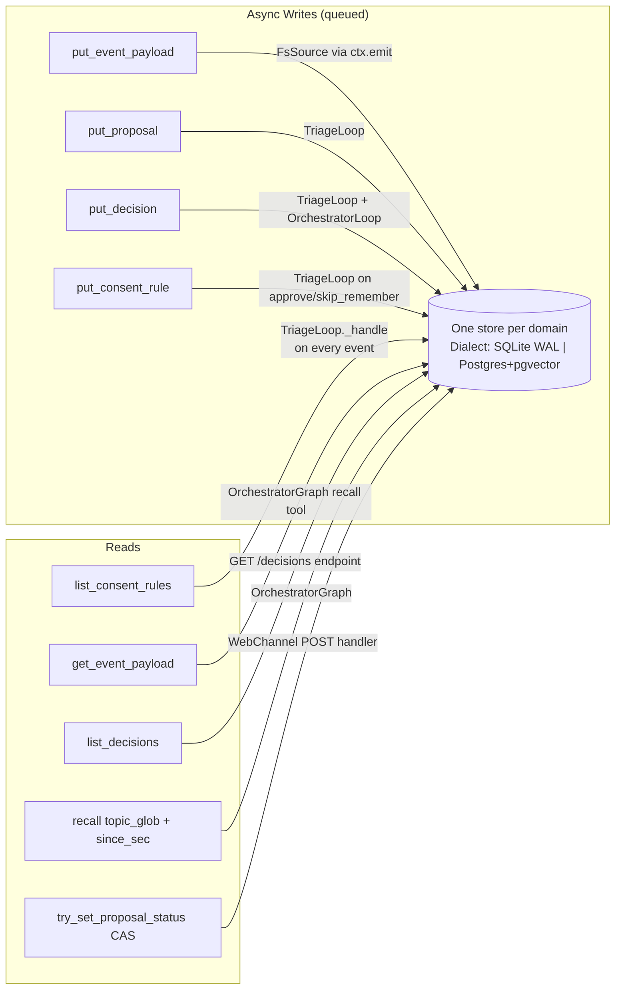

---

## 11. Consent Rule Matching — Triage Decision Tree

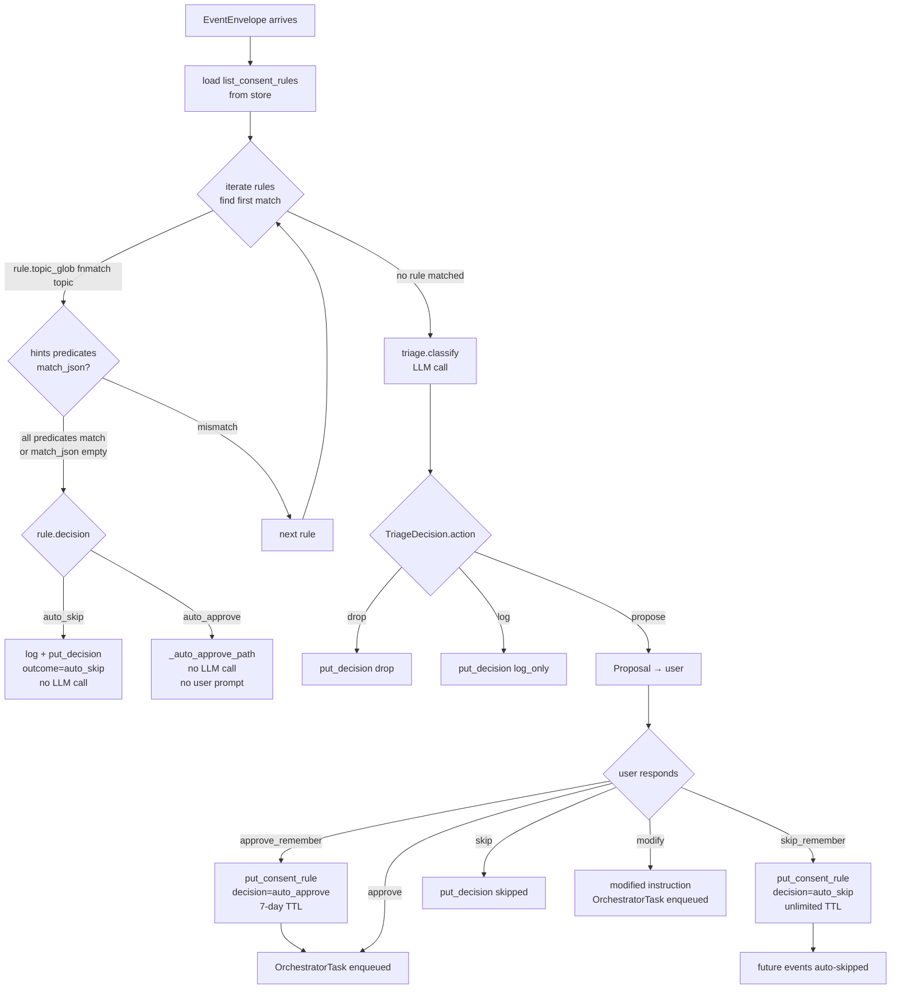

---

## 12. Token Budget Enforcement

`BudgetPolicy` (was `BudgetMiddleware`) is a plain `Policy` — no framework import,
tested without a graph. It reads `Turn.usage`, which the adapter resolves **once**
per turn from the latest `AIMessage`; before ADR-004 the budget and the usage
recorder each dug that out of `usage_metadata` separately.

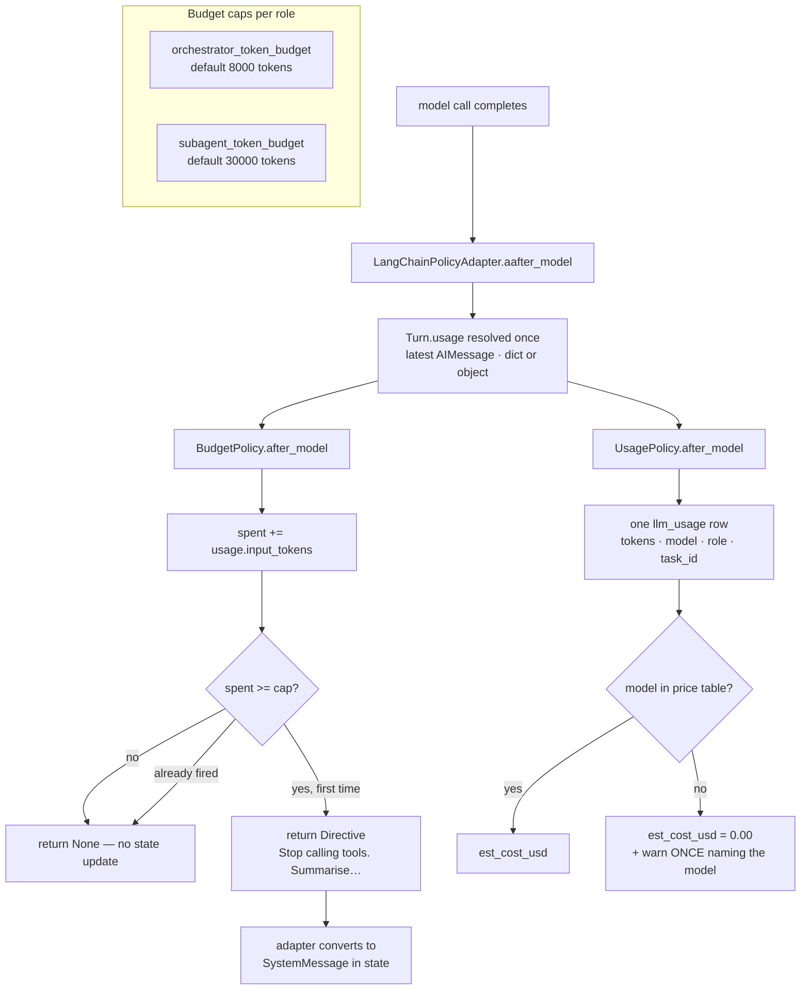

Two properties worth keeping:

- **The directive fires once.** It is a wrap-up instruction, not a hard stop —
  killing the graph mid-tool-call would leave an orphaned tool call in state,
  which is a worse failure than one more turn.
- **A call with no reported usage counts as nothing**, never as zero. A zero row
  is indistinguishable from a genuinely free call once the ledger is summed.

---

## 13. Source Registry — Supervision & Backoff

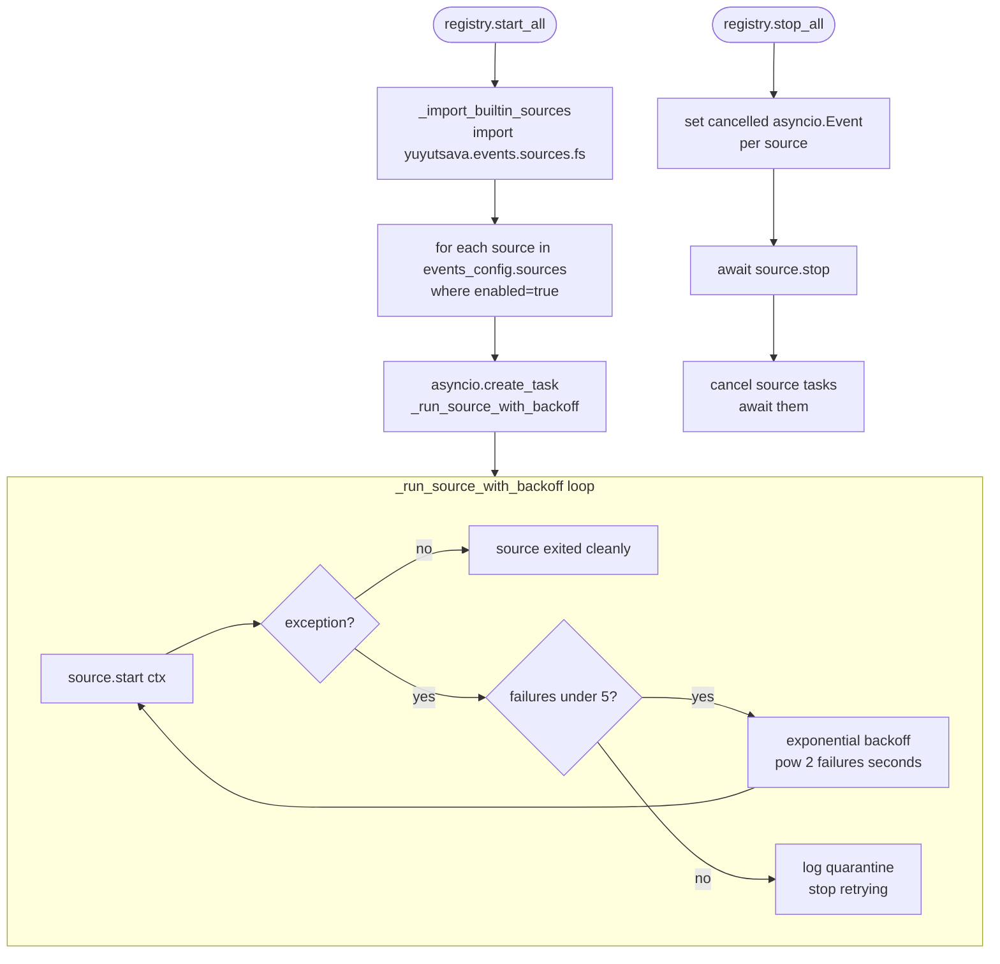

---

## 14. End-to-End Flow — File Downloaded to Task Completed

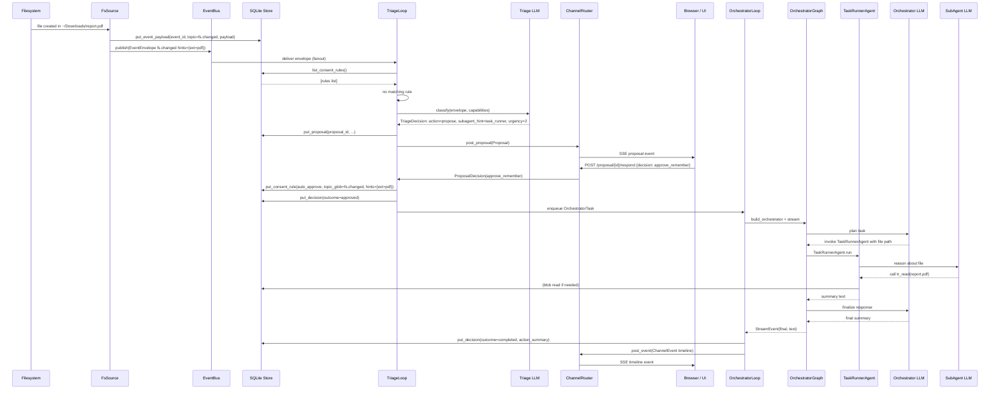

---

## 15. Key Invariants & Design Principles

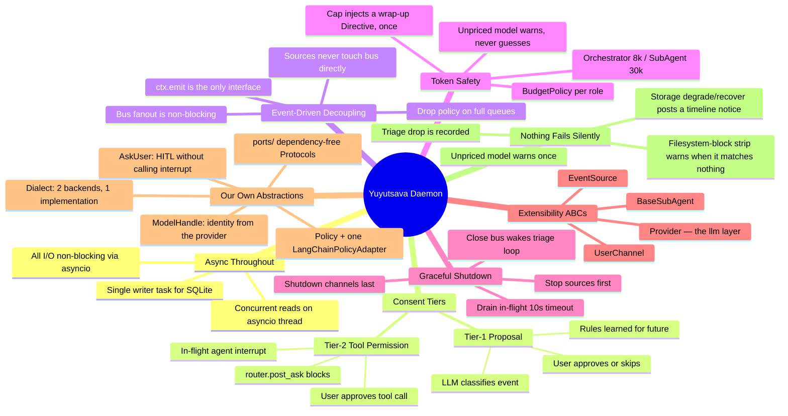
