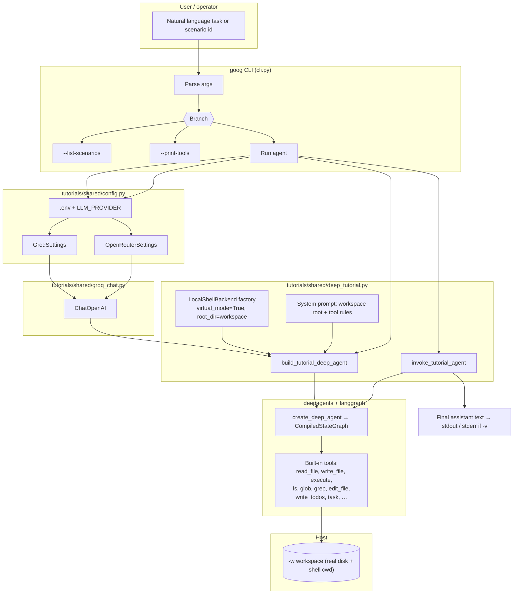
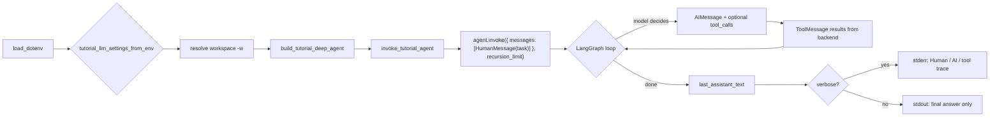
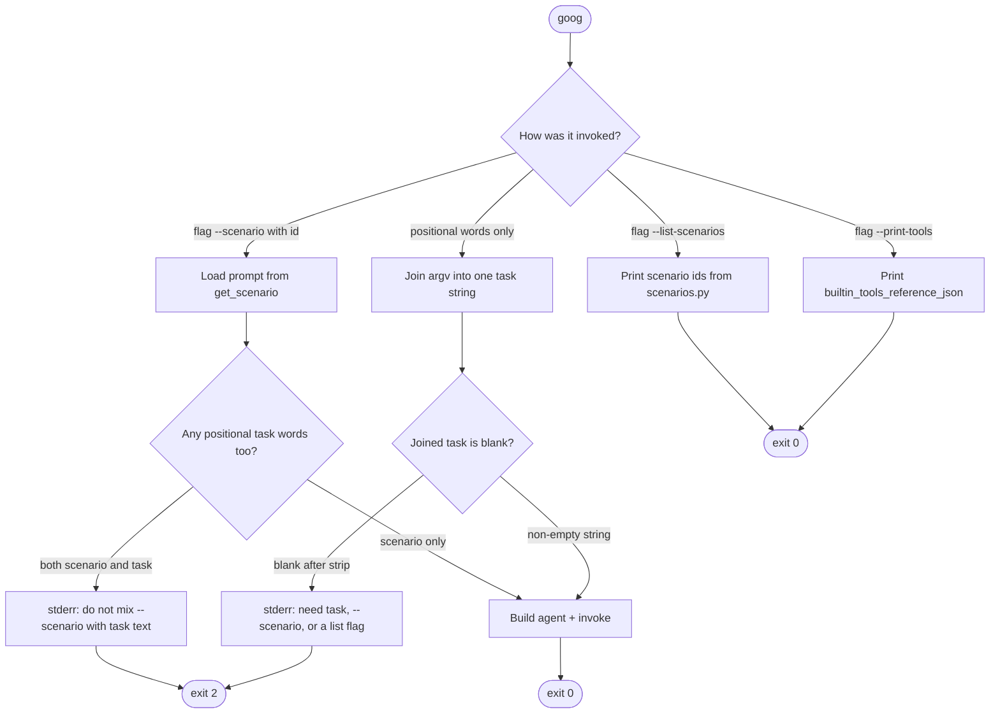
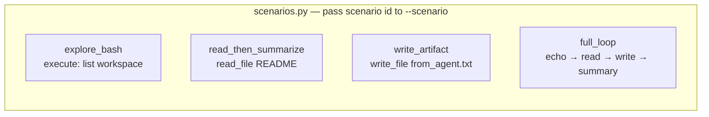
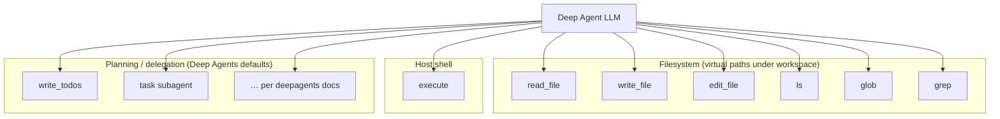
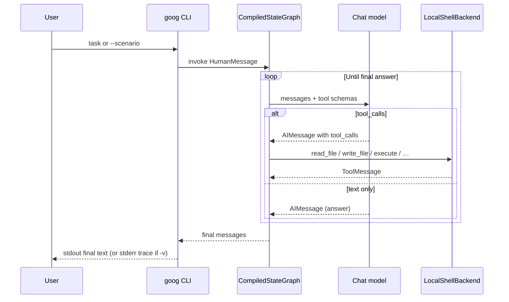

# Deep Agents tutorial — architecture and flow

This document describes how the **`goog`** CLI, shared tutorial code, and **Deep Agents** (`create_deep_agent`) fit together: entry points, runtime flow, and tools the agent can use.

Official overview: [LangChain Deep Agents](https://docs.langchain.com/oss/python/deepagents/overview).

---

## 1. System architecture (components)

---

## 2. End-to-end run flow (one invocation)

---

## 3. CLI entry modes (tasks vs utilities)

---

## 4. Built-in tutorial scenarios (`--scenario`)

| id | Intent |
| --- | --- |
| `explore_bash` | Use **execute** to list workspace; summarize |
| `read_then_summarize` | **read_file** on playground README; summarize |
| `write_artifact` | **write_file** a small artifact under workspace |
| `full_loop` | **execute** → **read_file** → **write_file** → short summary |

---

## 5. Agent actions (tools)

This tutorial configures **`LocalShellBackend`**: file tools map under **`-w`**, and **`execute`** runs shell on the host (trusted environments only). See `README.md` for env vars and security notes.

---

## 6. Sequence: one reasoning loop

